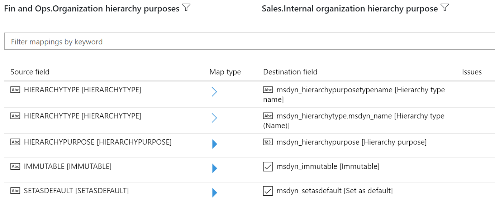
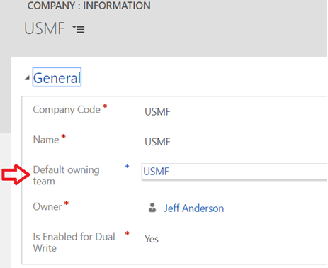

---
# required metadata

title: Near-real time data integration between Finance and Operations and Common Data Service
description: 
author: RamaKrishnamoorthy 
manager: AnnBe
ms.date: 07/15/2019
ms.topic: article
ms.prod: 
ms.service: dynamics-ax-applications
ms.technology: 

# optional metadata

ms.search.form: 
# ROBOTS: 
audience: Application User, IT Pro
# ms.devlang: 
ms.reviewer: rhaertle
ms.search.scope: Core, Operations
# ms.tgt_pltfrm: 
ms.custom: 
ms.assetid: 
ms.search.region: global
ms.search.industry: 
ms.author: ramasri
ms.dyn365.ops.version: 
ms.search.validFrom: 2019-07-15

---

# Near-real time data integration between Finance and Operations and Common Data Service

In this digital world,  business eco-systems use Dynamics 365 suite as a whole. Data from people, customers, operations and IoT devices flows in to one source creating the opportunity for digital feedback loops. To achieve this experience, native integration between Dynamics 365 for Finance and Operations and Dynamics 365 for Customer Engagement applications is essential. Dynamics 365 for Customer Engagement Applications is built on top of Common Data Services platform. Finance and Operations data integrating with Common Data Services enables the Customer Engagement applications to talk to Finance and Operations coherently and fluently.

The Finance and Operations and Common Data Service provides near real-time data synchronization between Dynamics 365 for Finance and Operations and Dynamics 365 for Customer Engagement applications via dual-write framework. The coverage is pretty broad and spans across 28 surface areas of Dynamics 365 for Finance and Operations. The idea is to give users "One Dynamics 365" user experience through seamless data flows that connect the business processes across applications say from customers, products through financials.

The following value propositions are available for the customers.

-   Organization hierarchy in Common Data Service
-   Company concept in Common Data Service
-   Integrated customer master
-   Integrated vendor master
-   Unified product master

## System requirements for Finance and Operations:

Synchronous, bi-directional near-real time data flows requires the following versions.

-   Microsoft Dynamics 365 for Finance and Operations, Enterprise
    edition 10.0.4 Platform Update 28 or higher
-   Dynamics 365 Customer Engagement, Platform version 9.1 (4.2) or
    higher

For system setup instructions, refer to [Announcing Dual Write Preview](https://powerapps.microsoft.com/en-us/blog/announcing-dual-write-preview). It has step-by-step guide as a PDF at the bottom.

## Organization hierarchy on Common Data Service

F&O being a financial system, considers organization to be a core
concept and the system setup starts with configuring an organization
hierarchy. This allows business financials and operations can be tracked
at the organization level as well as any level within the organization
hierarchy. CDS does not contain organization hierarchy concept but has
few loose concepts like total sales revenue. As part of CDS integration,
we are introducing organization hierarchy data structure in CDS.

### Data flow

If a business eco-system is made up of F&O and CDS, it will continue to
have organization hierarchy built on F&O but exposed in CDS for
information and extensibility. So, the following organization hierarchy
information is exposed in CDS as a one-way data flowing from F&O to CDS.

### Templates

Following organization hierarchy entity maps are available to synchronize data one-way from F&O to CDS.

#### Internal Organization Hierarchy Purpose

One-way synchronization of internal organization hierarchy purpose information from F&O to CE.

#### Internal Organization Hierarchy Type

One-way synchronization of internal organization hierarchy type information from F&O to CE.

#### Internal Organization Hierarchy

One-way synchronization of internal organization hierarchy information from F&O to CE.

#### Internal Organization

Internal organization information in CDS comes from 2 entities of F&O namely "operating unit" and "legal entities".

#### Company

Bi-directional synchronization of legal entity (aka company) information between F&O and CE.

## Company concept in Common Data Services

"Company" concept in F&O is both a legal/business construct, as well as a security and visibility boundary for data. F&O users are always working in the context of a single company. So, vast majority of the data is striped by company. We don't have an equivalent concept in CDS, but the closest one is "Business unit" and it is primarily a security and visibility boundary for user data. But it does not have the same legal/business implications as F&O company. 

For CDS integration, since Business Unit and Company are not equivalent constructs, we cannot force a 1:1 mapping between them. At the same time, it is necessary to ensure that by default a user will see the same records in F&O as that user sees in CDS. To support this, we introduce a new entity in CDS called cdm\_Company which* is* equivalent to Company in F&O. To ensure visibility of records is equivalent between F&O and CDS out of the box, we recommend the following setup of data in CDS: 

-   For each F&O Company that is dual written, an associated cdm\_Company record is created 
-   When a cdm\_Company is created and enabled for dual write, it creates a default Business Unit (BU) by the same name. That business unit gets a default team created automatically, but is not used.
-   A separate "Owner team" is created by the same name and also associated with that business unit. 
-   By default, any record created in F&O and dual-written to CDS will have its owner set to the DW "owner team", which is linked to the associated BU. 

The impact of this configuration is any F&O record related to the USMF company will be owned by a team linked to the USMF BU in CDS. So, any user who has access to that BU through a security role, set to BU-level visibility can now see those records. An example of how teams can be used to provide access to these records correctly is shown below. 

-   The "USMF Sales" team gives members of the team the "Sales manager" role. 
-   The Sales Manager role says people with the role can access any Account records which are members of the same BU as the user. 
-   The USMF Sales team is linked to the USMF BU mentioned earlier.  
-   This means members of the "USMF Sales" team can see any account owned by the "USMF DW" user, which would have come from the USMF company in F&O. 

As shown in the diagram, this one-to-one mapping between Business Unit, Company, and Team is just a starting point. In this example, a new "Europe BU" is manually created in CDS as the parent for both DEMF and ESMF. This new root BU is completely unrelated to Dual Write, but can be used to give members of the "EUR Sales" team access to both DEMF and ESMF account data by setting the data visibility to "Parent/Child BU" in the associated security role. 

A final element to discuss is how Dual Write knows *which* owner team to assign records to. This is controlled by the "Default owning team" field on the cdm\_Company record. When a cdm\_Company record is enabled for dual write, a plugin automatically creates the associated BU and owner team (if not yet existing) and will set the default owning team field. The administrator can change the default owning team to a different value, but can not clear the field as long as the entity is enabled for dual write. 

### Company striping and bootstrapping

CDS integration brings company parity through striping of data with company identifier. All company specific entities are extended to have a N:1 relationship with cdm\_company entity as shown below.

-   For a record, once a Company is added and saved, the value becomes read-only.​ So, users should make sure they choose the right company in the first place.
-   Only records having company data is eligible for dual-sync between F&O and CDS.
-   For the existing CDs data, an Administrator lead bootstrapping experience will be available soon.

## Related Topics

-   Organization Hierarchy in Common Data Service
-   Company concept in Common Data Service
-   Integrated customer master
-   Integrated vendor master
-   Unified product master

