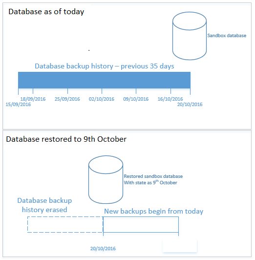

---
# required metadata

title: Quickstart: Database point-in-time restore (PITR)
description: This topic explains how to perform a point-in-time restore of a database for Microsoft Dynamics 365 for Finance and Operations.
author: LaneSwenka
manager: AnnBe
ms.date: 01/25/2019
ms.topic: article
ms.prod: 
ms.service: dynamics-ax-platform
ms.technology: 

# optional metadata

# ms.search.form: 
# ROBOTS: 
audience: IT Pro, Developer
# ms.devlang: 
ms.reviewer: sericks
ms.search.scope: Operations
# ms.tgt_pltfrm: 
ms.search.region: Global
# ms.search.industry: 
ms.author: laneswenka
ms.search.validFrom: 2019-01-31
ms.dyn365.ops.version: AX 7.0.0

---

# Quickstart: Database point-in-time restore (PITR)

[!include [banner](../includes/banner.md)]

You can use Microsoft Dynamics Lifecycle Services (LCS) to perform the point-in-time restore (PITR) for a Dynamics 365 for Finance and Operations sandbox user acceptance testing (UAT) environment. 

## Self-service point-in-time restore
[!include [pitr](../includes/dbmovement-pitr.md)]

### Restore operation failed
In case of failure, the option to perform a **Rollback** is available.  By clicking the rollback option after the operation has initially failed, your target sandbox environment will be restored to the state it was before the restore began. This will restore the previous database from the deleted databases storage on the Azure SQL Server. This is often required if a customization is present in the target sandbox that cannot complete a database synchronization with the newly-restored data.  

To determine the root cause of the failure, download the runbook logs using the available buttons before starting the rollback operation.

### Data elements that need attention after restore
When restoring a database from a previous point-in-time, keep in mind that the database is provided as-was. This means that batch jobs and other data elements in the system could be in an in-progress state. These will require manual review.

### Environment administrator
The System Administrator account in the target environment (UserId of 'Admin') is reset to the value found in the web.config file on the target.  This should be the same value as that of the Administrator from Lifecycle Services. To preview which account this will be, go to your target sandbox **Environment Details** page in LCS.  The value of the **Environment Administrator** field that was selected when the environment was first deployed is updated to be the System Administrator in the transactional database. This also means that the tenant of the environment will be that of the Environment Administrator.  

If you have used the Admin User Provisioning Tool on your environment to change the web.config file to a different value, it may not match what is in Lifecycle Services.  If you require a different account, you will need to deallocate and delete the target sandbox, and redeploy by selecting another account. After this, you can perform another refresh database action to restore the data.

## Steps to complete after a database restore for environments that use Retail functionality
[!include [environment-reprovision](../includes/environment-reprovision.md)]

## Known issues

### Point-in-time restore breaks the chain of available restore points
The restore database process always creates a new database based on a previous point-in-time snapshot.  Because of this, the new database does not have any restore history, but does begin to accrue new restore points going forward. The following illustration shows this process.

Going forward, the Lifecycle Services team will work to improve point-in-time restore by leveraging the restore history of deleted databases.  This will allow continual restore back to the same point-in-time for scenarios such as destructive testing.  This will be fixed in an upcoming release of LCS.

### Restore is denied for environments running Platform update 3 or earlier
The restore database process cannot be completed if the environment is running Platform update 3 or earlier. For more information, see the list of currently supported Platform Updates.

