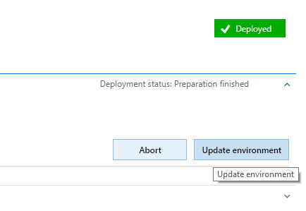
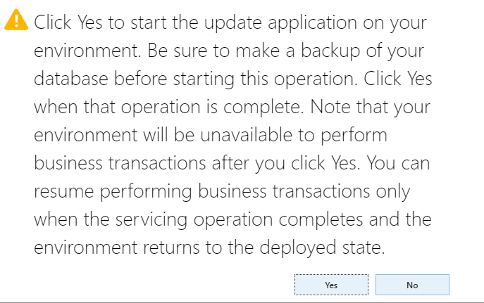

---
# required metadata

title: Certificate rotation
description: [Full description that appears in the search results. Often the first paragraph of your topic.]
author: PeterRFriis
manager: AnnBe
ms.date: 05/06/2019
ms.topic: article
ms.prod: 
ms.service: dynamics-ax-applications
ms.technology: 

# optional metadata

# ms.search.form:  [Operations AOT form name to tie this topic to]
audience: IT Pro
# ms.devlang: 
ms.reviewer: sericks
ms.search.scope: Operations
# ms.tgt_pltfrm: 
# ms.custom: [used by loc for topics migrated from the wiki]
ms.search.region: Global 
# ms.search.industry: [leave blank for most, retail, public sector]
ms.author: perahlff
ms.search.validFrom: 2019-04-30
ms.dyn365.ops.version: Platform update 25 

---

# Certificate rotation

[!include[banner](../includes/banner.md)]

You may need to rotate the certificates used by your Finance and Operations on-premises environment, as they approach their expiry date. In this article you can understand how to replace the existing certificates with new ones and update the references within the environment to use the new certificates.

  
**Old certificates must remain in place until the certificate rotation process is complete, removing them beforehand will cause the rotation process to fail.**

## Preparation steps 

1.  Rename the original ..\\Infrastructure\\ folder you created during the initial environment deployment (which contains the setup scripts downloaded from LCS) to ..\\InfrastructureOld\\

2.  Download the latest [on-premises setup scripts from LCS](https://docs.microsoft.com/en-us/dynamics365/unified-operations/dev-itpro/deployment/setup-deploy-on-premises-pu12#downloadscripts)

3.  Copy ConfigTemplate.xml and ClusterConfig.json from \\InfrastructureOld\\ to \\Infrastructure\\

4.  Reconfigure certificates: follow the steps in [Configure certificates](https://docs.microsoft.com/en-us/dynamics365/unified-operations/dev-itpro/deployment/setup-deploy-on-premises-pu12#configurecert)

5.  Setup VMs: This is similar to the original deployment step [Setup VMs](https://docs.microsoft.com/en-us/dynamics365/unified-operations/dev-itpro/deployment/setup-deploy-on-premises-pu12#setupvms), but some points do not need to be repeated this time around, the steps needed are:

    1.  Export the scripts that must be run on each VM.

        \# Exports the script files to be execute on each VM into a directory VMs\\\<VMName\>.
        \.\\Export-Scripts.ps1 -ConfigurationFilePath .\\ConfigTemplate.xml

1.  Run the following scripts, if they exist in each VM folder, to complete VM
    setup

>   \# If Remoting, only execute

>   \# .\\Complete-PreReqs-AllVMs.ps1 -ConfigurationFilePath
>   .\\ConfigTemplate.xml

>   \# .\\Test-D365FOConfiguration-AllVMs.ps1 -ConfigurationFilePath
>   .\\ConfigTemplate.xml

>   .\\Add-GMSAOnVM.ps1

>   .\\Import-PfxFiles.ps1

>   .\\Set-CertificateAcls.ps1

>   .\\Test-D365FOConfiguration.ps1

1.  You need to regenerate credentials.json file if axdataenciphermentcert
    certificates is rotated.

2.  Run:

.\\Get-DeploymentSettings.ps1 -ConfigurationFilePath .\\ConfigTemplate.xml

(From step 21.1 of the deployment steps)

1.  **Activation of New Certificates within Service Fabric Cluster**

    1.  **Service fabric with not expired Certificates:**

2.  Edit the Clusterconfig.json file. Find the Part:  
      
    "security": {

    "metadata": "The Credential type X509 indicates this is cluster is secured
    using X509 Certificates. The thumbprint format is - d5 ec 42 3b 79 cb e5 07
    fd 83 59 3c 56 b9 d5 31 24 25 42 64.",

    "ClusterCredentialType": "X509",

    "ServerCredentialType": "X509",

    "CertificateInformation": {

    "ClusterCertificate": {

    "X509StoreName": "My",

    "Thumbprint": "*Old server thumbprint(Star/SF)*"

    },

    "ServerCertificate": {

    "X509StoreName": "My",

    "Thumbprint": "*Old server thumbprint(Star/SF)*"

    },

    "ClientCertificateThumbprints": [

    {

    "CertificateThumbprint": "*Old client thumbprint*",

    "IsAdmin": true

    }

    ]

    }

    },

>   This part needs to be change in:

"security": {

"metadata": "The Credential type X509 indicates this is cluster is secured using
X509 Certificates. The thumbprint format is - d5 ec 42 3b 79 cb e5 07 fd 83 59
3c 56 b9 d5 31 24 25 42 64.",

"ClusterCredentialType": "X509",

"ServerCredentialType": "X509",

"CertificateInformation": {

"ClusterCertificate": {

"X509StoreName": "My",

"Thumbprint": "*New Server Thumbprint(Star/SF)*"

,"ThumbprintSecondary": "*Old Server Thumbprint(Star/SF)*"

},

"ServerCertificate": {

"X509StoreName": "My",

"Thumbprint": "*New Server Thumbprint(Star/SF)*"

,"ThumbprintSecondary":"*Old Server Thumbprint(Star/SF)*"

},

"ClientCertificateThumbprints": [

{

"CertificateThumbprint": "*Old Client Thumbprint*",

"IsAdmin": false

}

{

"CertificateThumbprint": "*New Client Thumbprint*",

"IsAdmin": true

}

]

}

},

Find in the top:

{

"name": "Dynamics365Operations",

"clusterConfigurationVersion": "2.0.0", To change to new version!

"apiVersion": "10-2017",

"nodes": [

1.  Save the new ClusterConfig.json

2.  Open A Powershell in admin mode and run:

>   Connect-ServiceFabricCluster

>   Start-ServiceFabricClusterConfigurationUpgrade -ClusterConfigPath
>   ClusterConfig.json

\*!!\* If PreUpgradeSafetyCheck on Single SSRS node during upgrade is getting
stuck, run the following: *Update-ServiceFabricClusterUpgrade
-UpgradeReplicaSetCheckTimeoutSec 30*

\*!!\* If you have a Service Fabric JSON file format issue, please add required
comma as below

1.  **Service fabric with or without expired Certificates (cluster not
    accessible):**

2.  In attached PS1 ChangeCert.ps1 change the first section so that it fits the
    environment:

Param(

[Parameter(Mandatory=\$false)]

[ValidateNotNullOrEmpty()]

[string] \$clusterDataRootPath="C:\\ProgramData\\SF", (Service Fabric
installation folder)

[Parameter(Mandatory=\$false)] \#\$true

[ValidateNotNullOrEmpty()]

[string]\$oldThumbprintServer="Old Server Thumbprint(Star/SF)",

[Parameter(Mandatory=\$false)] \#\$true

[ValidateNotNullOrEmpty()]

[string]\$newThumbprintServer="New Server Thumbprint(Star/SF)",

[Parameter(Mandatory=\$false)] \#\$true

[ValidateNotNullOrEmpty()]

[string]\$oldThumbprintClient="Old Client Thumbprint",

[Parameter(Mandatory=\$false)] \#\$true

[ValidateNotNullOrEmpty()]

[string]\$newThumbprintClient="New Client Thumbprint",

[Parameter(Mandatory=\$false)]

[ValidateNotNullOrEmpty()]

[string]\$certStoreLocation='Cert:\\LocalMachine\\My\\',

[Parameter(Mandatory=\$false)] \#\$true

[ValidateNotNullOrEmpty()]

[string[]]\$nodeIpArray=\@("10.0.0.11", "10.0.0.12", "10.0.0.13") (Add all IPs
from all member server of the SF cluster)

)

1.  Save the changes.

2.  Open a PowerShell in admin mode on one of the Cluster members and run the
    ChangeCert.ps1.

3.  A login screen will popup.

4.  Use an admin user that is present on all Nodes.

5.  Now the script will run on all nodes remotely and makes the necessary
    changes to get the cluster up and running again.

    1.  **Localagent Certificate update(if needed):**

6.  Run on one of the Orchestrator nodes the:

>   LocalAgentCLI.exe Cleanup \<path of localagent-config.json\>

1.  After the Localagent is deinstalled, we now need to remove the Old
    Thumbprint from the Service principle. Run:

>   .\\Get-AgentConfiguration.ps1 -ConfigurationFilePath .\\ConfigTemplate.xml

And note the NewOnPremLocalAgent Thumbprint

(From step 19.8 of the deployment steps)

1.  Follow:

<https://docs.microsoft.com/en-us/dynamics365/unified-operations/dev-itpro/deployment/setup-deploy-on-premises-pu12#configurelcs>

And you will run into an error like:

Update to existing credential with KeyId '\<key\>' is not allowed.

New-AzureRmADSpCredential : Update to existing credential with KeyId '\<key\>'
is not allowed.  
At C:\\InfrastructureScripts\\Add-CertToServicePrincipal.ps1:62 char:1  
New-AzureRmADSpCredential -ObjectId \$servicePrincipal.Id -CertValue \$ ...  
CategoryInfo : InvalidOperation: (:) [New-AzureRmADSpCredential], Exception  
FullyQualifiedErrorId :
Microsoft.Azure.Commands.ActiveDirectory.NewAzureADSpCredentialCommand

1.  Then run: (Use Key from error message)

Remove-AzureRmADSpCredential -ServicePrincipalName
"00000015-0000-0000-c000-000000000000" -KeyId \<key\>

1.  Now you can run the

.\\Add-CertToServicePrincipal.ps1 -CertificateThumbprint \<NewOnPremLocalAgent
Certificate Thumbprint\>

1.  Go to LCS \> on premises project -\> Project settings -\> On-premises
    connectors

2.  Chose the connector for the environment and click edit

3.  In point 2. Configure agent chose “enter configuration”. Change values for :

>   Client certificate thumbprint  
>   Server Certificate thumbprint  
>   Tenant service principle certificate thumbprint

1.  Download the new configuration

2.  Run the following with the new downloaded configuration file:  
    LocalAgentCLI.exe Install \<path of localagent-config.json\>

3.  Wait until the Localagent is installed.

4.  **Update Certificates for Dynamics 365 FFO**

**Update settings feature steps in LCS:**

1. After installing certificates and the configuration testing succeeded, access
LCS.

2. In LCS, click on the "Full Details" link of the environment where you want to
change the certificates.

3. Click "Maintain" button and select "Update Settings".

4. Change the thumbprints with the new ones that you have previously configured
(you can find these in the ConfigTemplate.xml in the InfrastructureScripts
folder).

5. Click “Prepare”.

6. After downloading and preparing is complete, the "Update environment" button
will show up.

7. Click "Update environment" to start updating you environment.

8. From this point, the downtime is starting and you have to make a backup of
your database. Also, the environment will be unavailable for a while.

9. After the environment is successfully updated with the new certificates, you
can check the new thumbprints in Service Fabric Cluster Explorer. Please note
that the name of the thumbprint name from SF Explorer might differ from the
names of the thumbprints you see in the LCS page. However, their values should
be the same!

Here is an example of how the name of the same thumbprint might differ.

