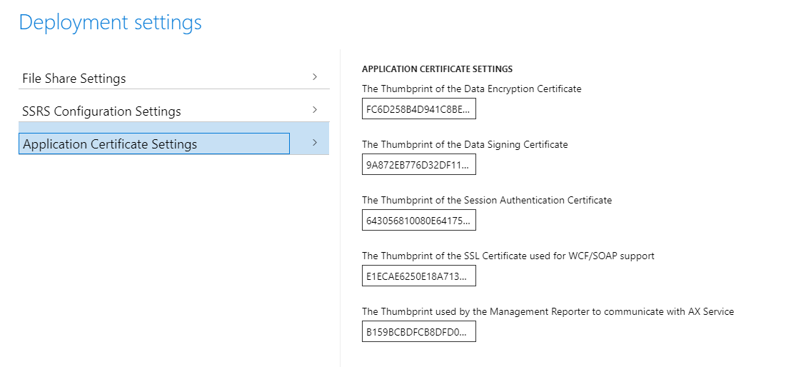
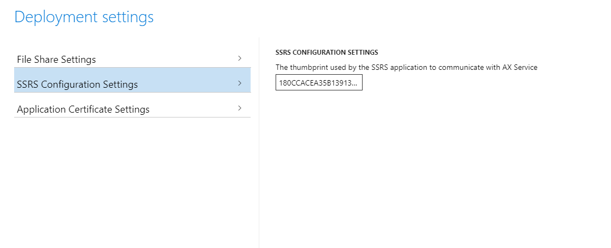

---
# required metadata

title: Certificate rotation
description: [Full description that appears in the search results. Often the first paragraph of your topic.]
author: PeterRFriis
manager: AnnBe
ms.date: 06/24/2019
ms.topic: article
ms.prod: 
ms.service: dynamics-ax-applications
ms.technology: 

# optional metadata

# ms.search.form:  [Operations AOT form name to tie this topic to]
audience: IT Pro
# ms.devlang: 
ms.reviewer: sericks
ms.search.scope: Operations
# ms.tgt_pltfrm: 
# ms.custom: [used by loc for topics migrated from the wiki]
ms.search.region: Global 
# ms.search.industry: [leave blank for most, retail, public sector]
ms.author: perahlff
ms.search.validFrom: 2019-04-30
ms.dyn365.ops.version: Platform update 25 

---

# Certificate rotation

[!include[banner](../includes/banner.md)]

You may need to rotate the certificates used by your Finance and Operations on-premises environment, as they approach their expiry date. In this article you can understand how to replace the existing certificates with new ones and update the references within the environment to use the new certificates.

> [!NOTE]
> Old certificates must remain in place until the certificate rotation process is complete, removing them beforehand will cause the rotation process to fail.

## Preparation steps 

1. Rename the original **Infrastructure** folder you created during **Set up and deploy on-premises environments** [on-premises setup scripts from LCS](setup-deploy-on-premises-pu12.md#downloadscripts) to **InfrastructureOld**.

2. Download the latest [on-premises setup scripts from LCS](setup-deploy-on-premises-pu12.md#downloadscripts). Unzip the files into a folder that is named **Infrastructure**.

3. Copy **ConfigTemplate.xml** and **ClusterConfig.json** from **InfrastructureOld** to **Infrastructure**.

4. Configure certificates as needed in **ConfigTemplate.xml**. Proceed with [Configure certificates](setup-deploy-on-premises-pu12.md#configurecert), specifically:

    ```powershell
    # Create self-signed certs
    .\New-SelfSignedCertificates.ps1 -ConfigurationFilePath .\ConfigTemplate.xml
    
    # Exports Pfx files into a directory VMs\<VMName>, all the certs will be written to infrastructure\Certs folder.
    .\Export-PfxFiles.ps1 -ConfigurationFilePath .\ConfigTemplate.xml
    ```

5. Proceed with [Setup VMs](setup-deploy-on-premises-pu12.md#setupvms). Specific steps that are needed are:

    1. Export the scripts that must be run on each VM.
    
        ```powershell
        # Exports the script files to be execute on each VM into a directory VMs\<VMName>.
        .\Export-Scripts.ps1 -ConfigurationFilePath .\ConfigTemplate.xml
        ```

    2. Copy the contents of each infrastructure\\VMs<VMName> folder into the corresponding VM (if remoting scripts are used, they will automatically copy the content to the target VMs), and then run the following scripts, if they exist, as an Administrator.
	
        ```powershell
        # If Remoting, only execute
        # .\Complete-PreReqs-AllVMs.ps1 -ConfigurationFilePath .\ConfigTemplate.xml
        # .\Test-D365FOConfiguration-AllVMs.ps1 -ConfigurationFilePath .\ConfigTemplate.xml

        .\Add-GMSAOnVM.ps1
        .\Import-PfxFiles.ps1
        .\Set-CertificateAcls.ps1
        ```
        
    3. Run the following script to validate the VM setup.
    
        ```powershell
        .\Test-D365FOConfiguration.ps1
        ```

6. If axdataenciphermentcert certificates is rotated, you need to regenerate credentials.json file. For more information, see [Encrypt credentials](https://docs.microsoft.com/dynamics365/unified-operations/dev-itpro/deployment/setup-deploy-on-premises-pu12#encryptcred).

7. Run following PowerShell command to have values to be used in LCS later. For more information, see [Deploy your Finance and Operations (on-premises) environment from LCS](setup-deploy-on-premises-pu12.md#deploy).

    ```powershell
    .\Get-DeploymentSettings.ps1 -ConfigurationFilePath .\ConfigTemplate.xml
    `````


## Activation of New Certificates within Service Fabric Cluster

### Service fabric with not expired Certificates

1. Edit the Clusterconfig.json file. Find the Part:  
    ```
                       "security":  {
                                        "metadata":  "The Credential type X509 indicates this is cluster is secured using X509 Certificates. The thumbprint format is - d5 ec 42 3b 79 cb e5 07 fd 83 59 3c 56 b9 d5 31 24 25 42 64.",
                                        "ClusterCredentialType":  "X509",
                                        "ServerCredentialType":  "X509",
                                        "CertificateInformation":  {
                                                                       "ClusterCertificate":  {
                                                                                                  "X509StoreName":  "My",
                                                                                                  "Thumbprint": "*Old server thumbprint(Star/SF)*"
                                                                                              },
                                                                       "ServerCertificate":  {
                                                                                                 "X509StoreName":  "My",
												 "Thumbprint": "*Old server thumbprint(Star/SF)*"
                                                                                             },
                                                                       "ClientCertificateThumbprints":  [
                                                                                                            {
                                                                                                                "CertificateThumbprint": "*Old client thumbprint*",
                                                                                                                "IsAdmin":  true
                                                                                                            }
                                                                                                        ]
                                                                   }
                                    },
    ```

2. Replace section with following:

    ```
                       "security":  {
                                        "metadata":  "The Credential type X509 indicates this is cluster is secured using X509 Certificates. The thumbprint format is - d5 ec 42 3b 79 cb e5 07 fd 83 59 3c 56 b9 d5 31 24 25 42 64.",
                                        "ClusterCredentialType":  "X509",
                                        "ServerCredentialType":  "X509",
                                        "CertificateInformation":  {
                                                                       "ClusterCertificate":  {
                                                                                                  "X509StoreName":  "My",
                                                                                                  "Thumbprint":  "New Server humbprint(Star/SF)"
												 ,"ThumbprintSecondary": "Old Server humbprint(Star/SF)"
                                                                                              },
                                                                       "ServerCertificate":  {
                                                                                                 "X509StoreName":  "My",
                                                                                                 "Thumbprint":  "New Server humbprint(Star/SF)"
												 ,"ThumbprintSecondary":"Old Server humbprint(Star/SF)"
                                                                                             },
                                                                       "ClientCertificateThumbprints":  [
                                                                                                            {
                                                                                                                "CertificateThumbprint":  "Old Client Thumbprint",
                                                                                                                "IsAdmin":  false
                                                                                                            },
                                                                                                            {
                                                                                                                "CertificateThumbprint":  "New Client Thumbprint",
                                                                                                                "IsAdmin":  true
                                                                                                            }
                                                                                                        ]
                                                                   }
                                    },
    ```

3. Edit new and old thumbprint values. 

4. Change clusterConfigurationVersion in the top to new version, example 2.0.0.

    ```
    {
    "name": "Dynamics365Operations",
    "clusterConfigurationVersion": "2.0.0",
    "apiVersion": "10-2017",
    ```
5. Save the new ClusterConfig.json.

6. Run following PowerShell command.

    ```powershell
    # Connect to the Service Fabric cluster
    Connect-ServiceFabricCluster

    # Get path of ClusterConfig.json for following command
    # Note after running following command, manually cancel via red button (Stop Operation) in Windows PowerShell ISE or Ctrl + C in Windows PowerShell as otherwise note will receive "Start-ServiceFabricClusterConfigurationUpgrade : Operation timed out.". Be aware upgrade will proceed.
    Start-ServiceFabricClusterConfigurationUpgrade -ClusterConfigPath ClusterConfig.json

    # If using a single Microsoft SQL Server Reporting Services node, use UpgradeReplicaSetCheckTimeout to skip PreUpgradeSafetyCheck check as otherwise will timeout
    Update-ServiceFabricClusterUpgrade -UpgradeReplicaSetCheckTimeoutSec 30
    
    # To monitor status of upgrade run following and note UpgradeState and UpgradeReplicaSetCheckTimeout
    Get-ServiceFabricClusterUpgrade
    
    # While monitoring status of upgrade, if UpgradeReplicaSetCheckTimeout was reset back to default (example 49710.06:28:15), run following command again
    Update-ServiceFabricClusterUpgrade -UpgradeReplicaSetCheckTimeoutSec 30
    
    # When UpgradeState shows RollingForwardCompleted, upgrade is done
    ```

### Service fabric with or without expired Certificates (cluster not accessible)

Proceed with [Clean up an existing environment and redeploy](troubleshoot-on-prem.md#clean-up-an-existing-environment-and-redeploy).

## LocalAgent Certificate update (if needed)

1. Run following PowerShell command on one of the Orchestrator nodes.

    ```powershell
    .\LocalAgentCLI.exe Cleanup <path of localagent-config.json>
    ```

2. Run following PowerShell command to note new LocalAgent thumbprint.

    ```powershell
    .\Get-AgentConfiguration.ps1 -ConfigurationFilePath .\ConfigTemplate.xml
    ```

3. Proceed with [Configure LCS connectivity for the tenant](setup-deploy-on-premises-pu12.md#configurelcs).

	> [!NOTE] 
	> If receive error **Update to existing credential with KeyId '\<key\>' is not allowed.**, follow [Error: "Updates to existing credential with KeyId '<key>' is not allowed"](troubleshoot-on-prem.md#error-updates-to-existing-credential-with-keyid-key-is-not-allowed).

4. Proceed with [Configure a connector and install an on-premises local agent](setup-deploy-on-premises-pu12.md#configureconnector), specifically following changes:

	- Client certificate thumbprint
	- Server Certificate thumbprint
	- Tenant service principle certificate thumbprint

## Update deployment settings in LCS

> [!NOTE] 
> Make a backup of local Dynamics database.

1. In LCS, click on the "Full Details" link of the environment where you want to change the certificates.

2. Click **Maintain** button and select **Update Settings**.

	

3. Change the thumbprints with the new ones that you have previously configured (you can find these in the ConfigTemplate.xml in the InfrastructureScripts folder).

	

	

4. Click “Prepare”.

5. After downloading and preparing is complete, the "Update environment" button will show up.

	

6. Click "Update environment" to start updating you environment.

7. During this period the environment will be unavailable.

	

8. After the environment is successfully updated with the new certificates, you can check the new thumbprints in Service Fabric Cluster Explorer. Please note that the name of the thumbprint name from SF Explorer might differ from the names of the thumbprints you see in the LCS page. However, their values should be the same.

	Here is an example of how the name of the same thumbprint might differ.

	

	

## Update other certificates as needed

1. SQL server. For more information, see [Set up SQL Server](setup-deploy-on-premises-pu12.md2#-13-set-up-sql-server).

2. AD FS
