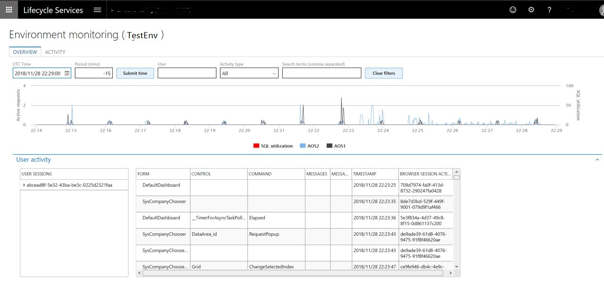

---
# required metadata

title: Diagnose issues with deployments
description: This topic explains how to diagnose issues in an environment on the new infrastructure stack.
author: manado
manager: AnnBe
ms.date: 12/07/2018
ms.topic: article
ms.prod: 
ms.service: dynamics-ax-platform
ms.technology: 

# optional metadata

# ms.search.form: 
# ROBOTS: 
audience: Developer
# ms.devlang: 
ms.reviewer: sericks
ms.search.scope: Operations
# ms.tgt_pltfrm: 
ms.custom: 
ms.search.region: Global
# ms.search.industry: 
ms.author: manado
ms.search.validFrom: 2018-12-31
ms.dyn365.ops.version: 8.1

---

# Diagnose issues with deployments

[!include [banner](../includes/banner.md)]

This topic explains how you can troubleshoot issues on an environment deployed in the new infrastructure stack. When a user reports an issue, you can use various tools in Lifecycle Servcies (LCS) for troubleshooting. The rich set of telemetry data helps you build a storyboard view that shows what that user and other users were doing when the issue was reported.

> [!Note] 
> This topic applies to deployments of Finance and Operations 8.1 and higher.

To navigate to the **Environment Monitoring** dashboard, follow the steps listed below:

1. Open LCS and navigate to the appropriate project.
2. In the **Environments** section, select the environment that you want to view, and then click **Full details**.
3. On the **Environment details** page, click **Environment monitoring** to open the Monitoring and diagnostics portal.

On the Environment Monitoring dashboard, you will see two tabs:

**Overview:**

The Overview tab provides a storyboard view that shows how the environment is being used during a specific period. You can use the filters on this page to narrow the information logs. Here are some of the filters that are available:

  - **Time duration**  – Go back 60 minutes from the selected date and time.
  - **User**  – View a specific user&#39;s activities.
  - **Search terms**  – Create a search that is based on the issue that is being investigated.

In addition, you will also see two sections:

  - The  **User interaction**  chart shows a user&#39;s activities on various machines in the environment and the SQL utilization trend.
  - The  **User activity**  grid shows the various activities that users performed, based on their session timestamp. It shows the           active sessions in the left hand side grid and for each session, it shows the Form:Control:Command and the corresponding timestamp       when the action was taken. You can trace back the exact steps of the user using the information presented in this grid.

**Activity** :

The Activity tab shows a predefined set of queries for advanced troubleshooting. This gives you access to the raw information logs. You can then export the logs to do more advanced analysis. The following types of queries are available:

  - User related errors
  - Slow queries
  - Deadlocks
  - Crashes

> [!IMPORTANT]
> The data shown on the Overview and Activity tabs is retained for only 30 days.

> [!NOTE] 
> The Environment monitoring will also  also include advanced SQL troubleshooting tools to diagnose and mitigate performance issues. This feature is being worked on and will be added shortly. 

