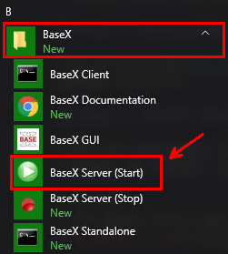

---
# required metadata

title: Installing BaseX for AppChecker
description: AppChecker depends on a running instance of BaseX for storage and querying of ASTs generated by the X++ compiler. This article describes how to install and set up BaseX in a developer environment.
author: AndreasHassing
manager: AnnBe
ms.date: 02/07/2019
ms.topic: article
ms.prod: 
ms.service: dynamics-ax-applications
ms.technology: 

# optional metadata

# ms.search.form:  [Operations AOT form name to tie this topic to]
audience: Developer
# ms.devlang: 
ms.reviewer: [Content Strategist microsoft alias]
ms.search.scope: Operations
# ms.tgt_pltfrm: 
# ms.custom: [used by loc for topics migrated from the wiki]
ms.search.region: Global
# ms.search.industry: 
ms.author: anniels
ms.search.validFrom: 2019-04-30
ms.dyn365.ops.version: Platform update 25

---

# Installing BaseX for AppChecker

[!include [banner](../includes/banner.md)]

AppChecker depends on a running instance of BaseX for storage and querying of abstract syntax trees generated by the X++ compiler. This article describes how to install and set up BaseX in a developer environment.

## Step 1: Prerequisites

* BaseX is a Java-based XML document database. Therefore, a Java Runtime Environment of version 8 or higher is required to run it.

  Before installing BaseX, make sure a Java JRE is installed: [aka.ms/getjava](https://aka.ms/getjava).

## Step 2: Download BaseX

* Go to [BaseX](http://basex.org/download/) and download the latest Windows Installer. At the time of writing the latest version is 9.1.2.

## Step 3: Install BaseX

* Run the executable on the developer machine you'll be compiling your module on.
* Accept the default settings for each step.

> [!TIP]
> The BaseX server data folder can be changed later, if the installation drive does not have enough space. See the [BaseX configuration page](http://docs.basex.org/wiki/Configuration#Database_Directory) for more information.

## Step 4 [Optional]: Configuring BaseX to handle your model

Depending on the size of your model, the BaseX server can take up a lot of memory to store the abstract syntax trees.

BaseX is configured by default to use ~1.17GB of RAM at the most. If you have a large model, you should consider to increase this limit by following the steps below:

* Edit the batch script at: `<BaseX Install Path>\bin\basexhttp.bat`.
* Change the line containing `set BASEX_JVM=-Xmx1200m %BASEX_JVM%` and increase the value after `-Xmx`. [See more about increasing the limits of the Java VM here](https://docs.oracle.com/javase/8/docs/technotes/tools/windows/java.html#BABHDABI).

  Leave everything else untouched.

> [!NOTE]
> If you make changes here after starting the BaseX server, you will need to restart the BaseX server after saving the `basexhttp.bat` file.

## Step 5: Start the BaseX server

* From the Start Menu, run the newly added `BaseX -> BaseX Server (Start)` program.

  

  * If you chose not to create start menu shortcuts, start the server with the following command in the Run prompt:

    ```text
    <BaseX Install Path>\BaseX\bin\basexhttp.bat -S
    ```

* This will start a BaseX server listening on ports `1984/tcp` (API), `8984/tcp` (HTTP API), and `8985/tcp` (Jetty HTTP stop port).

