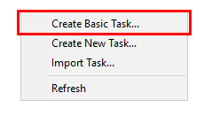
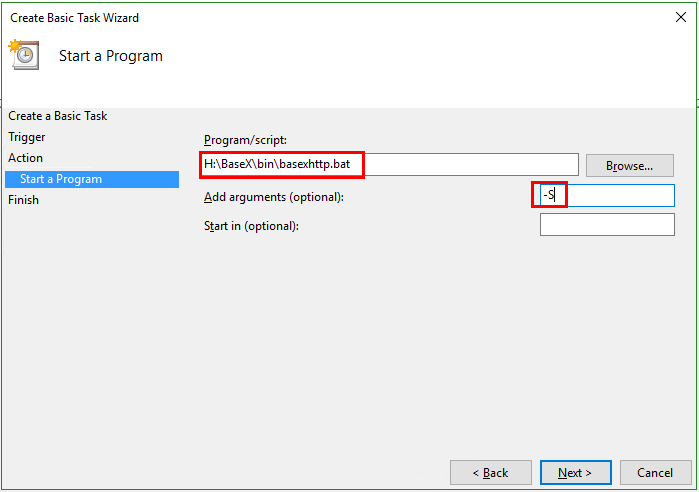

---
# required metadata

title: Install BaseX for AppChecker
description: This topic explains how to install and set up BaseX in a developer environment.
author: AndreasHassing
manager: AnnBe
ms.date: 02/13/2019
ms.topic: article
ms.prod: 
ms.service: dynamics-ax-applications
ms.technology: 

# optional metadata

# ms.search.form:  
audience: Developer
# ms.devlang: 
ms.reviewer: kfend
ms.search.scope: Operations
# ms.tgt_pltfrm: 
# ms.custom: 
ms.search.region: Global
# ms.search.industry: 
ms.author: anniels
ms.search.validFrom: 2019-04-30
ms.dyn365.ops.version: Platform update 25

---

# Install BaseX for AppChecker

[!include [banner](../includes/banner.md)]

[!include [banner](../includes/preview-banner.md)]

AppChecker depends on a running instance of BaseX to store and query abstract syntax trees that the X++ compiler generates. This topic explains how to install and set up BaseX in a developer environment.

The sections of this topic should be completed in the order that they appear in.

## Prerequisites

BaseX is a Java-based XML document database. It requires a Java Runtime Environment (JRE) of version 8 or later. Before you install BaseX, [verify that a JRE is installed](https://aka.ms/getjava).

## Download BaseX

To download BaseX, go to the [BaseX website](http://basex.org/download/), and download the latest version of the Microsoft Windows installer. Currently, the latest version is 9.1.2.

## Install BaseX

Run the executable file on the developer machine where you will compile your module. For each step, accept the default settings.

> [!TIP]
> If the installation drive doesn't have enough space, you can change the folder for BaseX server data later. For more information, see the [BaseX configuration page](http://docs.basex.org/wiki/Configuration#Database_Directory).

## Optional: Configure BaseX to handle your model

Depending on the size of your model, the BaseX server can use lots of memory to store the abstract syntax trees.

By default, BaseX is configured to use a maximum of about 1.17 gigabytes (GB) of random-access memory (RAM). If you have a large model, you should consider increasing this limit by following these steps.

1. Open the batch script at **\<BaseX Install Path\>\\bin\\basexhttp.bat** for editing.
2. Find the line that contains **set BASEX\_JVM=-Xmx1200m %BASEX\_JVM%**, and increase the value after **-Xmx**.

    For more information, see [Non-Standard Options](https://docs.oracle.com/javase/8/docs/technotes/tools/windows/java.html#BABHDABI). This section of the Java documentation explains how increase the limits of the Java virtual machine (VM).

    Leave the rest of the script unchanged.

> [!NOTE]
> If you make changes after you start the BaseX server, you must restart the BaseX server after you save the basexhttp.bat file.

## Start the BaseX server

- If you created shortcuts on the **Start** menu, select the **Start** button, and then select **BaseX** \> **BaseX Server (Start)**.

    

- If you didn't create shortcuts on the **Start** menu, run the following command at a command prompt.

    ```text
    <BaseX Install Path>\BaseX\bin\basexhttp.bat -S
    ```

    This command will start a BaseX server that listens on ports 1984/tcp (API), 8984/tcp (HTTP API), and 8985/tcp (Jetty HTTP stop port).

## Optional: Start the BaseX server at sign-in

You can manually start BaseX when it's required as part of your development process, or you can set it up as a service that starts when Windows starts.

Follow these steps to set up BaseX as a service.

1. Open the **Task Scheduler** tool.

    > [!NOTE]
    > To open the tool, you can run the following command at a command prompt: **control schedtasks**

2. In the **Tasks list** window, right-click, and then select **Create Basic Task** to open the **Create Basic Task** wizard.

    

3. Enter a name for the task, and set the trigger to **When I log on**.
4. Set the action to **Start a program**.

    When you select **Next**, the **Start a Program** page appears.

5. In the **Program/script** field, enter **\<BaseX Install Path\>\\BaseX\\bin\\basexhttp.bat**.
6. In the **Add arguments** field, enter **-S**.

    

7. Complete the wizard.

> [!NOTE]
> The BaseX wiki explains how to use Yet Another Java Service Wrapper (YAJSW) to run BaseX as a service. However, we recommend that you schedule a task at sign-in, for the sake of simplicity.
