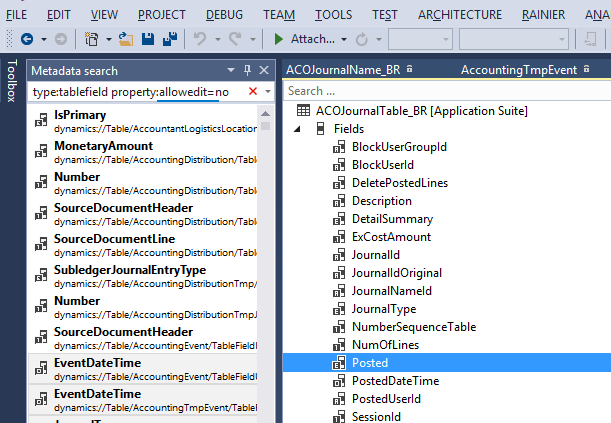
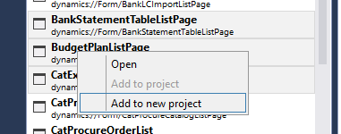
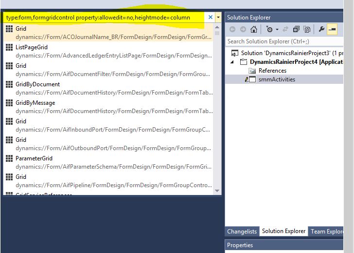

---
# required metadata

title: Metadata search in Visual Studio
description: This article describes how to use metadata search to search your code and metadata for arbitrary patterns and content. 
author: RobinARH
manager: AnnBe
ms.date: 06/20/2017
ms.topic: article
ms.prod: 
ms.service: dynamics-ax-platform
ms.technology: 

# optional metadata

# ms.search.form: 
# ROBOTS: 
audience: Developer
# ms.devlang: 
ms.reviewer: rhaertle
ms.search.scope: Operations
# ms.tgt_pltfrm: 
ms.custom: 83303
ms.assetid: 4d686948-a78d-48fa-bbf8-28da7880eec7
ms.search.region: Global
# ms.search.industry: 
ms.author: robadawy
ms.search.validFrom: 2016-02-28
ms.dyn365.ops.version: AX 7.0.0

---

# Metadata search in Visual Studio

[!include [banner](../includes/banner.md)]

This article describes how to use metadata search to search your code and metadata for arbitrary patterns and content. 

Given the large volume of the code base and metadata, it is often necessary to find things in the code that meet a certain criteria. Often times you may not know the name of the metadata element that contains the pattern or meets the criteria. Metadata search is exposed in Visual Studio through two user interfaces: the Metadata Search tool window and the Navigate To window.

## Metadata search tool window
You can access the Metadata search tool window from the **Dynamics 365 &gt; Metadata Search** menu command. Enter your search query to start the search. Results will start populating in the window asynchronously as you type. You can double-click any result line to navigate to the corresponding X++ code or metadata that matches your search query.   

 

You can also select one or more results, right-click, and then add these elements to a project. You don’t need to wait for the search to complete before you start interacting with the search results. 

## Navigate To window
The **Navigate To** window is invoked using the **Ctrl+‘,’** (the comma character) shortcut keys. Pressing **Ctrl+‘,’** displays the query entry box in top right corner of the Visual Studio main document window. You can also access the **Navigate To** window from the Visual Studio **Edit** menu. Enter you search query and see the results appear as you type. A progress indicator will stop when the search is complete. You don’t need to wait for the search to complete to start interacting with the results. 

## Search query syntax
This section describes the search query syntax and provides example queries.

### Syntax

The search query is a search string that consists of a set of filters in this general form: *&lt;filter\_1&gt;:&lt;filter\_1\_value&gt; \[&lt;filter\_2&gt;:&lt;filter\_2\_value&gt;… \[ &lt;filter\_N&gt;:&lt;filter\_N\_value&gt;\]\]* Where *&lt;filter\_i&gt;* is one of the acceptable filter names, and *&lt;filter\_i\_value&gt;* are comma separated (and possibly quoted) filtering values.

### Filter names

-   **Name**: Filter by element name. This is the default filter, meaning if you just type a filter value, it is assumed to be an element name. Each comma-separated value is an acceptable element name.
-   **Type**: Filter by element type. Each comma-separated value should be the name of an element or sub-element type (root type or subtype) (i.e. table, class, field). Logic of filtering is:

<!-- -->

-   **(roottype\_1 OR roottype\_2 OR … OR roottype\_N) AND (subtype\_1 OR subtype\_2 OR … OR subtype\_N)**

-   **Model**: Filter by model name. Each comma-separated value should be the name of a model in your application.
-   **Property**: Apply property filters. Each comma-separated value should be in the form *property\_name=property\_value*
-   **Code**: Filter using code snippets, use quotes around code snippets. The matching source code is the elements that contain the specified code snippet.

You can get help about using filter and filter syntax by opening the drop-down menu available in the search box.!

[metadatasearchfilter](./media/metadatasearchfilter.jpg)

## Examples

|                               <strong>Query string</strong>                               |                                                        <strong>What it does</strong>                                                         |
|-------------------------------------------------------------------------------------------|----------------------------------------------------------------------------------------------------------------------------------------------|
|                                        TrvExpTable                                        | If the token is by itself, it is assumed to be the name. So this will find everything in the application that has ‘TrvExpTable’ in the name. |
|                                     type:form ccount                                      |                                              Finds all forms that have ‘ccount’ in their names.                                              |
|                         type:form property:formtemplate=listpage                          |                                Finds all forms that contain the property ‘FormTemplate’ equal to ‘ListPage’.                                 |
|              type:table,formDesign property:"WorkflowDataSource=TrvExpTable"              |                                         Finds formDesign nodes under tables, nothing would be found.                                         |
|             type:form,formmenufunctionbuttoncontrol property:Text=@SYS311998              |                       Finds all menu function button controls with the Text property equal to (a label) ‘@SYS311998’.                        |
|                               type:table,method name:insert                               |                                      Finds tables with a method containing ‘insert’ in the method name.                                      |
|                             type:table,tableindex name:Export                             |                                        Finds tables with an index name containing the word ‘Export.’                                         |
|                           type:table,tableindexfield name:xpNum                           |                                          Finds table indexes with ‘xpNum’ in the index field name.                                           |
|                           type:table,tablefieldgroup name:EPNew                           |                                       Finds FieldGroups (in tables) containing ‘EPNew’ in their names.                                       |
|             type:form,formgridcontrol property:allowedit=no,heightmode=column             |                     Finds form grid controls, with properties allowedit equal to ‘no’ and heightmode equal to ‘column’.                      |
| type:form,formtabcontrol property:arrangeMethod=Vertical,ViewEditMode=view,WidthMode=Auto |  Finds form tab controls, with properties arrangeMethod equal to ’Vertical’ and ViewEditMode equal to ‘view’ and WidthMode equal to ‘Auto.'  |
|              type:form,formDesign property:"WorkflowDataSource=TrvExpTable"               |                Finds all forms with the 'WorkflowDataSource" property in the FormDesign node set to the value "TrvExpTable."                 |
|         model:”Application Suite” type:formdesign property:style=simplelistdetail         |            Find all forms in Application Suite model that has the style property set to simpleListDetail in the FormDesign node.             |
|                                    code:”return null”                                     |                                       Finds all places in the source code that contains “return null”.                                       |
|                              code:"element.lock()" type:form                              |                             Finds all places in the forms source code that contain the snippet ‘element.lock()’.                             |
|                               code:"insert" type:table,form                               |                             Finds all places in the source code of either forms or tables that contain ‘insert’.                             |
|                          code:"public display" type:form,method                           |                                        Finds all form methods that contain the code ‘public display’.                                        |
|                           type:formbuttoncontrol property:text=                           |                               Finds all form Button Controls that have <strong>empty</strong> text properties.                               |

