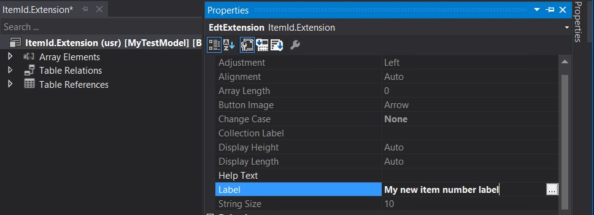
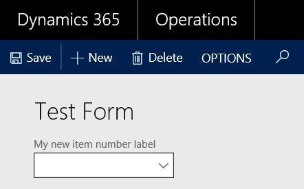
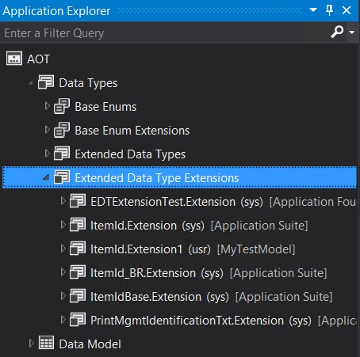

---
# required metadata

title: Modify extended data types (EDTs) through extension
description: You can customize several properties on extended data types (EDTs) by using extensions.
author: ivanv-microsoft
manager: AnnBe
ms.date: 06/07/2018
ms.topic: article
ms.prod: 
ms.service: dynamics-ax-platform
ms.technology: 

# optional metadata

# ms.search.form: 
# ROBOTS: 
audience: Developer
# ms.devlang: 
ms.reviewer: margoc
ms.search.scope: Operations
# ms.tgt_pltfrm: 
ms.custom: 89563
ms.assetid: 
ms.search.region: Global
# ms.search.industry: 
ms.author: ivanv
ms.search.validFrom: 2017-07-01
ms.dyn365.ops.version: Platform update 9
---

# Modify extended data types (EDTs) through extension

[!include [banner](../includes/banner.md)]

There are several properties that can be customized on existing extended data types (EDTs) through extension:
- Label
- Help text
- Form help
- Country region codes
- String size 
    + You can only modify the value if the EDT does not extend from another EDT.
    + You can only set the new String size to a value equal to or larger than the base EDT value.
- Decimals 
    + For more information, see [Extending decimal point presicion for extended data types](decimal-point-precision.md).

You modify the properties as you would for newly added elements, using the property sheet.

 
 
After compiling the code, you can see the changes in the application.

 

You can view the created extensions in the Application Explorer in Visual Studio.

 

## If the EDT is modified in more than one model
If multiple ISVs have extended the same extended data type, the properties of the EDT from the model with the highest Model ID (closest to USR) will be used. If there are multiple models with changes in the same layer, changes from the model with the highest Model ID will be used. For example, if ISV 1 modified the label of ItemId to “Awesome item number” in model AwesomeModel (USR layer) with ID 15, while ISV 2 modified the label of ItemId to “Super item number” in model SuperModel (USR layer) with ID 12, the end user would see “Awesome item number” in the user interface instead of “Item number”.

> Tip:
> Instead of extending an existing EDT, you can create a new one, deriving it from the existing EDT. This allows you to edit more properties than you could edit using the extension approach. This means that you would need to modify the fields using this EDT to use your new EDT.

