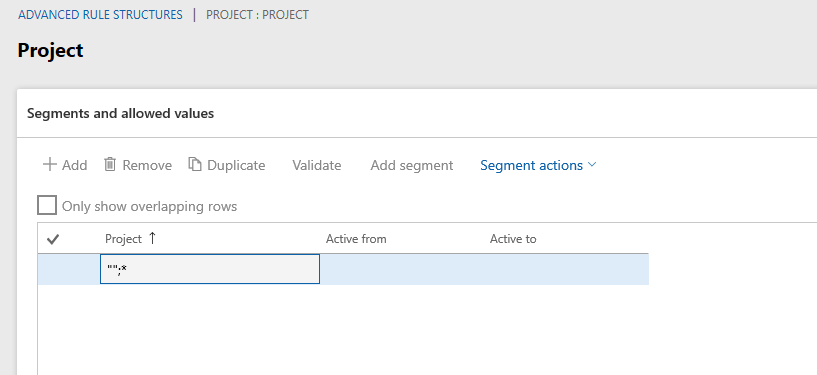

---
# required metadata

title: Dimension defaulting - Part 1 (Financial dimensions discovery)
description: Default dimensions discovery of financial dimensions
author: jasonsto
manager: jdinham
ms.date: 1/16/2019
ms.topic: article
ms.prod: 
ms.service: dynamics-ax-platform
ms.technology: 

# optional metadata

# ms.search.form: 
# ROBOTS: 
audience: Developer
# ms.devlang: 
ms.reviewer:
ms.search.scope: Operations
# ms.tgt_pltfrm: 
ms.custom: 11314
ms.assetid: 20e6b97e-30ed-48d4-b63c-a073f80300b2
ms.search.region: Global
# ms.search.industry: 
ms.author: rbrow
ms.search.validFrom: 2019-01-16
ms.dyn365.ops.version: AX 7.0.0

---

**Introduction**

This series of blog posts describes default dimensions, starting from where the
dimensions originate, the APIs used to merge them, and how they are used to
create a ledger dimension. Examples showing the user interface as well as SQL
table queries with output are included along with some explanation of APIs and
usage examples.

This blog post series includes:

-   Financial dimensions discovery (This post)

-   [Control uptake and storage](dimension-defaulting-part2.md)

-   [Copy patterns](dimension-defaulting-part3.md)

-   [Merging patterns](dimension-defaulting-part4.md)

-   [Ledger dimension creation](dimension-defaulting-part5.md)

-   [Common pattern APIs] (dimension-defaulting-part6.md)

**Default dimension entry**

There are approximately over 250 forms in Microsoft Dynamics 365 for Finance and
Operations that allow the entry of default financial dimensions. They appear in
their own tab page or fast tab and display a list of dimensions with values and
descriptions as shown in Figure 1 below.

 
**Figure 1: Default dimension entry**

In standard demo data, as seen in Figure 2 below, there are over 30 dimensions
listed but only 5 are shown in the example in Figure 1 above. How is the list
filtered down?

 
**Figure 2: Financial dimension list**

The list is determined by starting with the the current company or a specific
company specified on a form. The company context is used to obtain a list of all
active account structures associated with its ledger. Finally, a union of all of
the dimensions in these account structures, plus all active advanced rules
associated with those structures is obtained.

In this example, the demo data company being used is "USMF". Opening the
*Ledger* form (General Ledger \> Setup \> Ledger), it shows that three different
account structures are used by this company as shown in Figure 3 below.

 
**Figure 3: Ledger configuration for company "USMF"**

Selecting the first account structure and clicking the Configure account
structure button shows 3 dimensions are used by that account structure as shown
in Figure 4 below. Selecting the second account structure shows 5 dimensions are
used in that account structure as shown in Figure 5 below.
 
**Figure 4: Balance sheet account structure setup for company "USMF"**
 
**Figure 5: Profit and loss account structure setup for company "USMF"**

Comparing the dimensions from both account structures, there are a total of 4
unique dimensions. Four of these dimensions account for dimensions displaying in
the default dimensions. In addition to these dimensions, dimensions from
advanced rule structures linked to those account structures through advanced
rules are also examined. In this example, it results in a fifth dimension added
to the default entry, Project.

It is also important to note that the MainAccount dimension is not shown in most
default dimension lists. The exception to this is budgeting which does
explicitly include the MainAccount as part of the list of default dimensions.

Figures 6 and 7 below show the advanced rule and structure resulting in the
project dimension being display in the default dimensions.

**Figure 6: Advanced rule linked to the Profit and loss structure**

**Figure 7: The rule structure for Project**

**API for default dimensions list**

The default dimension controller determines which dimensions are applicable for
a company using the *DimensionCache::getDimensionAttributeSetForLedger()* API.
