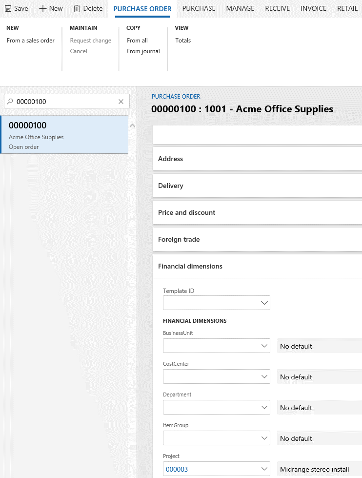

---
# required metadata

title: Dimension defaulting - Part 4 (Merging patterns)
description: Merging patterns for default dimensions
author: jasonsto
manager: jdinham
ms.date: 1/16/2019
ms.topic: article
ms.prod: 
ms.service: dynamics-ax-platform
ms.technology: 

# optional metadata

# ms.search.form: 
# ROBOTS: 
audience: Developer
# ms.devlang: 
ms.reviewer: 
ms.search.scope: Operations
# ms.tgt_pltfrm: 
ms.custom: 11314
ms.assetid: 20e6b97e-30ed-48d4-b63c-a073f80300b2
ms.search.region: Global
# ms.search.industry: 
ms.author: rbrow
ms.search.validFrom: 2019-01-16
ms.dyn365.ops.version: AX 7.0.0

---
**Introduction**

Continuing this series of blog posts, this post covers how default dimensions
are merged between entities.

This blog post series includes:

-   [Financial dimensions discovery](dimension-defaulting-part1.md)

-   [Control uptake and storage](dimension-defaulting-part2.md)

-   [Copy patterns](dimension-defaulting-part3.md)

-   Merging patterns (This post)

-   [Ledger dimension creation](dimension-defaulting-part5.md)

-   [Common pattern APIs] (dimension-defaulting-part6.md)

**Default dimension merging**

Figure 1 below shows the user manually cleared the BusinessUnit dimension on the
line, which in turn creates a new default dimension foreign key and updates the
purchase order header.  Since the header has not yet been saved this updated
foreign key is only visible on the table buffer in memory, but the new default
dimension can be queried and found as shown in Figure 2 below. 

**Figure 1: Default dimension modified on a document line (Purchase order
line)**

**Figure 2: SQL query and output showing updated default dimensions**

Next, consider the item that the user will enter on the purchase order line. 
Figures 3 and 4 below show default financial dimensions on the released product
and the SQL query and result for that default dimension in the database.

**Figure 3: Default dimensions on an item**

**Figure 4: SQL query and output showing default dimensions on item record**

Next, the user enters the item on the purchase order line.  Figures 5 below
shows the item selected on the purchase order line and the resulting default
dimensions. In this case, the default dimension values were merged by the
purchase order logic.

**Figure 5: Resulting default dimensions on a purchase order line**

**Figure 6: SQL query and output showing default dimensions from item record on the purchase order line**

The purchase order logic merges the default dimensions from 3 different sources
when the item is specified for a purchase order line as shown in Figure 7 below.

Order header default dimensions merged with the order line default dimensions =
merged result 1 default dimensions

Item default dimensions merged with merged result 1 = final order line default
dimensions (merged result 2)

**Figure 7: Merging steps taken**

The tables in Figure 7 show the logical steps of  the merging that is occurring.
 However, these steps are combined during execution using the APIs provided by
the dimensions framework. Figure 8 below shows the code needed to do all of the
merging of the dimensions from the 3 sources shown above.

**Figure 8: Code used to merge the three sets of default dimensions**
