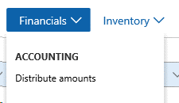
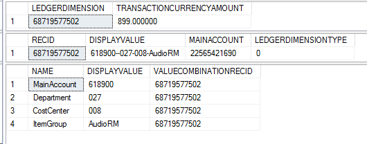

---
# required metadata

title: Dimension defaulting - Part 5 (Ledger dimension creation)
description: Ledger dimension creation with default dimensions
author: jasonsto
manager: jdinham
ms.date: 1/16/2019
ms.topic: article
ms.prod: 
ms.service: dynamics-ax-platform
ms.technology: 

# optional metadata

# ms.search.form: 
# ROBOTS: 
audience: Developer
# ms.devlang: 
ms.reviewer: 
ms.search.scope: Operations
# ms.tgt_pltfrm: 
ms.custom: 11314
ms.assetid: 20e6b97e-30ed-48d4-b63c-a073f80300b2
ms.search.region: Global
# ms.search.industry: 
ms.author: rbrow
ms.search.validFrom: 2019-01-16
ms.dyn365.ops.version: AX 7.0.0

---
**Introduction**

Continuing this series of blog posts, this post covers how default dimensions
can be merged to create new ledger dimensions.

This blog post series includes:

-   [Financial dimensions discovery](dimension-defaulting-part1.md)

-   [Control uptake and storage](dimension-defaulting-part2.md)

-   [Copy patterns](dimension-defaulting-part3.md)

-   [Merging patterns](dimension-defaulting-part4.md)

-   Ledger dimension creation (This post)

-   [Common pattern APIs] (dimension-defaulting-part6.md)

**Ledger dimension creation**

Default dimensions exist as a way to provide values that later will be used to
create ledger account combinations used in journals and accounting
distributions. Default dimensions provide the dimensions other than MainAccount
needed for a ledger account combination, and can be combined with a default
account, or another ledger dimension in order to produce one.  As defined in the
[Ledger account combinations series of blog
posts](http://blogs.msdn.com/b/ax_gfm_framework_team_blog/archive/2013/02/15/ledger-account-combinations-part-5-_2800_ledger-dimensions_2900_-.aspx),
a ledger account combination is just a set of MainAccount and dimension values
with structure and order applied.

 

 
**Figure 1: Accounting distributions from the purchase order line**

As shown in Figure 1 above, choosing the Financials-\>Distribute amounts option
from the purchase order line the accounting distributions form opens. It already
has a ledger account combination defaulted “618900--027-008-AudioRM”. From the
previous blog post the values for the Project, CostCenter, ItemGroup and
Department dimensions have been populated and a MainAccount defaulted from the
posting item group on the item, as the Purchase expenditure for expense account
for a purchase order as shown in Figure 2 below. The reason project is not shown
is because it is not a part of the applicable account structure.

 
 
**Figure 2: Source of a default (main) account for the item on the purchase
order line**

 
 
**Figure 3: SQL query and results showing default account source**

The code required to merge the default dimension on the purchase order line with
the default account from the item group is shown in Figure 4 below. 

 
**Figure 4: Code used to merge the default dimension with a default account**

Similar to merging default dimensions, once merged, a newledger account
combination is created as shown in the query in Figure 5 below:

 
**Figure 5: SQL query and results showing merged default account and default
dimension**
