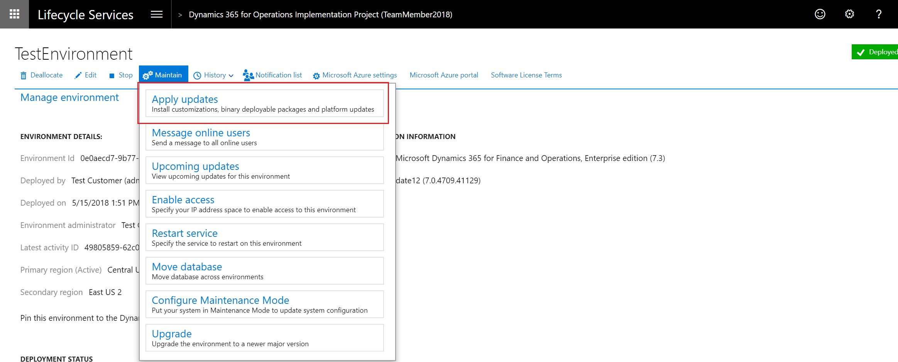
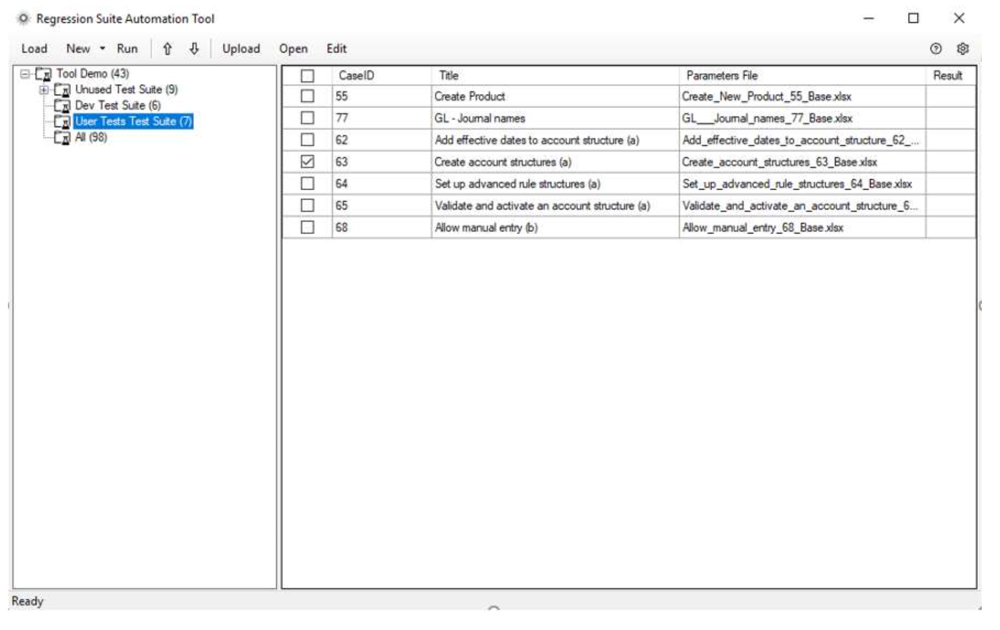

---
# required metadata

title: One Version overview
description: This topic gives an overview of the different experiences that encompass One Version.
author: meeram
manager: AnnBe
ms.date: 03/07/2019
ms.topic: article
ms.prod: 
ms.service: dynamics-ax-applications
ms.technology: 

# optional metadata

# ms.search.form: 
# ROBOTS: 
audience: Developer, IT Pro
# ms.devlang: 
ms.reviewer: sericks
ms.search.scope: Operations
# ms.tgt_pltfrm: 
# ms.custom: 
ms.search.region: Global
# ms.search.industry: 
ms.author: manado
ms.search.validFrom: 2019-3-31 
ms.dyn365.ops.version: Platform update 24 

---

# One Version overview

[!include [banner](../includes/banner.md)]

[!include [banner](../includes/coming-soon.md)]

The following set of topics provides information that is related to service updates for Microsoft Dynamics 365 for Finance and Operations **version 8.1 (October 2018) and later** for the cloud releases.

- [Standard and First release service updates](../../fin-and-ops/get-started/public-preview-releases.md) – This topic provides information about the release cadence and release process.
- [Software lifecycle policy and cloud releases](../migration-upgrade/versions-update-policy.md) – This topic provides information about the service updates, availability, and end of service.
- [One Version service updates FAQ](../../fin-and-ops/get-started/one-version.md) – This topic answers questions about the update process, tools, planning, and Retail service updates.

The experience for service updates consists of four distinct steps: 

1. Onboard
2. Notify
3. Execute
4. Validate

The rest of this topic describes each step and provides links to related topics.

## Onboard

Customers can select a maintenance window, based on their business constraints. In Microsoft Dynamics Lifecycle Services (LCS), use the fields in the **Production environment update cadence** section on the **Update settings** tab of the **Project settings** page, as shown in the following image. A calendar of upcoming updates is available to help you plan ahead.

Users must opt in to new features and turn them on. All updates are applied first to the user acceptance testing (UAT) environment and then to the production environment. Therefore, customers have time to do any validation that is required. Customers can select the environment that is updated. They can also pause an update for up to three months.

## Notify

[Release notes](https://docs.microsoft.com/business-applications-release-notes/april19/dynamics365-finance-operations/) will be available to help you plan ahead and understand what is changing. You can learn about upcoming features up to three months in advance. The [What's new](https://docs.microsoft.com/dynamics365/unified-operations/fin-and-ops/get-started/whats-new-changed) topics provide details about the updates for specific months.

Additionally, a notification email will be sent five days in advance, and a notification will appear in LCS just before an update, as shown in the following illustration.

## Execute

After notifications have been sent, Microsoft will apply the update (**auto update**) during the designated maintenance window. After this operation is completed, a notification email will be sent to indicate the status of the update. Customers will also be able to **self-update** by using the standard update experience in LCS. For more information, see [Apply updates to cloud environments](../deployment/apply-deployable-package-system.md). 

Customers who participate in the First release program will have an opportunity to update their sandbox environment and other environments early through [http://experience.dynamics.com](http://experience.dynamics.com).

## Validate

After an update is completed in the UAT environment, a basic business process test validation can be completed. To support this effort, a no-code automation test tool for business process testing is available. For more information, see [Create user acceptance test libraries by using task recordings and BPM](using-task-guides-and-bpm-to-create-user-acceptance-tests.md). 

Some customers have both external data integrations and internal data integrations. We recommend that these customers use the [Data task automation tool](../data-entities/data-task-automation.md) for testing.

