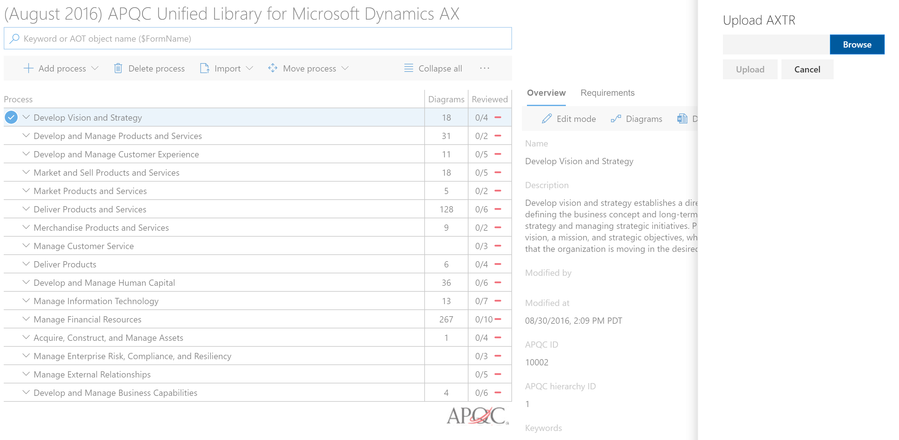
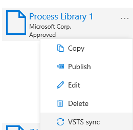
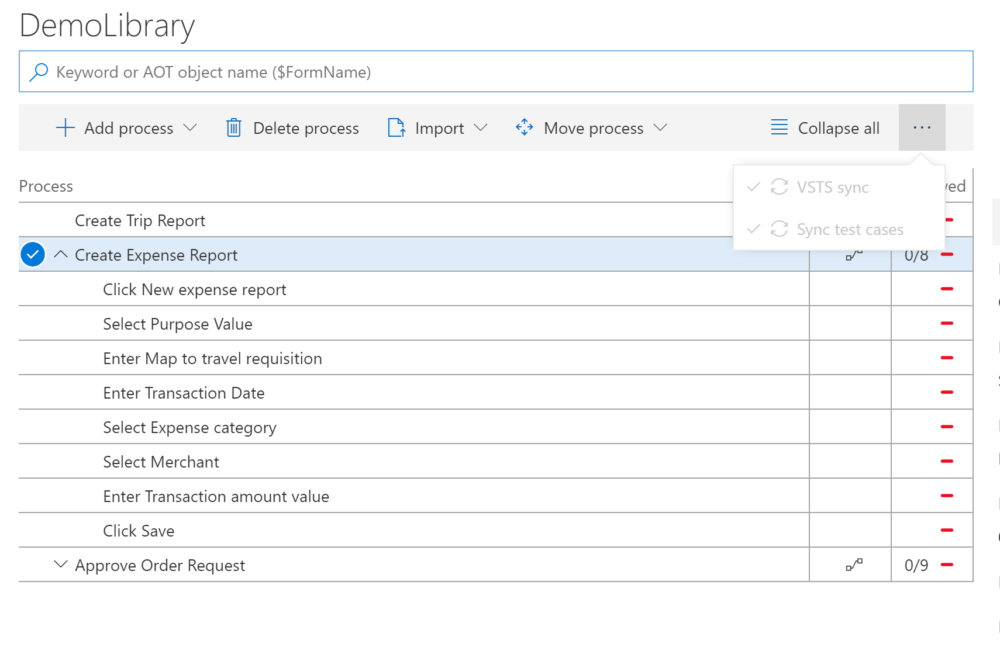
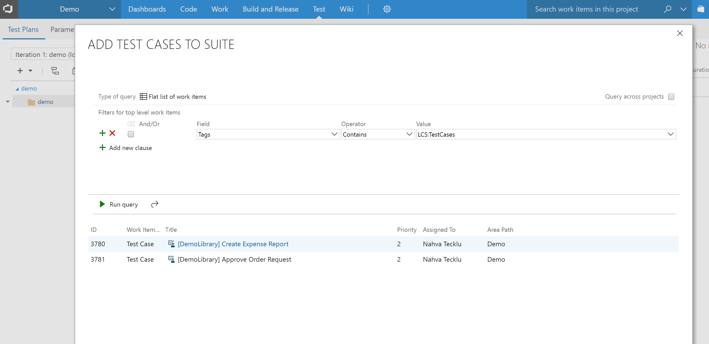

# Create and automate user acceptance tests

[!include [banner](../includes/banner.md)]

You can use Task recorder and Business process modeler (BPM) to create user acceptance test libraries. Task recorder is a powerful tool to record test cases and organize them by business process using BPM. As a Microsoft partner you can use BPM to distribute test libraries to your customers via LCS and LCS solutions. If you are a customer, use BPM to author and distribute test libraries across different projects and team.
Since BPM can be synchronized with Azure DevOps (formerly known as Visual Studio Team Services), you can automatically create test cases (including test steps) in your Azure DevOps project. Azure DevOps can then serve as your test configuration and test management tool where you can create targeted test plans and test suites, manage the execution of tests and investigate results.  

This topic walks through the process of creating and executing acceptance test suites to be used for manual or automated testing.

## Create a Scenario Acceptance Testing BPM library
BPM is a great LCS tool to describe a hierarchy of business processes and user tasks. LCS also allows Microsoft partners and customers to author and distribute BPM libraries across LCS projects via the Asset library. This section describes how to take advantage of BPM to define your acceptance test library.

### Create a BPM library
There are several ways to create a Business process modeler (BPM) library. For more information about how to create libraries in BPM, see [Create, edit, and browse BPM libraries](creating-editing-browsing.md).

For illustration purposes, this topic uses a library that contains common business processes such as Create expense report and Approve order requests. The library was created by using the Excel import functionality.  

### Record test cases and save to BPM 

After you have created a BPM library, you'll need to use Task recorder to create your test cases and then upload the cases to BPM. There are several ways to do this. 

If you're using a BPM library that already has all of the necessary task recordings (test cases) attached, you can skip this step. Otherwise, follow the instructions below to create new task recordings.

#### Create and save a new task recording
1. Open the client and sign in. 
2. Select the company that you want to use while recording.
3. Go to **Settings** > **Task recorder**.

4. Click **Create a new recording**.
5. Enter a name for the recording, and then click **Start**. Recording begins the moment that you click **Start**.
6. When the recording is complete, in the Task recorder pane, click **Stop**.
7. To save the task recording to an attached BPM, click **Save to Lifecycle Services**.

8. Select the library that you want to save the recording to, and then click **Save**. Otherwise, select **Save to Disk** and follow the steps in the next section, "Upload an AXTR file to BPM."

 >[!NOTE]
 > To enable the effective execution of your tests using automation tools, make sure all of your task recordings start on the main dashboard of Dynamics 365 for Finance and Operations.
 > For end-to-end processes that are performed by more than one user, we recommend that you divide your task recordings into user-specific tasks. This simplifies the maintenance of test cases and allows you to execute test cases in the context of security roles, which is a best a practice. 

#### Upload an AXTR file to BPM
If you have saved your recordings (AXTR files) to disk, follow these steps to upload them to BPM.

1. In Lifecycle Services (LCS), in your project, on the **Business process libraries** page, select the library to upload the task recording to.
2. Click **Author and edit** and in the lines, locate and select the process to upload the task recording to.
3. In the right pane, click **Upload**. 

4. Click **Browse** to find and select the file to upload, and then click **Upload**.

#### Save an existing task recording to BPM
1. To attach an existing task recording, sign in to the client.
2. Go to **Settings** > **Task recorder**.
3. Select **Edit Task Recording** and attach the file by either saving directly to LCS or downloading the AXTR and then uploading to BPM.

### Guidelines for recording test cases

Follow these guidelines when authoring and recording your test cases, especially if you are planning to automate test execution.
The process and tools described in this article apply to business process acceptance tests. They are not meant to replace component and unit testing that is typically owned by developers.

- Author a limited number of test cases that, when combined, cover complete end-to-end processes.
- Focus on business processes that have been customized.
- An individual test case (recording) should cover one or two business tasks only, typically executed by one person. This simplifies task recording maintenance. Do not combine a complete end-to-end business process such as "Procure to Pay" or "Order to Cash" into one large task recording. For example, instead of having RFQ > Purchase Order > Product Receipt > Vendor Invoice > Vendor Payment as one test case, divide the process into three or four test cases. You will have the opportunity to combine these tests into an ordered test suite later.
- A test case should have at least one validation. Try to validate critical fields that cover the impact of other fields. For example: Validation of totals on sales or purchase orders cover the unit price/quantity/discount/tax ...etc.
- Avoid printing a report in a test case. If a test case needs to print a report, it should be selected on screen.
- 80+% of test cases should be of transactions or source documents. Master data should be limited to up to 20% of test cases only.

## Synchronize and configure your test plan in Azure DevOps

An acceptance test library is your starting point. It typically contains all test cases (task recordings) of a particular application organized by business process. During a particular test pass, you usually do not need to execute all test cases. What test cases you select depends on the phase of your implementation or the nature of the update you are planning to apply to your production environment. Azure DevOps enables you to organize your test cases in test plans and test suites. A test plan contains one or more test suites (A subset of your test library); test cases can belong to more than one test suite.

Once you have selected your acceptance testing BPM library, synchronize it with Azure DevOps and create your test plan and test suites.

### Sync with Azure DevOps
Synchronize your BPM library with your Azure DevOps project. For more information, see [Configure your LCS project and connect to LCS](synchronize-bpm-vsts.md#configure-your-lcs-project-to-connect-to-azure-devops). 

After configuration is complete, synchronize the BPM library with a Azure DevOps project.
1. On the **Business process libraries** page, on the tile for the library that you want to synchronize, select the ellipsis button (…), and then select **Azure DevOps sync**.

You can also start Azure DevOps synchronization from the toolbar in a BPM library. Select the ellipsis button (…), and then select **Azure DevOps sync**.

2. After Azure DevOps synchronization is complete, select the ellipsis button (…), and then select **Sync test cases**.

3. When this step is complete, your task recordings will become test cases in Azure DevOps and a link will appear under the **Requirements** tab. 

In addition to the test steps, the task recording XML file is attached to the Azure DevOps test case. This file will be needed if you want to automate test execution. 

### Create a test suite in Azure DevOps
Next, you will need to create a test plan and test suite in Azure DevOps. This will allow you to execute an ordered suite of test cases and easily manage, investigate, and track the results. 

1. Sign in to Azure DevOps and select the project and test plan that you want to test in. 
2. On the toolbar, select **Test** > **Test Plans**.
3. In the left pane, select **+**, and then select **Static suite**. 
4. Enter a name for the suite.
5. Click **Add existing** and query the tag **LCS:Test Cases**.
6. Click **Run** > **Add test cases**.

 
7. Select the test case to view details and the attached XML file.   

 >[!NOTE]
 > This example shows how to create one comprehensive acceptance test suite with all test cases added. Instead, you should create various test suites under the same test plan and then use custom queries to add specific test cases to a test suite. A test case can belong to more than one test suite.

## Execute your tests

### Run manual test cases
After you have a test suite, you are ready to use it for regression testing after updates have been made to your Dynamics 365 for Finance and Operations application in a sandbox or test environment. You can run the test cases in your test suite manually or play the task recordings that are part of the test suite and use Azure DevOps to mark the test cases as passed or failed.

Azure DevOps also provides a tool, **Test Runner**, to manage manual test case execution. For more information about using Test Runner, see [Run manual tests](https://docs.microsoft.com/vsts/manual-test/getting-started/run-manual-tests).

We recommend that you take advantage of Azure DevOps as it provides a rich set of management features not only for testing, but result management and mitigation.

### Run automated test cases

The Dynamics 365 Finance and Operations platform provides developers with tools to author test cases based on task recordings and use Azure DevOps to manage the automated execution of these test cases. 

Developers can use the build and test automation capabilities of **build and test** environments. For details, see the [Continuous delivery home page](../dev-tools/continuous-delivery-home-page.md).

Functional power users can automate the execution of their test cases using the **Regression suite automation tool**. For more information, [download the tool](https://www.microsoft.com/download/details.aspx?id=57357) and read the [Regression suite automation tool documentation](../perf-test/rsat/rsat-overview.md).

To learn more about using the Regression suite automation tool, see the following:

- [-	PART 1: Regression Suite Automation Tool -- Background & Setup](https://infopedia.eventbuilder.com/event?eventid=j5m3w4&source=Dynamics_365_for_Operations_-_FastTrack_Tech_Talks)
- [-	PART 2: Regression Suite Automation Tool -- Testing Lifecycle Demo](https://infopedia.eventbuilder.com/event?eventid=r5j6c1&source=Dynamics_365_for_Operations_-_FastTrack_Tech_Talks)
-  [Regression suite automation tool documentation](../perf-test/rsat/rsat-overview.md)
 
For a hands-on lab experience, see the following topics:

- [Set up and install Regression suite automation tool](../../fin-and-ops/get-started/hol-set-up-regression-suite-automation-tool.md)
- [Use Regression suite automation tool](../../fin-and-ops/get-started/hol-use-regression-suite-automation-tool.md)

#### Investigate test runs
Once an automated run is complete, on the Azure DevOps toolbar, select **Test > Runs** (or **Test Plans > Runs**) to investigate your test run. Select the desired test run to investigate test case failures and errors. You can also go to your test suite in Azure DevOps to see the latest results associated with your test cases.
For more information on testing and test management in Azure DevOps, see the [Azure DevOps documentation](https://docs.microsoft.com/azure/devops).

