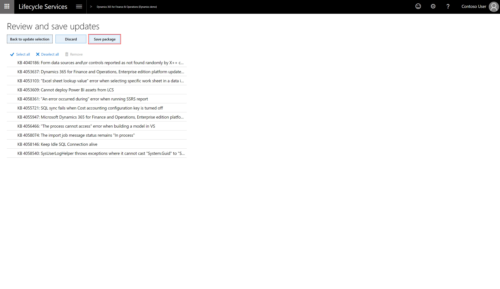
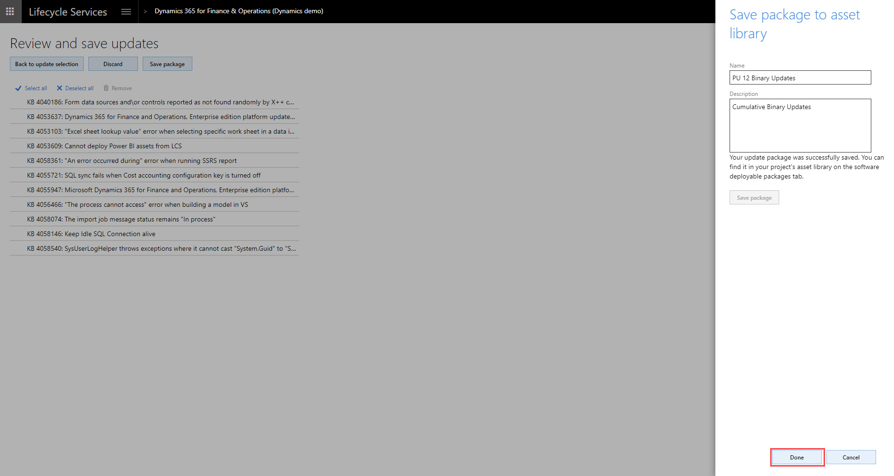
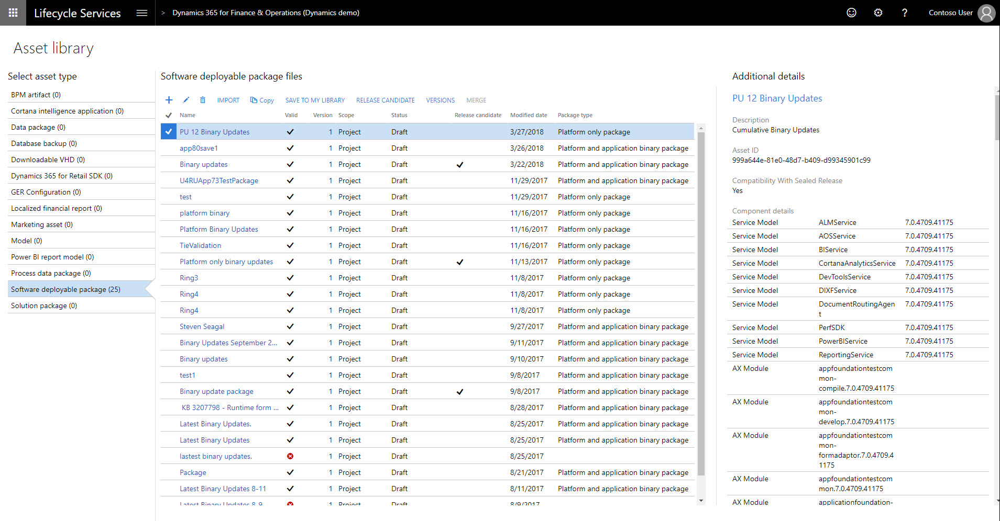
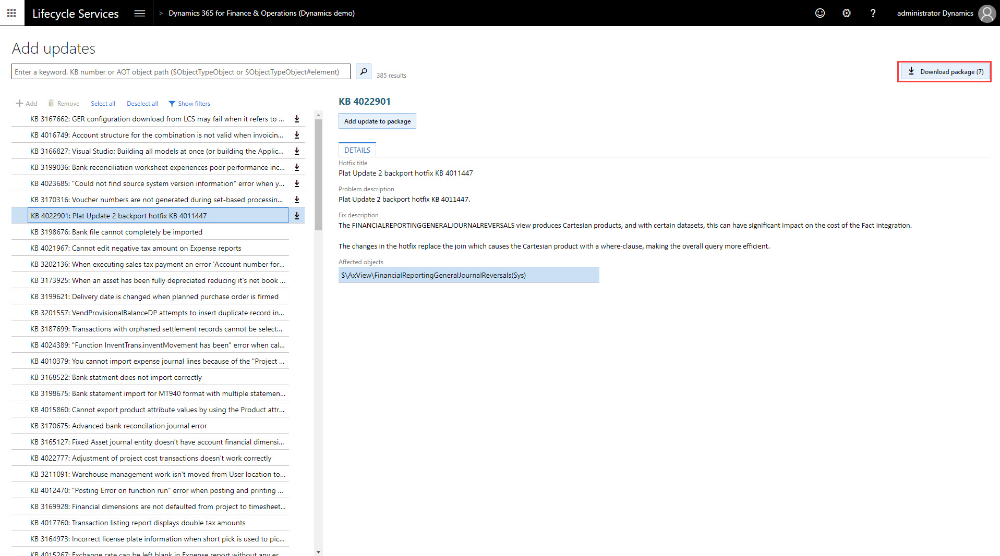

---
# required metadata

title: Download updates from Lifecycle Services (LCS)
description: This topic covers what updates you should expect to see and how you can get the updates from Lifecycle Services (LCS).
author: AngelMarshall
manager: AnnBe
ms.date: 07/03/2019
ms.topic: article
ms.prod: 
ms.service: dynamics-ax-platform
ms.technology: 

# optional metadata

# ms.search.form: 
# ROBOTS: 
audience: Developer
# ms.devlang: 
ms.reviewer: sericks
ms.search.scope: Operations
# ms.tgt_pltfrm: 
ms.custom: 56171
ms.assetid: 61069cf2-6c3f-4ebc-bbee-b21b1c99626a
ms.search.region: Global
# ms.search.industry: 
ms.author: amarshall
ms.search.validFrom: 2016-02-28
ms.dyn365.ops.version: AX 7.0.0

---

# Get updates from Lifecycle Services (LCS)

[!include [banner](../includes/banner.md)]

This topic covers what updates you should expect to see and how you can get the latest updates using Lifecycle Services (LCS).

## Get updates

To view available updates:
1. Sign in to LCS using your credentials.
2. In the LCS project, select an environment.
3. On the **Environment** page, scroll down to see the **Available updates**.

## Types of updates

- **Binary updates** are pre-compiled and cumulative. Every subsequent binary update includes all previous updates. These updates don't have to be compiled in a development environment, and they can be applied directly to a non-development environment from LCS.
        
    If you're running an environment that has Retail functionality and a customized instance of Cloud point of sale (POS), you must complete the additional steps that are listed under Retail SDK packaging. For Microsoft Dynamics 365 for Retail, all updates, even updates for application models, are released as binary updates.    
    
    For all versions of Microsoft Dynamics 365 for Retail, and Microsoft Dynamics 365 for Finance and Operations version 8.1 and later, all updates, including updates for application models, are released as binary updates.

- **X++ updates** include updates to specific application functionality in application models. These updates can be independently downloaded and applied. You can select specific X++ updates to apply to your environment. Dependent X++ updates are automatically selected and downloaded. Any X++ updates are source code updates, before they can be applied to a non-development environment, they must be compiled in a developer environment and merged with any customizations. X++ updates apply only to Microsoft Dynamics 365 for Finance and Operations version 8.0 and earlier. 

## Update option by product and version
Based on your product and version, you will have different update options from Lifecycle Services.  

### Dynamics 365 for Retail 
- **Application version 8.0 and earlier** - There will be a single tile that is a cumulative, combined binary update of all the application and platform changes.

- **Application version 8.1 and later** - This includes the same update options as Dynamics 365 for Finance and Operations for version 8.1 and later, as described in the following section.

### Dynamics 365 for Finance and Operations
- **Application version 8.1 and later** - All updates for version 8.1 and later will be a cumulative, combined binary update of all of the application and platform updates. There will be no granular X++ updates starting with this release.  

     Based on your environment version and the [service update availability](../fin-and-ops/get-started/public-preview-releases.md), you will have the option to choose the updates available to your environment. Each update option is associated with a version number and a build number.  

    You may see one or more of the following update options. 

   | Update        | Description           | Availability  |
   | ------------- |-------------| -----|
   | Quality update      | A quality update is a cumulative, roll-up build that contains fixes for issues that are specific to the    product version that you’re currently running. | A quality update is available when your environment is running the same version of the current service update (n), or when your environment is running on one version older than the current service update (n-1). For example, if the current service update is version 10.0.2, you will have the option to choose a quality update if you’re running version 10.0.2, or if you’re running one version older, which is 10.0.1.  There will be no quality update available for any version that’s older than 2 versions of the current service update. You will have to apply the latest service update to stay current. |
   | Service update     | A service update is the version currently automatically applied to customer environments based on the LCS project update settings.  A service update is a cumulative, roll-up build that contains new features, functionality, and the related quality update that is generally available. | A service update is available if your environment has not been updated to the current service update version available for auto-update.  Only the designated sandbox or production environment will be auto-updated if you have configured the update settings for the LCS project. However, you can manually apply the current service update version to other sandbox environments or your cloud-hosted environments.|
   | Upcoming service update | An upcoming service update is the latest version that is generally available for self-update.  An upcoming service update is a cumulative, roll-up build that contains new features, functionality, and the related quality update that is generally available. | An upcoming service update will be made generally available for self-deployment approximately 2 weeks prior to when Microsoft starts automatically applying this version based on your update settings for the LCS project.|

- **Application version 7.x or 8.0 with Platform update 4 or later** - This release will still have the granular X++ updates. Starting with Platform update 4, no overlayering is allowed on the platform modules, which means that the **Platform binary updates** tile is available to provide the platform updates as a cumulative update.
 
   For customers that are on this combination, you will see the following tiles: 
   1. **All X++ updates** - This tile shows all the granular X++ updates released by Microsoft. 
        
   2. **Critical X++ updates** - This tile shows recommended KBs that are based on the telemetry data in your production environment. This tile will only show Production environments and a subset of the updates shown under the **All X++ updates** tile that are recommended for your environments. 
        
   3. **All binary updates** - This tile shows a combined cumulative binary update for both the Application and Platform.
        
   4. **Platform binary updates** - This tile shows only the Platform binary updates. If you want to update only the platform, you can get the update from this tile. 

- **Application version 7.x with Platform update 3 or earlier** - 
   For customers that are on this combination, you will see 3 tiles: **All X++ updates**, **Critical X++ updates**, and **All binary updates**. Because this release platform can still be overlayered, there is no **Platform binary updates** tile.
   
    > [!NOTE]
    > If you are on this release, you need to upgrade as soon as possible. 

  
## Download binary updates
To download binary updates, follow these steps in LCS.

1. Select any of the binary update options, including Quality update, Service update, All binary updates, and Platform binary updates to view the combined list of application and platform binary updates. 
  
2. On the **Binary updates** page, select **Save package**.
   
   > [!NOTE]
   > You will not be able to select KBs to be saved because binary updates will automatically save all KBs in an update package.        
   
   

3. On the **Review and save updates** page, select **Save package**.

   

4. In the **Save package to asset library**, enter the **Name** and **Description**, and select **Save package**.

   

5. Select **Done** to return to environment page.

   
 
6. You'll see the saved binary package in the asset library. 

   

## Download X++ updates
To download X++ updates, follow these steps in LCS. 

1. Select the **All X++ updates** tile to view the list of available application updates for an environment, or select the **Critical X++ updates** tile for the application updates that are recommended for your production environment. 

      
  
2. On the **Add updates** page, select the applicable Knowledge Base (KB) numbers, and then select **Add** to add selected KBs to the download package.

    

    > [!NOTE]
    > For X++ updates, you can download all available updates at this point. Click **Select all**, and then click **Add** to add all KBs to the download package.

3. Select **Download package**.

    

4. On the **Review and download hotfixes** page, you can review the hotfixes that you selected, discard the package, return to the hotfix selections, or download the final hotfix package.

    
    
5. Download the package, and select **Done**.
    
    

## Additional resources
- [Apply updates to a cloud environment](../deployment/apply-deployable-package-system.md)
- [Install a metadata hotfix](./install-metadata-hotfix-package.md) 
