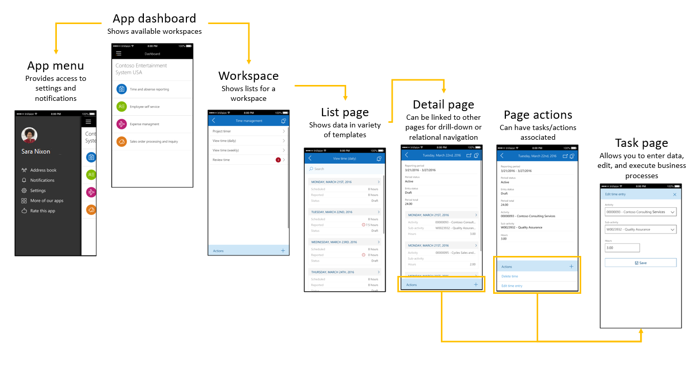
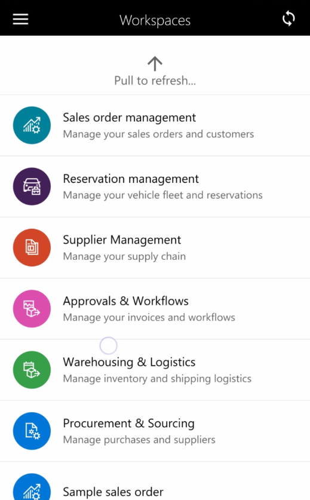
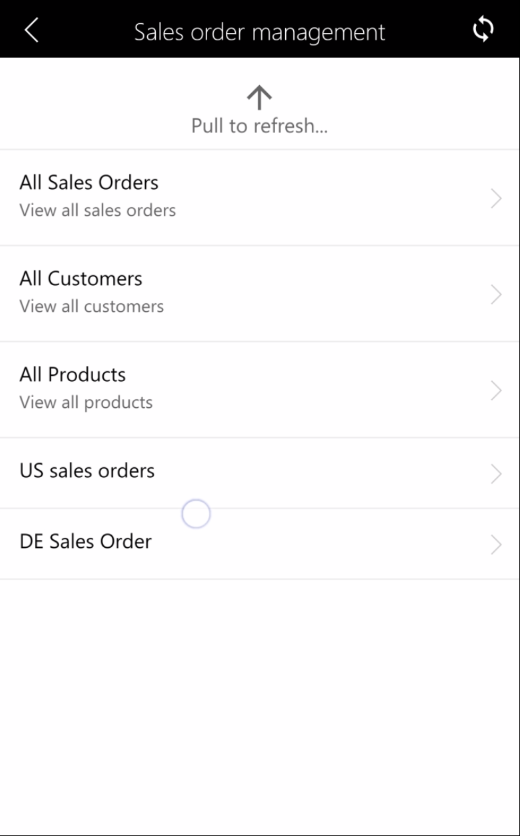

---
# required metadata

title: Architecture and design considerations for the mobile platform
description: This topic provides in-depth information on designing mobile apps.
author: makhabaz
manager: AnnBe
ms.date: 07/01/2017
ms.topic: article
ms.prod: 
ms.service: dynamics-ax-platform
ms.technology: 

# optional metadata

# ms.search.form: 
# ROBOTS: 
audience: Developer, IT Pro
# ms.devlang: 
ms.reviewer: sericks
ms.search.scope: Operations
# ms.tgt_pltfrm: 
ms.custom: 255544
ms.assetid: 
ms.search.region: Global
# ms.search.industry: 
ms.author: makhabaz
ms.search.validFrom: 2016-11-30
ms.dyn365.ops.version: Platform update 3

---

# Architecture and design considerations for the mobile platform

[!include [banner](../../includes/banner.md)]

The mobile app communicates with Application Object Server (AOS) to get the metadata for the mobile workspaces (and the pages and the fields that appear on the page), and to get the data for the fields on the pages. Each time that the mobile app requests data for a page, AOS creates a new session that uses the context of the user who is using the mobile app. AOS then uses the user's context to open the corresponding forms (by using the corresponding menu items). AOS can open multiple forms in quick succession and perform actions on those forms (for example, filtering, opening FactBoxes, changing tab pages, and clicking buttons). Any business logic on the forms is also run as usual. Through that process, AOS collects the data values from the requested fields and then sends that data back to the mobile app. 

The mobile app platform doesn't assume connectivity to Finance and Operations. Activities such as navigation, data view, and data entry don't require server connectivity after data has been cached.

## Understanding navigation in the mobile app
Navigation in the mobile app consists of four simple concepts: the dashboard, workspaces, pages, and actions. 

-   When you start the app, you land on the **dashboard**. On the **dashboard**, you can see a list of **workspaces** that are published in your Finance and Operations environment.
-   In each **workspace**, you can see a list of **pages** that are available for that workspace.
-   On a **page**, you can view data that is collected from one or more Finance and Operations forms.
-   From a **page**, you can navigate to other **pages** for related data, such as an entity details or lines.
-   On a **page**, you can see a list of **actions** that are available for that page.
-   **Actions** let you create or edit existing data.

### Notes

At any time, you can pull-to-refresh in the mobile app to make the mobile app update its data or metadata. After you edit an existing workspace or publish a workspace, be sure to pull-to-refresh in the mobile app, in either the list of workspaces (if you added a workspace or business logic) or the list of pages (if you modified a page or an action). Workspaces that have been published to Finance and Operations are visible to all users. In Microsoft Dynamics 365 for Finance and Operations platform update 3, menu item security automatically hides pages that the user doesn’t have access to. If a user doesn’t have access to any pages in a workspace, the workspace itself is hidden.

## Using the mobile app designer
The mobile app designer lets you select the specific data fields from forms that should appear in the mobile app. 

**A mobile workspace can be created through designer, using X++ attribute APIs or a combination of both. See [Workspace class overview](scenarios/mobile-workspace-configuration.md) for more details on using X++ APIs for building a mobile workspace.**

1.  Open the Finance and Operations client. 
2.  Go to **Settings** &gt; **Mobile app**.
3.  Create a new workspace, or select an existing workspace to edit.
4.  Specify the name of the workspace, an icon, and a color.
5.  Add pages to the workspace, or edit an existing page.
6.  Specify the name of the page.
7.  Click **Select Fields** to select the data fields to add to the page.
8.  Open the forms that have the data fields that you want to add, and then click the yellow plus sign (+) that appears next to the fields. The fields are added in the order that you select them in. You can add fields from multiple forms, in any order.
9.  When you've finished selecting fields, click **Done**.
10. If you've added a field list to the page, you will see that the **List** type is specified for one of the items in the field list. You can optionally add a details page for items in that list by following these steps:
    1.  Select the list by clicking on it in the designer.
    2.  Click **Add details page**.
    3.  Repeat steps 6 through 10 as you require.

### Refreshing the app after you make changes

| Type of change     | Description                      |
|-------|----------------------------------------------|
| New workspaces, deleted workspaces, or changes to the name, color, or icon of a workspace | Pull-to-refresh from the main landing page (dashboard) of the app, where you see the list of workspaces.  |
| All other changes (new or changed pages or actions, or changes to business logic)         | Pull-to-refresh from the workspace that has the edited pages or actions.                                              |

### Additional resources

[Page design guidelines](page-design-guidelines.md)

[Action design guidelines](action-design-guidelines.md)

[Form design requirements](form-design-requirements.md)
