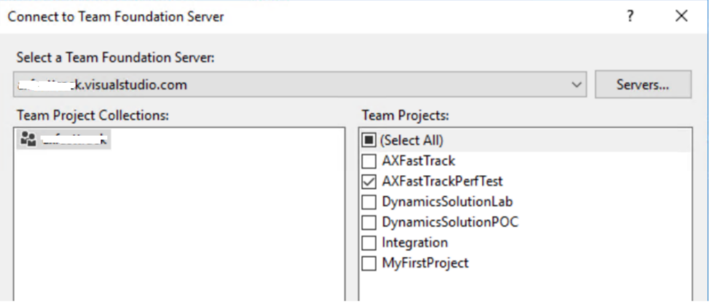
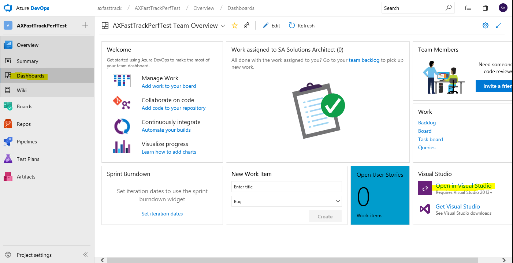
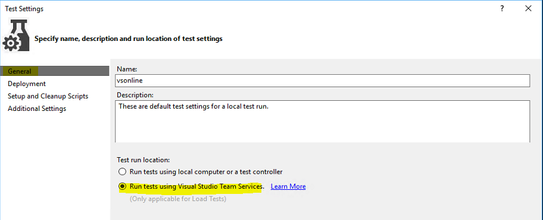
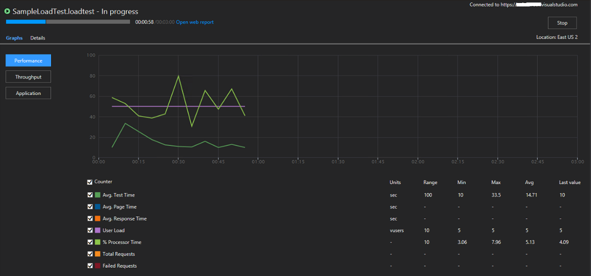
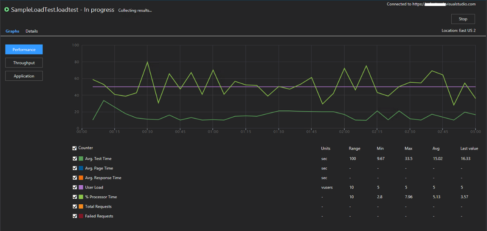
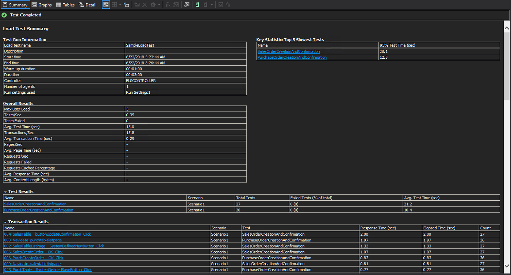
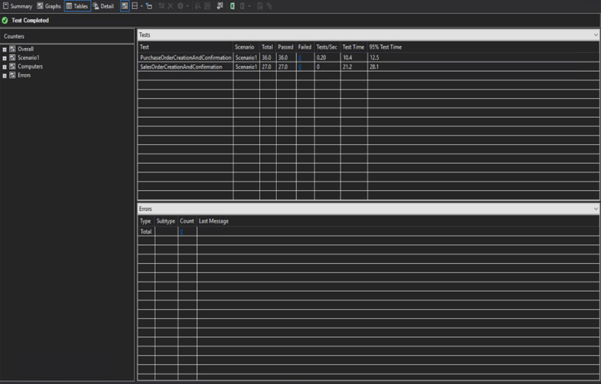
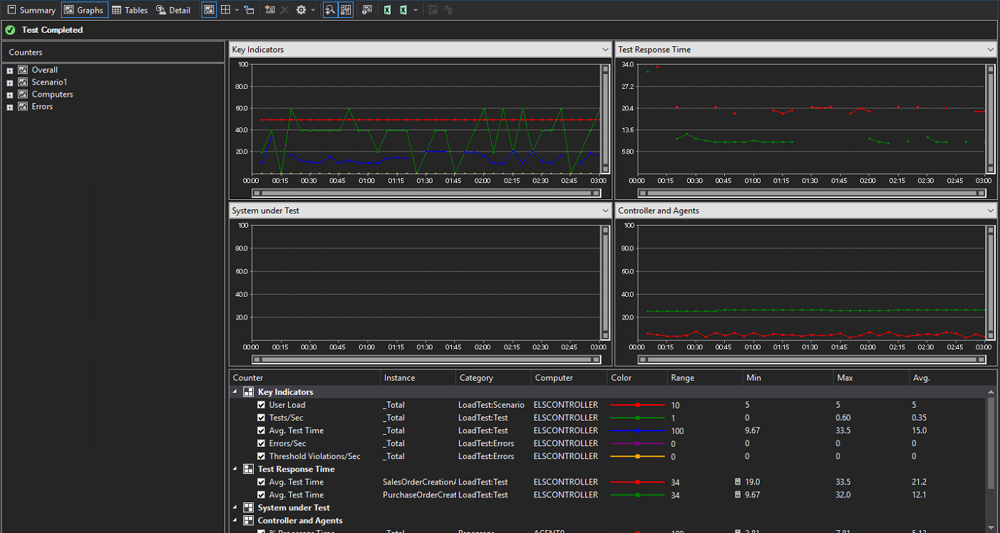

---
# required metadata

title: Multi-user testing with Performance SDK and Azure DevOps
description: This topic provides information about how to complete multi-user testing by using the Performance SDK and Azure DevOps with performance test scripts generated from Task recroder. 
author: hasaid
manager: AnnBe
ms.date: 05/15/2019
ms.topic: article
ms.prod: 
ms.service: dynamics-ax-platform
ms.technology: 

# optional metadata

# ms.search.form: 
# ROBOTS: 
audience: Developer
# ms.devlang: 
ms.reviewer: kfend
ms.search.scope: Operations
# ms.tgt_pltfrm: 
ms.custom: 9954
ms.assetid: 7b605810-e4da-4eb8-9a26-5389f99befcf
ms.search.region: Global
# ms.search.industry: 
ms.author: jujoh
ms.search.validFrom: 2016-02-28
ms.dyn365.ops.version: AX 7.0.0

---

# Multi-user testing with Performance SDK and Azure DevOps
[!include [banner](../includes/banner.md)]

## Prerequisites
Before you work through the steps in this topic, verify that you have the following prerequisites: 

- A Microsoft Dynamics 365 for Finance and Operations development environment with Platform Update 21 or later in own your Azure subscription.
- Microsoft Visual Studio 2015 Enterprise edition in a development environment.
- A tier-2 or above sandbox with the same release (App + PU) as your development environment.
- You have completed all steps in Single user testing with Task recorder and Performance SDK  and all steps in Multi-user testing with Performance SDK and local test controller  except for step “Run multi-user testing with local test controller”

## Prepare PerfSDKSample solution for multi-user testing

1. Connect Visual Studio in development environment to an Azure DevOps project.
 
 
 
  > [!NOTE]
  > When you add the Azure DevOps server, use https://<YourAzureDevOpsAccount>.visualstudio.com.

2. Go to your Azure DevOps project dashboard, click **Open in Visual Studio**, and then click **Allow in prompted window**. After Visual Studio opens, verify that you are running it as an administrator. If not, close and re-open it as an administrator.

  
 
3. Change **vsonline.testsettings** for Azure DevOps.
4. On the **General** tab, select **Run tests using Visual Studio Team Services**.

  
  
5. Keep the **Deployment** tab as it is in the topic, [Multi-user testing with Performance SDK and local test controller](multi-user-testing-local-test-controller.md). 

  
  
6. On the **Setup and Cleanup Scripts** tab, point **Setup script** to **setup.cmd** under the Visual Studio Online folder.

  

7. Keep the **Additional Settings** tab as instructed in the topic, [Multi-user testing with Performance SDK and local test controller](multi-user-testing-local-test-controller.md). 

  

8. Click **Apply and Close**.

## Run multi-user testing with Azure DevOps

1.	Open **SampleLoadTest.loadtest**.
2.	Click **Run Load Test**.
 
 
 
 
 
 

3.	Review the test output.

   
   
   
    
   
 
 
## Tips

If you want switch multi-user testing between local test controller and Azure DevOps, create a copy of **testsettings** for each of them and then select the copy you want as **Active Test Settings**.
 
## Troubleshooting
For information about single or multi-user testing with PerformanceSDK, see [Troubleshooting guide](troubleshoot-perf-sdk-user-testing.md).

