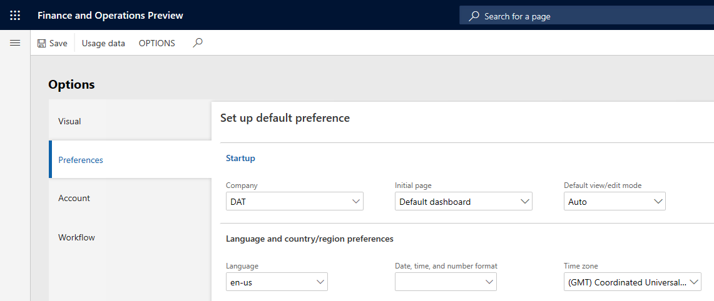
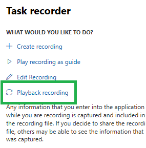

---
# required metadata

title: RSAT best practices
description: 
author: robadawy
manager: AnnBe
ms.date: 08/01/2019
ms.topic: article
ms.prod: 
ms.service: dynamics-ax-platform
ms.technology: 

# optional metadata

# ms.search.form: 
# ROBOTS: 
audience: Developer
# ms.devlang: 
ms.reviewer: rhaertle
ms.search.scope: Operations
# ms.tgt_pltfrm: 
ms.custom: 21631
ms.search.region: Global
# ms.search.industry: 
ms.author: robadawy
ms.search.validFrom: 2019-08-01
ms.dyn365.ops.version: AX 7.0.0

---

# RSAT best practices

[!include [banner](../../includes/banner.md)]

## Authoring test cases using the Task Recorder

1. Make sure all your recordings start on the main dashboard of Finance and Operations (or Retail).
2. Keep individual recordings short and focus on a business task performed by one user, like creating a sales order. This simplifies maintainability and reusability of test cases.
3. Chart controls are not supported. Any task recording actions related to charts will be ignored by RSAT during test case playback.
4. When creating a recording make sure to click on a tab header even if the tab is already open. For example, you can switch to another tab and then click back on the needed tab to activate it before using a control on it. This will make your recording more reliable during test case playback.
5. RSAT cannot playback any test step that is not recognized by the task recorder. For example, you cannot upload a file from the local disk during playback of a test case.
6. RSAT cannot playback a **page refresh** step. Avoid refreshing a page while recording your test.

## Using RSAT

1. Upon opening the tool for the first time, click on Settings and ensure you have all the desired settings. 
2. Before installing a new version of the tool, it is recommended to close and uninstall the previous version. 
3. When you install a new version of the tool, regenerate ALL test execution files.
 
    

    It is not necessary to regenerate Excel parameter files unless you want to take advantage of new features available in a newer format of parameter files.

4. For test parameters that need a unique value, for example, the product receipt number in the Product Receipt form or the invoice number in the Vendor Invoice form, use the **RandBetween(a,b)** Excel function to generate a unique number every time the test case is executed.
5. The default values in Excel come from the task recording. For certain **Reference Group** controls such as storage dimensions and tracking dimensions etc, it stores the key of the lookup instead of the value, for example, **2** instead of **SiteWH**. We recommend that you update these fields with the actual value in Excel so that the test is more robust and resilient to changes.
6. It is recommended to set the same locale for **Language** and **Date ,time, and number format** settings of your Finance and Operations environment prior to running RSAT. If these values are inconsistent, it may result in validation errors.   

    

The following are typical usage sequences.

**Sequence A:  Load->New->Edit->Run->Upload**

1. Click **Load**.
2. Select desired test cases.
3. If some test cases have no parameter file, click **New** to generate them. 
4. Optional: Edit Excel file to run tests with different parameters.
5. Click **Run**.
6. Optional: After a successful run, click **Upload** to upload all generated automation files (including Excel test parameter files) to Azure DevOps. 

**Sequence B:  Load->Edit->Run->Upload**

1. Click **Load**. If all parameter files already exist, there is no need to click **New** to regenerate them.
2. Optional: Edit Excel file to run tests with different parameters.
3. Click **Run**.
4. Optional: After a successful run, click **Upload** to upload all generated automation files (including Excel test parameter files) to Azure DevOps. 

**Sequence C:  Load->New (for All Test Cases)->Run->Upload**

This sequence is recommended after installing a new version of the tool. 

1. Click **Load**. 
2. Select all test cases in the test plan and click **New**.
3. Edit Excel parameter files.
4. Click **Run**.
5. After a successful run, click **Upload** to upload all generated test artifacts to Azure DevOps. 

## How to modify a Task Recording. 

If you wish to modify an existing task recording, note these best practices. 

In the Finance and Operations web client, open the Task recorder pane and start editing the recording using the **Edit Recording** option.

  
When you finish editing, save or download the recording, then play it back in the Finance and Operations client and verify that all steps.

 
After playing back an edited recording, save it. It is then ready to be used by RSAT.

