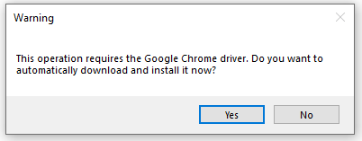

---
# required metadata

title: RSAT installation and configuration
description: 
author: robadawy
manager: AnnBe
ms.date: 08/01/2019
ms.topic: article
ms.prod: 
ms.service: dynamics-ax-platform
ms.technology: 

# optional metadata

# ms.search.form: 
# ROBOTS: 
audience: Developer
# ms.devlang: 
ms.reviewer: rhaertle
ms.search.scope: Operations
# ms.tgt_pltfrm: 
ms.custom: 21631
ms.search.region: Global
# ms.search.industry: 
ms.author: robadawy
ms.search.validFrom: 2019-08-01
ms.dyn365.ops.version: AX 7.0.0

---

# RSAT installation and configuration

[!include [banner](../../includes/banner.md)]

## Prerequisites

### Dynamics 365 for Finance and Operations test environment
Your Dynamics 365 for Finance and Operations test environment must be running Platform update 15 or newer. The Regression Suite Automation Tool must have access to your Dynamics 365 for Finance and Operations test environment via a web browser.  

### Excel
You need Microsoft Excel installed to generate and edit test parameters. 

### Azure DevOps
You must have an Azure DevOps project to store and manage your test cases, test plans and test case results. You will need an Azure DevOps Test Manager or Test Plans license. For example, if you have a Visual Studio Enterprise subscription, you already have a license to Test Plans. For more information, see [Pricing for Azure DevOps](https://azure.microsoft.com/en-us/pricing/details/devops/azure-devops-services/).

### Authentication Certificate
RSAT is designed to be installed on any Windows 10 computer and connect remotely via a web browser to a Dynamics 365 for Finance and Operations environment.

To enable secure authentication, RSAT requires a certificate to be installed on the RSAT client computer. The RSAT settings dialog allows you to automatically create and install the authentication certificate, you will also need to configure the Finance and Operations VMs to trust the connection. Follow the instructions in the next sections to install and configure RSAT.

## Installation

### Installer
Download Regression Suite Automation Tool.msi to your machine and double-click it to run the installer. 

 
### Selenium and Browser Drivers
RSAT requires Selenium and web browser driver libraries. RSAT will prompt you if needed libraries are missing and will automatically install them for you. Select yes when you see the following (or similar) dialogs.
 

 

Alternatively, refer to [Install Selenium Driver](#install-selenium-drivers) in the next section.

## Install Selenium Drivers

For manual installation of Selenium drivers, follow these steps:
1. Download [Selenium 3.13.1](http://selenium-release.storage.googleapis.com/3.13/selenium-dotnet-strongnamed-3.13.1.zip). Or, go to http://docs.seleniumhq.org/download and click **Previous releases**. Choose **3.13** and download **selenium-dotnet-strongnamed-3.13.1.zip**.
2. Install the Selenium libraries:
    + Unzip the downloaded file. 
    + Unpack the file **dist\Selenium.WebDriver.StrongNamed.3.13.1.nupkg**. To unpack this file, add the .zip suffix to the file and unzip it. 
    + Copy the contents of the folder named **Selenium.WebDriver.StrongNamed.3.13.1.nupkg\lib** to **C:\Program Files (x86)\Regression Suite Automation Tool\Common\External\Selenium**.
3.	Download the [Internet Explorer driver version 3.4.0](http://selenium-release.storage.googleapis.com/3.4/IEDriverServer_x64_3.4.0.zip). Or, go back in the browser, open the **3.4** folder and download **IEDriverServer_x64_3.4.0.zip**.
4.	Unzip the downloaded file and move the contents to **C:\Program Files (x86)\Regression Suite Automation Tool\Common\External\Selenium**.

If you want to use Google Chrome as your browser, follow these steps:
1. Go to https://sites.google.com/a/chromium.org/chromedriver/downloads. 
2. Download **chromedriver_win32.zip** from the latest/current release.
3. Unzip the downloaded file and move the contents to **C:\Program Files (x86)\Regression Suite Automation Tool\Common\External\Selenium**.
