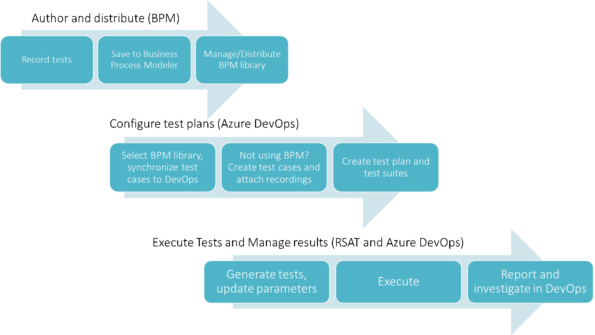

---
# required metadata

title: Regression Suite Automation Tool
description: Regression Suite Automation Tool lets you record business tasks using the task recorder and convert them into a suite of automated tests without the need to write source code.
author: robadawy
manager: AnnBe
ms.date: 08/01/2019
ms.topic: article
ms.prod: 
ms.service: dynamics-ax-platform
ms.technology: 

# optional metadata

# ms.search.form: 
# ROBOTS: 
audience: Developer
# ms.devlang: 
ms.reviewer: rhaertle
ms.search.scope: Operations
# ms.tgt_pltfrm: 
ms.custom: 21631
ms.search.region: Global
# ms.search.industry: 
ms.author: robadawy
ms.search.validFrom: 2019-08-01
ms.dyn365.ops.version: AX 7.0.0

---

# Regression Suite Automation Tool

[!include [banner](../../includes/banner.md)]

## Overview
The Regression Suite Automation Tool (RSAT) significantly reduces the time and cost of user acceptance testing. User acceptance testing is typically required before taking a  Microsoft application update or applying custom code and configurations to your Dynamics 365 for Finance and Operations production environment.

It enables functional power users to record business tasks using the Finance and Operations task recorder and convert them into a suite of automated tests without the need to write source code. Test libraries are stored and distributed in Lifecycle services using the Business Process Modeler (BPM) libraries and fully integrated with Azure DevOps Services (Azure DevOps) for test execution, reporting and investigation. Test parameters are decoupled from test steps and stored in Microsoft Excel files.

## End-to-end Flow
This tool is part of the end to end flow described below. Finance and Operations, along with LCS and Azure DevOps, provide a set of tools for test case authoring (using task recorder), configuration, execution, investigation and reporting.

Get familiar with this process by reading [Create and automate user acceptance tests](../../lifecycle-services/using-task-guides-and-bpm-to-create-user-acceptance-tests.md).

## Lifecycle Services
Using Lifecycle Services (LCS) and BPM is recommended but not mandatory. BPM is a great tool to manage and distribute test libraries, especially for Microsoft partners and independent software vendors. 

You can manually create test cases in Azure DevOps and attach developer recording files to your Azure DevOps test cases. Developer recording files can be created directly from the task recorder pane in Finance and Operations.

You must name the developer recording file **Recording.xml** before attaching it to a Azure DevOps test case. The developer recording file can also be named **<Test Case Title>.xml** where **<Test Case Title>** is the DevOps title of the test case.

## Intended Usage and Test Classification

### Business cycle (Business process) testing
The Regression Suite Automation Tool is intended to be used for business cycle tests and scenario tests (multiple component tests) that usually occurs at the end of the development lifecycle, also referred to as user acceptance testing. Business cycle testing consists of a smaller number of test cases than component or unit testing. This is illustrated in the pyramid below.

### Unit and component testing
For unit tests, we do not recommend RSAT. Instead use the SysTest framework and the build/test automation tools of Finance and Operations. For component tests, take advantage of the [Acceptance Test Library](../acceptance-test-library.md) (ATL). ATL is a library of X++ test helpers.  When used with the SysTest framework, it offers the following benefits:
+ It lets you create consistent test data.
+ It increases the readability of test code.
+ It provides improved discoverability of the methods that are used to create test data.
+ It hides the complexity of setting up prerequisites.
+ It supports high performance of test cases.

For more details, see the [Continuous delivery homepage](../../dev-tools/continuous-delivery-home-page.md).

### Data Integration testing
Do not use RSAT for integration tests, instead rely on the data management framework (also known as DIXF). The [Data task automation](../../data-entities/data-task-automation.md) framework enables you to configure and automate the testing of your data integration scenarios.

