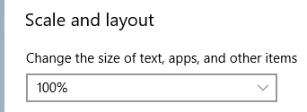
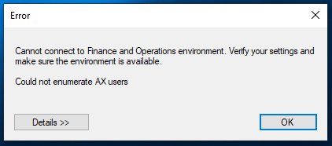

---
# required metadata

title: Troubleshooting RSAT
description: 
author: robadawy
manager: AnnBe
ms.date: 08/01/2019
ms.topic: article
ms.prod: 
ms.service: dynamics-ax-platform
ms.technology: 

# optional metadata

# ms.search.form: 
# ROBOTS: 
audience: Developer
# ms.devlang: 
ms.reviewer: rhaertle
ms.search.scope: Operations
# ms.tgt_pltfrm: 
ms.custom: 21631
ms.search.region: Global
# ms.search.industry: 
ms.author: robadawy
ms.search.validFrom: 2019-08-01
ms.dyn365.ops.version: AX 7.0.0

---

# Troubleshooting RSAT

[!include [banner](../../includes/banner.md)]

## Playback logs

To troubleshoot issues with the tool during Playback operation, open the developer error log located at **C:\Users\$YourUserName\AppData\Roaming\regressionTool\playback\[TestName]Log.txt**. Analyze the error message to determine the possible cause of a failure.

## Authentication certificate and installation

+ The authentication certificate must be created and installed by an administrator on the same computer where RSAT is installed. If it is not created by an admin, you will encounter an error message when you try to run a test case:  
  - **Cannot access Finance and Operations environment. Verify your settings and make sure the environment is available.**  
+ If you have used a previous version of RSAT on the same computer, close it and uninstall it before installing a new version.

## Screen resolution

Your desktop resolution should be set to 100% to run the tests successfully. To change the settings, use Windows **Display settings > Scale and layout**, as shown in the following image:


 
## Test playback errors

### SOAP or HTTP request errors

If you are testing against a Standard Acceptance Test Sandbox environment (Tier2) or any other multi-box environment, and you get one of the following errors when you run a test: 

```
There was no endpoint listening at https://<yourURL>soap.sandbox.operations.dynamics.com/Services/AxUserManagement/Service.svc/ws2007FedHttp that could accept the message. This is often caused by an incorrect address or SOAP action…

An error occurred while making the HTTP request to <Hostname>/Services/AxUserManagement/Service.svc/ws2007FedHttp. This could be due to the fact that the server certificate is not configured properly with HTTP.SYS in the HTTPS case. This could also be caused by a mismatch of the security binding between the client and the server.
```

Assuming you have specified the correct SOAP hostname in the settings dialog, run the following Powershell scripts on your client computer where the test tool is installed:

```PowerShell
Set-ItemProperty HKLM:\SOFTWARE\Microsoft\.NETFramework\v4.0.30319 -Name SchUseStrongCrypto -Value 1 -Type dword -Force -Confirm:$false

if ((Test-Path HKLM:\SOFTWARE\Wow6432Node\Microsoft\.NETFramework\v4.0.30319))  { Set-ItemProperty HKLM:\SOFTWARE\Wow6432Node\Microsoft\.NETFramework\v4.0.30319 -Name SchUseStrongCrypto -Value 1 -Type dword -Force -Confirm:$false}
```

You can also set the registry keys manually.

### Cannot enumerate error

If you encounter the error dialog below when running a test case, or the error details contain the following messages.

```
<Message>The type initializer for 'MS.Dynamics.TestTools.CloudCommonTestUtilities.Authentication.UserManagement' threw an exception.</Message>
<Message>Could not enumerate AX users</Message>  (InnerError)`
```


 
Verify the **Admin user name** specified in the RSAT settings dialog. The **Admin user name** must be the e-mail address of a user that belongs to the System Administrator role on the Finance and Operations environment that RSAT is connecting to.

## Browser

The Chrome browser may not work with the tool due to your Active Directory security settings. In this case, change your settings to use Internet Explorer browser.

## Excel data tabs

Excel data tabs display the system identifiers for data variables. It does not display friendly names.
