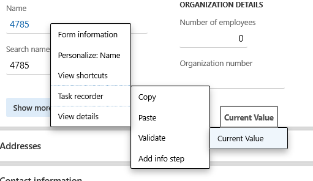
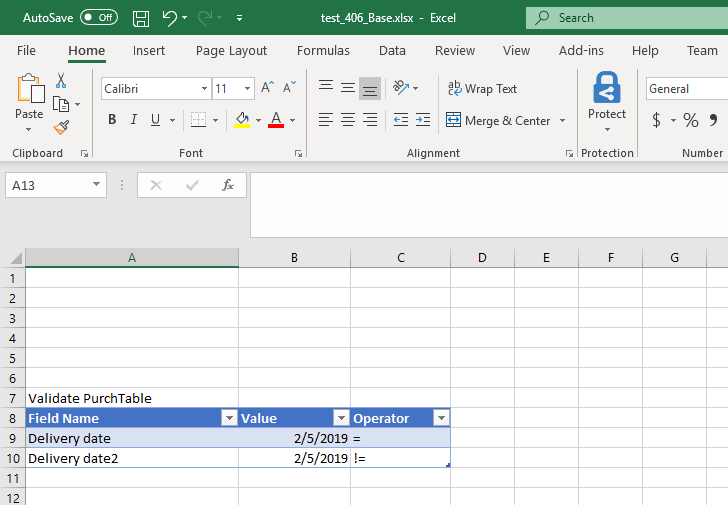

---
# required metadata

title: Validate expected values
description: 
author: robadawy
manager: AnnBe
ms.date: 08/01/2019
ms.topic: article
ms.prod: 
ms.service: dynamics-ax-platform
ms.technology: 

# optional metadata

# ms.search.form: 
# ROBOTS: 
audience: Developer
# ms.devlang: 
ms.reviewer: rhaertle
ms.search.scope: Operations
# ms.tgt_pltfrm: 
ms.custom: 21631
ms.search.region: Global
# ms.search.industry: 
ms.author: robadawy
ms.search.validFrom: 2019-08-01
ms.dyn365.ops.version: AX 7.0.0

---

# Validate expected values

[!include [banner](../../includes/banner.md)]

An important component of a test case is validation of expected values. You can define validation parameters during the authoring of your test cases using Task Recorder. While recording, right-click on a control and select **CurrentValue** under the **Task Recorder > Validate** menu. This action becomes a validation step that you can use with RSAT The control value will become a validation variable in the automatically generated Excel parameters file. Tne menu item is shown in the following image:


 
For more information on how to create task recordings, see [Task recorder](../../user-interface/task-recorder.md).

## Validate expected values using operators

To utilize this feature, you need to edit the config file named **Microsoft.Dynamics.RegressionSuite.WindowsApp.exe.config** in the RSAT installation folder.  Edit the file and modify the value of the **AddOperatorFieldsToExcelValidation** to **true**: 

```Xml
<add key=" AddOperatorFieldsToExcelValidation" value="true" />
```

In previous versions of RSAT, you could only validate if a control value is equal to an expected value. This new feature allows you to validate that a variable is not equal, less then or greater than a specified value.

If you have been using an older version of RSAT, you will need to regenerate new Excel parameter files to take advantage of this functionality. In the Excel file, a new Operator field will appear. An example is shown in the following image:



