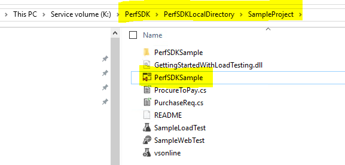
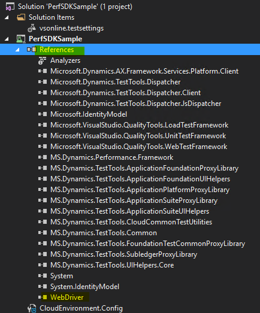

---
# required metadata

title: Single-user testing with Task recorder and the Performance SDK
description: This topic explains how to do single-user testing by using Microsoft Visual Studio and the Performance SDK together with a performance test script that is generated by using Task recorder. 
author: hasaid
manager: AnnBe
ms.date: 06/10/2019
ms.topic: article
ms.prod: 
ms.service: dynamics-ax-platform
ms.technology: 

# optional metadata

# ms.search.form: 
# ROBOTS: 
audience: Developer
# ms.devlang: 
ms.reviewer: rhaertle
ms.search.scope: Operations
# ms.tgt_pltfrm: 
ms.custom: 9954
ms.assetid: 7b605810-e4da-4eb8-9a26-5389f99befcf
ms.search.region: Global
# ms.search.industry: 
ms.author: jujoh
ms.search.validFrom: 2016-02-28
ms.dyn365.ops.version: AX 7.0.0

---

# Single-user testing with Task recorder and the Performance SDK

[!include [banner](../includes/banner.md)]

Use the information in this topic to do single-user testing by using Visual Studio and the Performance software development kit (SDK) together with a performance test script that is generated by using Task recorder.

 > [!IMPORTANT]
  > Visual Studio 2019 will be the last version of Visual Studio with web performance and load test features. In the future, we will publish some recommendations for alternative solutions.  
  > - If you are using the Visual Studio and Test Controller/Test Agent for on-premises load testing, Visual Studio 2019 will be the last version. You can continue using it until the end of the support cycle. 
  > - If you are using the cloud-based load testing service, it will continue to run through March 31, 2020. Until then, you can continue to use all of the experiences powered by this service without interruption. Alternatively, you can switch to on-premises load testing. For more information, see [Cloud-based load testing service end of life](https://devblogs.microsoft.com/devops/cloud-based-load-testing-service-eol/).
## Prerequisites

To complete the steps in this topic, you must have a development environment that has Platform update 21 or later.

## Use Task recorder to define and record an end-to-end business scenario

Before you run a single-user test, you must work with your business team to define your end-to-end scenarios and then use Task recorder to create a recording of the steps in each scenario. For more information about how to create a task recording, see [Task recorder](../user-interface/task-recorder.md). The scenarios that you should test depend on your customer's business requirements. In this topic, you will use the "Create and confirm a sales order" sample scenario.

1. Sign in to Finance and Operations as a Sales persona.
2. Turn on Task recorder, and create and confirm a sales order that includes the following information:

    - Customer account
    - Item number
    - Sales quantity
    - Site
    - Warehouse
    - Sales price

3. When you've finished, select **Save as developer recording** to download the XML file.

## Configure a Finance and Operations development environment

1. Download the [selenium-dotnet-strongnamed-3.13.1.zip](https://selenium-release.storage.googleapis.com/index.html?path=3.13/) and [IEDriverServer\_Win32\_3.13.0.zip](https://selenium-release.storage.googleapis.com/index.html?path=3.13/) files.
2. Unblock and unzip the files.
3. In the **dist** folder, rename the .nupkg files as .zip files, and then unzip them.

    | Original file name                          | New file name                             |
    |---------------------------------------------|-------------------------------------------|
    | Selenium.Support.StrongNamed.3.13.1.nupkg   | Selenium.Support.StrongNamed.3.13.1.zip   |
    | Selenium.WebDriver.StrongNamed.3.13.1.nupkg | Selenium.WebDriver.StrongNamed.3.13.1.zip |

4. Under your **PerfSDK** folder, create a folder that is named **Common\\External\\Selenium**.

    

5. Copy the following files, and save them to the folder that you created in the previous step:

    - IEDriverServer.exe from the unzipped IEDriverServer\_Win32\_3.13.0.zip file
    - WebDriver.dll and WebDriver.xml from the lib\\net45 folder in the unzipped Selenium.WebDriver.StrongNamed.3.13.1.zip file
    - WebDriver.Support.dll and WebDriver.Support.xml from the lib\\net45 folder in the unzipped Selenium.Support.StrongNamed.3.13.1.zip file

## Generate a C\# performance test from Task recorder

When you've finished recording the end-to-end scenario, you must generate a C\# performance test script that is based the task recording. 

1. In a development environment, open Microsoft Visual Studio as an admin.
2. From your **PerfSDK** folder, open the **PerfSDKSample** solution. In a tier-1 sandbox or a cloud-hosted-environment, the PerfSDK folder is typically in K:\\PerfSDK\\PerfSDKLocalDirectory.

    

3. Add a reference to the WebDriver.dll file in the Common\\External\\Selenium folder.

    

4. On the **Dynamics 365** menu, point to **Addins**, and then select **Create C\# perf test from recording**.
5. In the **Import Task Recording** dialog box, enter the following required details:

    - **Recording path** – The file location of the developer recording of your end-to-end scenario.
    - **Project path** – The location of the PerfSDKSample project. Typically, the path is \<Your\_PerfSDK\_Folder\>\\SampleProject\\PerfSDKSample\\PerfSDKSample.csproj.
    - **PerfSDK path** – The location of PerfSDK. Typically, the path is \<ServiceVolumeDrive\>\\PerfSDK\\PerfSDKLocalDirectory.
    
6. When you've finished, select **Import**. A new C\# class is created under the **Generated** folder of your PerfSDKSample project.

    

7. Build the solution.

## Run single-user testing by using Test Explorer in Visual Studio

1. Update the **CloudEnvironment.config** file of the PerfSDKSample project in the following ways, so that it reflects the configuration of your environment:

    - In each **AuthenticatorConfiguration** element under the **AuthenticatorConfigurationCollection** element, replace **AadAuthenticator** with **SelfMintedTokenAuthenticator**.
    - Comment out the **AzureActiveDirectoryConfiguration** and **KeyVaultConfigurations** elements.

    

2. In Visual Studio, on the **Test** menu, point to **Windows**, and then select **Test Explorer**.
3. Right-click your test case, and then select **Run selected tests**.

## Tips and tricks

Use the following tips and tricks for single-user testing that uses Task recorder and the Performance SDK:

- Run your business end-to-end scenario first, before you capture it by using Task recorder.
- When you record your scenario by using Task recorder, enter values manually instead of selecting them in drop-down lists.
- Replay your task recording to make sure that everything works as you expect.
- Restart Visual Studio if you don't see your test case after the solution is built.

## Troubleshooting

For information about single-user or multi-user testing that uses the Performance SDK, see [Troubleshooting guide](troubleshoot-perf-sdk-user-testing.md).
