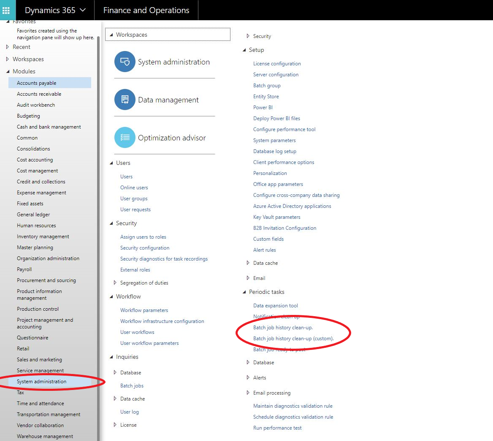

---
# required metadata

title: Clean up the batch job history 
description: This topic provides information about how to clean up the batch job history.
author: hasaid
manager: AnnBe
ms.date: 03/12/2019
ms.topic: article
ms.prod: 
ms.service: dynamics-ax-platform
ms.technology: 

# optional metadata

# ms.search.form: 
# ROBOTS: 
audience: IT Pro
# ms.devlang: 
ms.reviewer: sericks
ms.search.scope: Core, Operations
# ms.tgt_pltfrm: 
ms.custom: 62333
ms.assetid: 6135bcf7-bf8f-42ae-b2c6-458f6538e6a4
ms.search.region: Global
# ms.search.industry: 
ms.author: hasaid
ms.search.validFrom: 2019-03-08
ms.dyn365.ops.version: Platform update 25

---

# Clean up the job batch history

[!include [banner](../includes/banner.md)]

When you run a batch job, a history is recorded. This history can be used to monitor the correct execution of jobs. However, when several batch jobs have been created, especially batch jobs that have a high recurrence, lots of batch job history entries are generated. Too many entries in the history table can negatively affect the performance of future jobs.

Two pages that have been added to the **System administration** module make it easy to clean up the batch job history:

- Batch job history clean-up
- Custom batch job history clean-up

> [!NOTE]
> We recommend that you regularly clean up the batch job history, and that you do this cleanup outside of business hours.

## Batch job history clean-up

Follow these steps to quickly clean up all history entries that are older than a specified number of days.

1. On the **Periodic tasks in System administration** module, select **Batch job history clean-up**.
2. In the **History limit (days)** field, specify the number of days to keep a history of batch jobs.
3. Select **OK**.

## Batch job history clean-up (custom)

The custom batch job lets you to apply additional filtering, based on criteria such as status, job description, company, or user. You can also add other filter criteria by selecting the **Filter** button.

1. On the **Periodic tasks in System administration** module, select **Batch job history clean-up (custom)**.
2. In the **History limit (days)** field, specify the number of days to keep a history of batch jobs.
3. On the **Records to include** FastTab, specify any filter criteria that you require, and then select **OK**.
4. Select **OK**.

