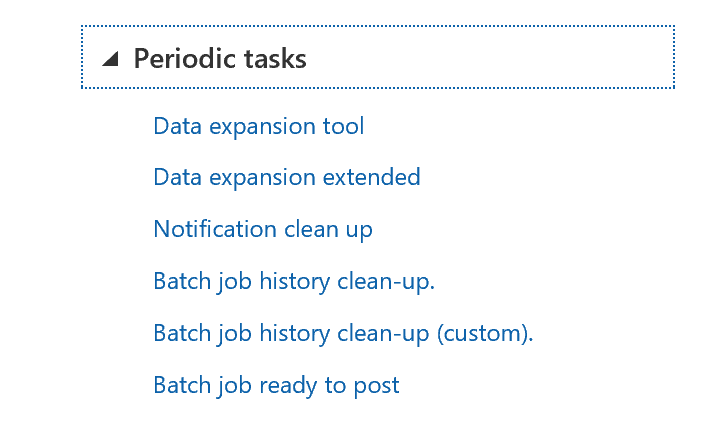
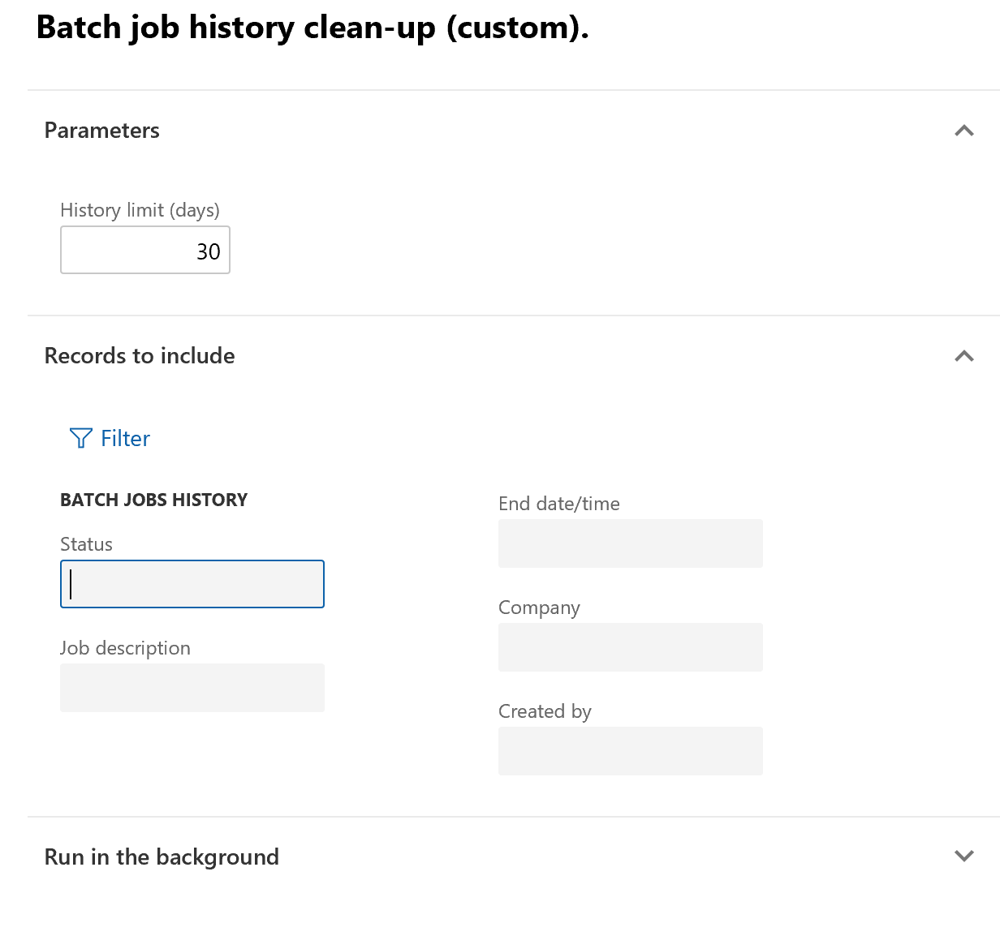

---
# required metadata

title: Batch history cleanup
description: This topic provides batch history cleanup in Microsoft Dynamics 365 for Finance and Operations.
author: hasaid
manager: AnnBe
ms.date: 03/12/2019
ms.topic: article
ms.prod: 
ms.service: dynamics-ax-platform
ms.technology: 

# optional metadata

# ms.search.form: 
# ROBOTS: 
audience: IT Pro
# ms.devlang: 
ms.reviewer: kfend
ms.search.scope: Core, Operations
# ms.tgt_pltfrm: 
ms.custom: 62333
ms.assetid: 6135bcf7-bf8f-42ae-b2c6-458f6538e6a4
ms.search.region: Global
# ms.search.industry: 
ms.author: hasaid
ms.search.validFrom: 2019-03-08
ms.dyn365.ops.version: Platform update 25

---

# Batch history cleanup

[!include [banner](../includes/banner.md)]

[!include [banner](../includes/preview-banner.md)]

When you execute a batch job, the history is saved to monitor proper execution of jobs, with a lot of batch jobs, especially those with a high recurrence 
will generate a lot of batch job history entries.

Keeping too many entries in the history table can negatively affect the performance of future jobs

We improved the functionality to clean up batch jobs history which was introduced in an early platform update. 
Two forms have been added to the System Administration workspace:

1. Batch job history clean-up.
2. Batch job history clean-up (custom).

 

>[!NOTE] 
>We strongly recommend cleaning batch history regularly and outside of business hours.

## Batch job history clean-up

This version of batch job history clean-up allows you to quickly clean all history entries older than a specified timeframe (in days).

1.	Click on the Batch job history clean-up from the menu
2.	specify the number of days to keep

 
 
# Batch job history clean-up (Custom)

The custom batch job allows you to add additional filtering based on criteria such as status, job description, company, or user. Other criteria can be added by clicking on the filter button.

 

1.	Click on the Batch job history clean-up (custom) from the menu
2.	specify the number of days to keep
3.  Enter you filter criteria
