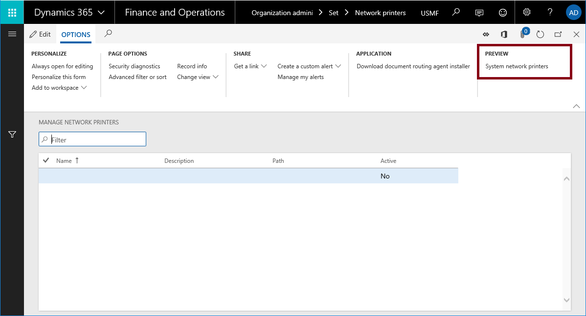

---
# required metadata

title: System administrator network printers
description: This topic provides information about using the System administrator network utility to set up network printers.
author: tjvass
manager: AnnBe
ms.date: 12/03/2018
ms.topic: article
ms.prod: 
ms.service: dynamics-ax-platform
ms.technology: 

# optional metadata

# ms.search.form: 
# ROBOTS: 
audience: IT Pro
# ms.devlang: 
ms.reviewer: kfend
ms.search.scope: Core, Operations
# ms.tgt_pltfrm: 
ms.custom: 62333
ms.assetid: 6135bcf7-bf8f-42ae-b2c6-458f6538e6a4
ms.search.region: Global
# ms.search.industry: 
ms.author: tjvass
ms.search.validFrom: 2018-12-04
ms.dyn365.ops.version: AX 7.0.0

---

# System administrator network printers

[!include [banner](../includes/banner.md)]

[!include [banner](../includes/private-preview-banner.md)]

> [!IMPORTANT]
> Access to the new System administration utility is managed by the Carbon Flighting Service. Platform Update 23 includes the **System network printers management** form for System administrators. 

Domain Administrators register the network printers with the Dynamics 365 for Finance and Operations service using the Document Routing Agent (DRA). After the printers are registered, it’s the responsibility of the Organization administrator to make printers available to end users. These settings are managed in the **Network printers** form (**Organization administration** > **Setup** > **Network printers**).   
 
Because the settings presented in this form are intended for Organization administrators, the data is restricted to the active legal entity. System administrators can't manage network printer settings across legal entities. This can makeit difficult to update settings across legal entities in some situations. 
These situations can include network printer changes such as deleting a network printer instance, which occurs when a network printer path is updated or hardware is replaced. Or, trying to purge all documents in the printer queue.

The System administration utility is a recovery tool for inadvertent print instructions and a way to simplify the task of managing network printer settings, including access from specific Legal Entities. 

 
## Access the feature
After the feature has been enabled through feature flighting, a **Preview** link will appear in the **Network printers** form.

 

1. Click **Organization administration** > **Setup** > **Network printers**.
2. Click **System network printers**. 
3. On the **System network printers** form, register the network printers with the service by using the DRA. You will see the configuration information for each legal entity in the organization. 
 
## Supported operations
Currently, the administration tool is limited to support Delete operations only. Deleting network printers using the **System network printers management** form triggers the following events: 

- All documents in the printer queue that are directed at the printer are deleted 
- The network printer is deleted for all legal entities in the organization 
- The domain admins can register devices using the old printer name 
- The organization admins can continue to use the existing tools to manage network printer settings for a single legal entity 
 

