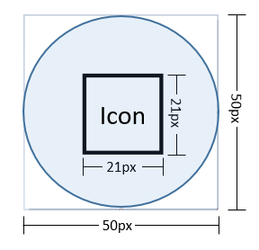
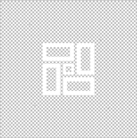
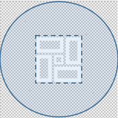
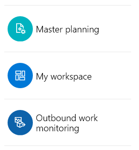

---
# required metadata

title: Create icons for workspace tiles
description: This topic provides guidelines and recommendations for creating and assigning icons to custom workspace tiles.  
author: jasongre
manager: AnnBe
ms.date: 06/20/2017
ms.topic: article
ms.prod: 
ms.service: dynamics-ax-platform
ms.technology: 

# optional metadata

# ms.search.form: 
# ROBOTS: 
audience: Developer
# ms.devlang: 
ms.reviewer: sericks
ms.search.scope: Operations
# ms.tgt_pltfrm: 
ms.custom: 141853
ms.assetid: 4f78c3a4-011f-4ebd-bada-98e77d43821e
ms.search.region: Global
# ms.search.industry: 
ms.author: jasongre
ms.search.validFrom: 2016-05-31
ms.dyn365.ops.version: Platform update 1

---

# Create icons for workspace tiles

[!include [banner](../includes/banner.md)]

This topic provides guidelines and recommendations for creating and assigning icons to custom workspace tiles.  

The dashboard contains a set of workspace tiles to which the user has access. Each of these tiles contains an icon specific to that workspace. For out-of-the-box workspaces provided by Microsoft, the icons used on the workspace tiles generally correspond to a symbol from the [Symbol font](symbol-font.md). This article discusses the guidelines and recommendations for creating and assigning icons to tiles for workspaces created by Microsoft Certified Partners or individual customers.

## Implementation details
### Icon creation

For workspace icons we recommend using an AOT resource for the icon. While the out-of-the-box symbols will work, we recommend creating your own so that multiple workspaces don't use the same icons. For each workspace that needs an icon, create a new image file that adheres to the following guidelines:

-   The image file should be a PNG file with a 1:1 aspect ratio.
-   The icon should have a transparent background with white content. The framework will then set a default background color to match the theme.
-   The recommended image size is 50 x 50 pixels, with the icon being contained within a centered 21 x 21 px square (see the illustration below).
    -   The recommended image and icon sizes correspond to the out-of-the-box workspaces. Larger images are allowed; however, the size and positioning of the icon relative to the full image should be maintained regardless of image size.
    -   Following this recommendation ensures the following:
        -   Your workspace icon matches the size of other workspace icons.
        -   The content of your workspace icon does not get cropped by the CSS that renders the image as a circle.

### Modeling details

As you create a workspace tile, adhere to the following guidelines:

-   Add an AOTResource for each new icon.
-   On the tile corresponding to the workspace, set the following properties:
    -   ImageLocation=AOTResource
    -   NormalImage=&lt;name of AOTResource&gt;

## Example
Consider the following image/icon that is to be used for a new workspace. 

 

This icon would be converted to an image with a transparent background, and white content with the icon centered in a larger image canvas. 

 

Workspace icon image

 

Workspace icon image overlaid to show the circular portion visible on the tile as well as the area set aside for the icon.

Using this image on a workspace tile yields the following result on the dashboard. 

                

