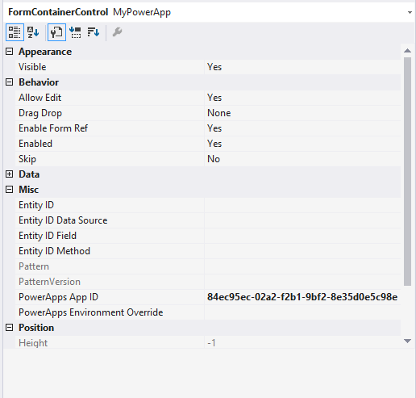

---
# required metadata

title: PowerApps Host control
description: By using the PowerApps Host control, you can embed a PowerApps app that you’ve created or a shared PowerApps app.
author: TLeforMicrosoft
manager: AnnBe
ms.date: 04/25/2017
ms.topic: article
ms.prod: 
ms.service: dynamics-ax-platform
ms.technology: 

# optional metadata

# ms.search.form: 
# ROBOTS: 
audience: Developer
# ms.devlang: 
ms.reviewer: sericks
ms.search.scope: Operations
# ms.tgt_pltfrm: 
ms.custom: 16061
ms.assetid: 80c93e91-1952-44ce-af93-a17965ee476a
ms.search.region: Global
# ms.search.industry: 
ms.author: tlefor
ms.search.validFrom: 2017-04-26
ms.dyn365.ops.version: AX 7.0.0

---

# PowerApps Host control

[!include [banner](../includes/banner.md)]

In Microsoft PowerApps, you can manage organizational data by running an app that you created, or an app that someone else created and shared with you. Apps run on [mobile devices such as phones](https://powerapps.microsoft.com/tutorials/run-app-client/), or you can run them [in a browser](https://powerapps.microsoft.com/tutorials/run-app-browser/) by starting Microsoft Dynamics 365 for Finance and Operations. You can create many types of apps without having to learn a programming language such as C\#. By using the PowerApps Host control that is available to developers who use Microsoft Visual Studio, you can embed a PowerApps app that you’ve created or a shared PowerApps app. To learn more about PowerApps, see [https://powerapps.microsoft.com](https://powerapps.microsoft.com/).

## Host a PowerApps app on a page

1.  In PowerApps, find the web-based PowerApps app that you want to host, and record or copy the **App ID** value.
  
    
  
2.  In Visual Studio, open your project, and then, in the form designer, add an instance of a PowerApps Host control to your page.
3.  In the **Properties** pane, enter the **App ID** value.
4.  If your PowerApps app shares or is linked to the current data source on your page, you should pass the ID of the primary or linked key field for the data that you want your PowerApps app to show. In this case, provide the ID as the value of the **Entity ID**, **Entity ID Data Source/Field**, or **DataMethod** property. This value will then be passed to your PowerApps app as a parm value, and your PowerApps app must use that value to obtain the linked data. 
    
    
    
5.  In some cases, your PowerApps app might be hosted in a development or sandbox PowerApps environment that is provided by Microsoft. In this case, you must supply that override URL as the value of the **PowerApps Environment Override** property.

Sizing is determined by the container that you put your control in. If you put your control in a form pattern that has limited available space, and your PowerApps app has been designed to be larger than the available space, your PowerApps app will have scroll bars.
