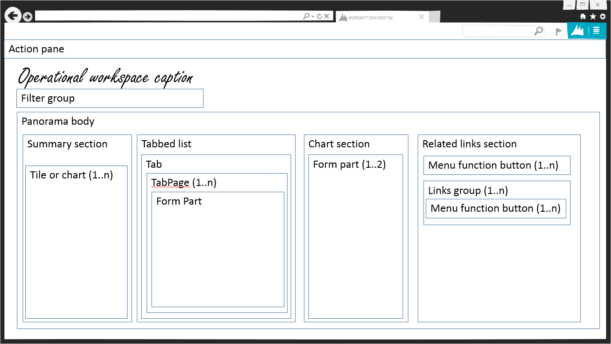
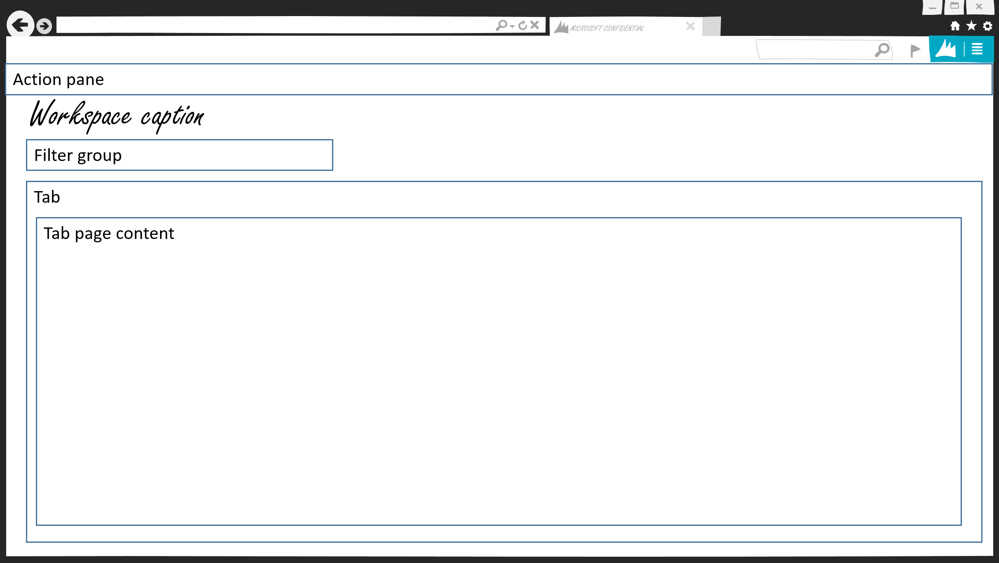
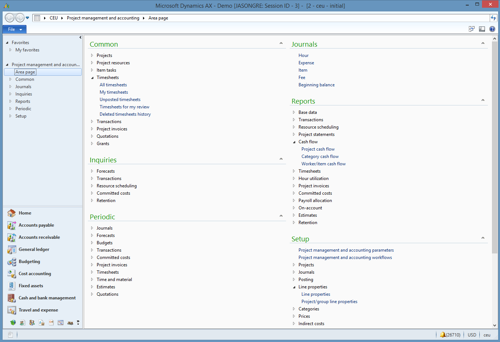

---
# required metadata

title: Workspace form pattern
description: This topic discusses workspace form patterns. Workspaces are the primary way that users navigate to tasks and specific pages. A workspace should be created for every significant business activity that is supported.  
author: jasongre
manager: AnnBe
ms.date: 05/23/2017
ms.topic: article
ms.prod: 
ms.service: dynamics-ax-platform
ms.technology: 

# optional metadata

# ms.search.form: 
# ROBOTS: 
audience: Developer
# ms.devlang: 
ms.reviewer: robinr
ms.search.scope: Operations
# ms.tgt_pltfrm: 
ms.custom: 29151
ms.assetid: 4ca77c08-1c8f-4b0c-af55-ca89a7e8982b
ms.search.region: Global
# ms.search.industry: 
ms.author: jasongre
ms.search.validFrom: 2016-02-28
ms.dyn365.ops.version: AX 7.0.0

---

# Workspace form pattern

[!include [banner](../includes/banner.md)]

This topic discusses workspace form patterns. Workspaces are the primary way that users navigate to tasks and specific pages. A workspace should be created for every significant business activity that is supported.  

## Usage

Workspaces are a new concept, and are meant to be the primary way that users navigate to tasks and specific pages. A workspace should be created for every significant business “activity” that you want to support. An “activity” is less granular than a task and more granular than a legacy “area page.” A workspace is intended to provide a one-page overview of the activity, and to help users understand the current status, the upcoming workload, and the performance of the process or user. Users should be able to start the most typical tasks for the activity directly from the workspace. If possible, users should also be able to complete tasks directly in the workspace, based on the overview that they just received. Currently, there are two workspace patterns:

-   **Tabbed workspace**: This is a new workspace pattern that is being made available in Platform Update 7. Instead of forcing a horizontally-scrolling panorama for content, this pattern uses standard tabs to allow the development of vertically-scrolling workspaces. This is particularly being used to embed Power BI reports into workspaces. Additional subpatterns to help define content inside these tabs will likely be provided in the future.
-   **Operational workspace**: This is the standard pattern currently used for workspace development. Because of the set of components that are permitted in it, this pattern has superior performance over the deprecated "workspace" pattern. For this reason and to ensure visual and behavioral consistency with the other workspaces in the system, we recommend that you use this pattern.
-   (Deprecated) **Workspace**: This pattern is only mentioned for the sake of completeness. Do **not** use this pattern. It will soon be removed from the product.

The rest of this topic will focus on the Operational workspace pattern and the Tabbed Workspace pattern, as the original Workspace pattern is deprecated and should not be used.

## Wireframe

### Operational workspace

### Tabbed workspace

## Pattern changes for Microsoft Dynamics 365 for Finance and Operations
The Microsoft Dynamics AX 2012 Role Center has been replaced by multiple activity-focused workspaces.

## Model

### Operational workspace – High-level structure

- Design

    - *Action pane (ActionPane) \[Optional\]*
    - *Workspace page filter group (Group) \[Optional\]* – This must use the [Workspace Page Filter Group](workspace-filter-group-subpattern.md) subpattern.
    - Panorama (Tab)

        - Section summary tiles (TabPage) – This must use the [Section Tiles](section-tiles-subpattern.md) subpattern.
        - Section tabbed list (TabPage) – This must use the [Section Tabbed List](section-tabbed-list-subpattern.md) subpattern.
        - *Section charts (TabPage) \[Optional\]* – This must use the [Section Stacked Chart](section-stacked-chart-subpattern.md) subpattern.
        - *Section PowerBI (TabPage) \[Optional\]* – This must use the [Section PowerBI](section-powerbi-subpattern.md) subpattern.
        - Section related links (TabPage) – This must use the [Section Related Links](section-related-links-subpattern.md) subpattern.

### Tabbed workspace – High-level structure

- Design

    - *Action pane (ActionPane) \[Optional\]*
    - *Workspace page filter group (Group) \[Optional\]* – This must use the [Workspace Page Filter Group](workspace-filter-group-subpattern.md) subpattern.
    - StandardTab (Tab)

        - ContentTabPage (1..N) 

## Core components

-   Apply the appropriate Workspace pattern on **Form.Design**.
-   Address BP Warnings:
    -   **Form** must be referenced by at least one menu item.
    -   **TabPage.Caption** isn't empty (for all panorama sections).

## Commonly used subpatterns

- [Workspace Page Filter Group ](workspace-filter-group-subpattern.md)
- [Section Tiles](section-tiles-subpattern.md)
- [Section Tabbed List ](section-tabbed-list-subpattern.md)
- [Section Stacked Chart](section-stacked-chart-subpattern.md)
- [Section PowerBI](section-powerbi-subpattern.md)
- [Section Related Links](section-related-links-subpattern.md)

## Related patterns

- [Form Part Section List](section-list-form-pattern.md)
- [Section Chart](section-chart-form-pattern.md)

## UX guidelines
The verification checklist shows the steps for manually verifying that the form complies with UX guidelines. This checklist doesn't include any guidelines that will be enforced automatically through the development environment. Open the form in the browser, and walk through these steps.

-   Standard form guidelines
    -   Standard form guidelines have been consolidated into the [General Form Guidelines](general-form-guidelines.md) document.
-   Workspace form guidelines
    -   Use a noun phase for the page title, and avoid general words. The page title should not duplicate the title of an area page.
    -   The page title should begin with the noun that users would have in mind.
    -   All sections must have a title.
    -   A section typically spans the width of two to four standard tiles.
    -   Any section that uses a FormPartControl to display content should have **HeightMode** set to **SizeToAvailable** on the FormPartControl.
-   Actions
    -   Include only frequently used commands.
    -   Actions on the Action Pane should be related to the whole workspace (not a specific section of it).
        -   **Exception:** A single "New" action can be put as a tile in the **Summary** section if it's very frequently used.
    -   Group variations of the same command on drop-down menus.
        -   **Examples:** New sales quote, New sales order, New return order
-   Filters
    -   Zero to five filter fields are allowed on a workspace.
        -   Only a single field can be put under the page title
        -   The remaining filters must be in a workspace configuration dialog.

## Example

### Operational workspace

Form: **FMClerkWorkspace** 

## Frequently asked questions

This section will have answers to frequently asked questions that are related to this guideline/pattern.

## Open issues

-   None

## AX 2012 content

### AX 2012 links

-   [MSDN Role Center Page Reference \[AX 2012\]](https://msdn.microsoft.com/library/cc558235.aspx)
-   [MSDN Role Center User Experience Guidelines \[AX 2012\]](https://msdn.microsoft.com/library/gg886608.aspx)

### AX 2012 example

