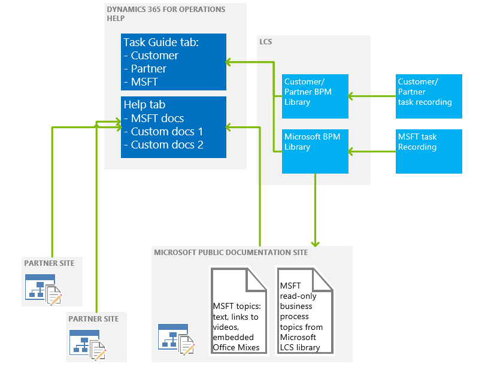
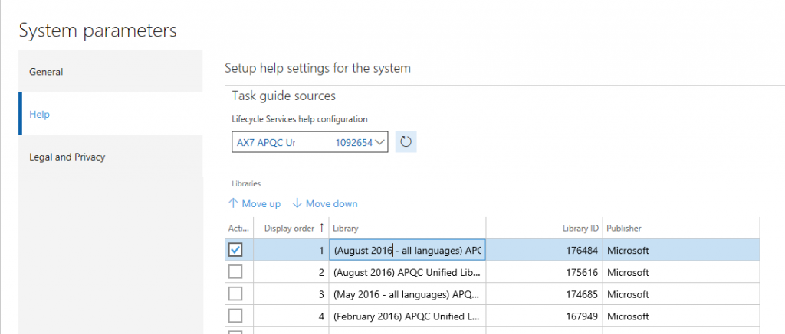
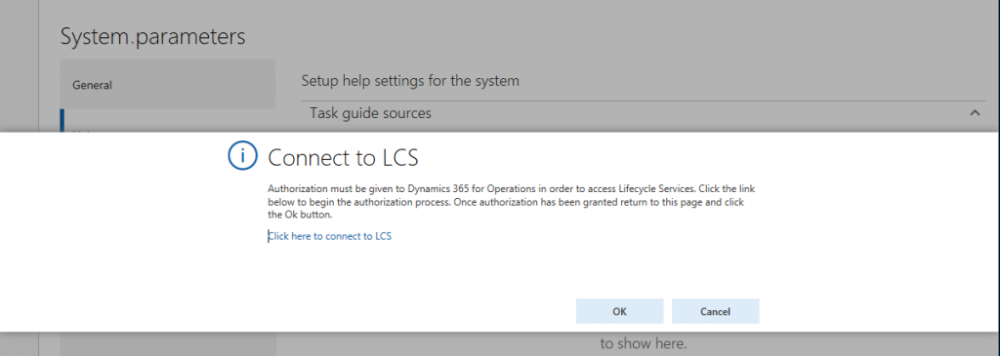

---
# required metadata

title: Connect the Help system
description: This topic describes the components of the Help system for Microsoft Dynamics 365 for Finance and Operations, and provides an overview of how to connect them and a summary of how to create custom help. 
author: margoc
manager: AnnBe
ms.date: 11/16/2018
ms.topic: article
ms.prod: 
ms.service: dynamics-ax-platform
ms.technology: 

# optional metadata

ms.search.form: SystemParameters
# ROBOTS: 
audience: Application User, Developer, IT Pro
# ms.devlang: 
ms.reviewer: margoc
ms.search.scope: Core, Operations
# ms.tgt_pltfrm: 
ms.custom: 16141
ms.assetid: 0b9c8630-9474-4473-80fd-7db5d54b2275
ms.search.region: Global
# ms.search.industry: 
ms.author: margoc
ms.search.validFrom: 2016-02-28
ms.dyn365.ops.version: AX 7.0.0

---

# Connect the Help system

[!include [banner](../includes/banner.md)]

This topic describes the components of the Help system for Microsoft Dynamics 365 for Finance and Operations. It provides an overview of how to connect these components and a summary of how to create custom help.

## Help architecture

The following illustration shows the parts of the Finance and Operations Help system. The in-product Help system pulls articles from the Finance and Operations site on https://docs.microsoft.com, as well as task guides stored in Business Process Modeler in Lifecycle Services (LCS).

> [!NOTE]
> The features listed in the diagram with an asterisk (\*) are planned, but are not available yet.

## Connecting the Help system

> [!NOTE]
> The **Task guides** tab is currently not available in Microsoft Dynamics 365 for Talent and Microsoft Dynamics 365 for Retail. We are currently working to enable this functionality in a future release. The Task guides in the Getting Started experience in Talent remain available to cover basic functionality. Procedural help is also available on the docs.microsoft.com site ([docs.microsoft.com/dynamics365/unified-operations](../../index.md)) for both Retail and Talent.

Using the **System Parameters** page, system administrators connect the pieces of the Help system for an implementation.

On the **System parameters** page, follow these steps:

> [!IMPORTANT]
> The first time that you open the **Help** tab, you must connect to Lifecycle Services. Be sure to click the link in the middle of the form, wait for the connection, close the dialog box, and then click **OK** to get to the **System Parameters** page.
>
> 

1. Select the Lifecycle Services project to connect to.
2. Select the BPM libraries (within the selected project) to retrieve task recordings from.

    - For Finance and Operations, for Microsoft content, select the most recent APQC Unified Library for Finance and Operations.
    - For Retail, we will be releasing a library in the near future.
    - You do not need to select a library for Talent—the connection to the correct library is established for you.

3. Set the display order of the BPM libraries. This determines the order in which task recordings from the libraries will appear in the **Help** pane.

After you complete these steps, you can open the **Help** pane and click the **Task guides** tab. You'll now see the task guides that apply to the page that you're currently on in Finance and Operations. If no task guides are found, you can enter keywords to refine your search.

### Showing translated task guides

Translated task guides were first shipped in the May 2016 APQC Unified Library, and the Getting Started library. In Finance and Operations, to see localized task guide help, make sure that you are connected to the May library. The language that a task guide appears in is controlled for each user by the Language settings under **Options** &gt; **Preferences**.

> [!NOTE]
> Even though many task guides have been translated, right now the Finance and Operations client is not showing the translated task guide names. Also, only the task guides that were released in February 2016 are available in translation in the May library. We will release an updated library with additional translations.
>
> - If a task guide has been translated, when you open that task guide all the text of the task guide will appear in your selected language.
> - If a task guide has not yet been translated, when you open it, only some of the text (the text of the controls) will appear in your selected language.

## Creating custom help

You can use task guides to create custom help, or connect a website to the Help pane.

### Create custom help with task guides

You can create custom help for Finance and Operations, and for Retail by creating task recordings that reflect your implementation, and saving them to an LCS Business Process Library. You cannot create custom task guides for Talent.

For partners, if you promote a library to be a corporate library, and include it in a solution, it will be available to your customers. You can also make a copy of the APQC Unified global library, and then open your copy, open task recordings from it, modify them, and save the recordings with your changes. For more information, see [How to create a task recording to use as documentation or training](../../dev-itpro/user-interface/task-recorder.md).

### Connect a custom site

Microsoft has provided a white paper and sample code that describe how to create and connect a custom help site to the Help pane. For more information, see:

- [Create Custom Help for Finance and Operations (white paper)](https://go.microsoft.com/fwlink/?linkid=2041185)
- [Custom help GitHub repository](https://github.com/microsoft/dynamics356f-o-custom-help)

## Additional resources

[Help overview](help-overview.md)

[Task recorder overview](../../dev-itpro/user-interface/task-recorder.md)

[How to create a task recording to use as documentation or training](../../dev-itpro/user-interface/task-recorder-training-docs.md)
