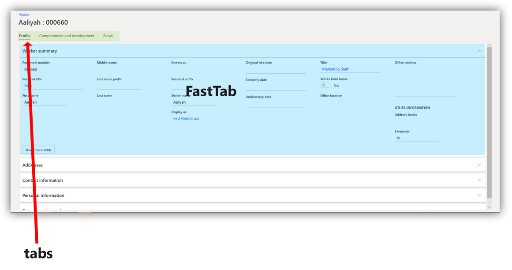
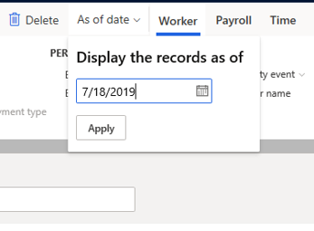
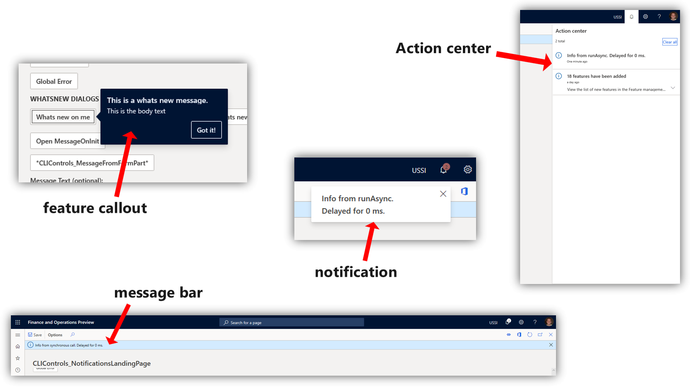

---
# required metadata

title: User interface elements
description: This topic describes the user interface (UI) elements used in Dynamics 365 for Finance and Operations.
author: 
manager: AnnBe
ms.date: 08/09/2019
ms.topic: article
ms.prod: 
ms.service: dynamics-ax-applications
ms.technology: 

# optional metadata

# ms.search.form:  
audience: Application User
# ms.devlang: 
ms.reviewer: 
ms.search.scope: Core, Operations
# ms.tgt_pltfrm: 
# ms.custom: 
ms.search.region: Global
# ms.search.industry: 
ms.author: tlefor
ms.search.validFrom:  
ms.dyn365.ops.version: 7.3
---

# User interface elements

This topic describes the user interface (UI) elements used in Dynamics 365 for Finance and Operations. Before users can navigate the interface, it's important to know the names and functions of the elements that make up the interface.

## Overview

- **Action Pane** - The bar beneath the navigation bar. Here, you can select tabs to change records shown in the page. You can edit and save the records here.  
- **FactBox** - You can see information and follow the activities of certain records in this pane.  
- **FactBox pane** Here, you can scroll through different aspects of a record to view in the FactBox.  
- **Filter pane** - On some pages, you can select **Show filters** to open this pane. It allows you to narrow the results visible to you on the page.  
- **Navigation bar** - The bar at the top of the interface. It contains the **Dynamics 365 portal**, **Search**, **company picker**, **Action center**, **Settings**, **Help & Support**, and the user profile.  
- **Navigation list** - On some pages, you can scroll through this pane to find a specific record. When selected, the details of the record will appear in the page.  
- **Navigation pane** - The left-most pane. From here, you can find any page in the product.  
- **Page** - The central focus of the interface. Selections made on the other UI components will affect what records are shown here.  
- **Pane** - The right-most pane. This will open in some cases when aspects of a record need to be changed and saved.  
- **Tab** - When referring to the Action Pane, it's a menu of options that appears when you select a given option in the Action Pane.  

## Tabs, fields, and sections

A *tab* is a selection made on the page that opens a different aspect of a record on the same page. Often, it will allow you to change certain *fields*, or UI elements that allow typed input. 

A *FastTab* is a tab with the added benefit of allowing multiple tabs to be visible at the same. You can expand a FastTab by selecting the downward-pointing arrow on the right end of it.

A *section* is similar to a tab. The word "section" is often used to describe any area of a page that organizes a specific category of information. In the following image, Summary, Orders and favorites, and Links are all examples of sections.

## Dialog boxes and drop-down menus

A *dialog box* is a pane that opens when certain selections are made to change or create a record. Dialog boxes contain fields that allow you to enter typed input. Sometimes, a given field will allow you to select a downward facing arrow that opens a list of options to choose from. This is called a *drop-down menu*. In the following image, the **Type** and **Customer group** fields contain the option to open a drop-down menu.

In some cases, a dialog box will open near a given button when you select it. This is called a *drop-down dialog box*. In the following image, the **As of date** button was selected, which opened a drop-down dialog box.

## Notifications

Certain changes to the objects you oversee will appear as *notifications*. Notifications may notify you when a specific customer's information has been changed, or it may alert you when the system can't accept inputs you've added in certain fields. You can learn how to customize what you receive notifications about in the [Alerts overview](../get-started/alerts-overview.md).

Notifications appear in a variety of ways.
- **Feature callout** - This will appear next to a field, tab, or other button to offer an explanation of what the feature is used for. 
- **Action center** - A box that contains the notification will appear next to the Action center button on the navigation bar. You can see details about the notification by selecting **Action center**.  
- **Message bar** - This will appear beneath the Action Pane.  

The following image shows examples of these types of notifications.

- **Message box** - This will appear over the interface and must be interacted with before you can continue to use the product.  

## Toolbars, grids, and lists

A *toolbar* contains tools, such as the ability to add fields or remove records. Sometimes, a toolbar will appear on the page above a *grid*. This area, grid, is a name given to rows of records with various columns of data. Not all grids have toolbars above them.

A *list* is the name given to a collection of records that you can scroll through. You can bring these records into the page by selecting them. Often, this will open a grid.

