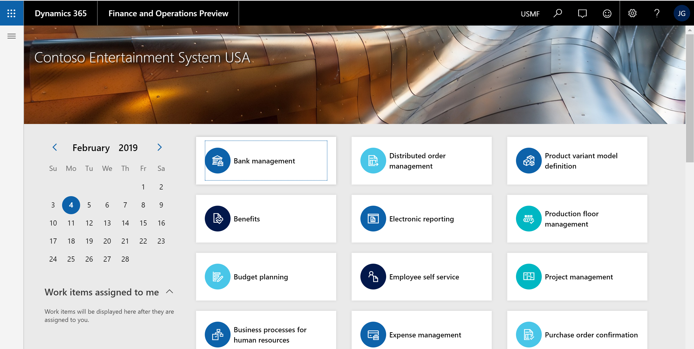
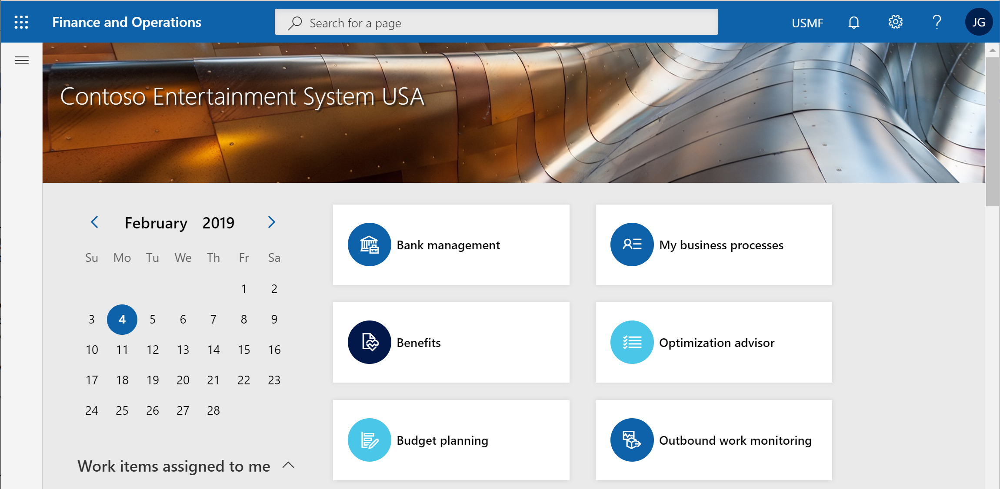
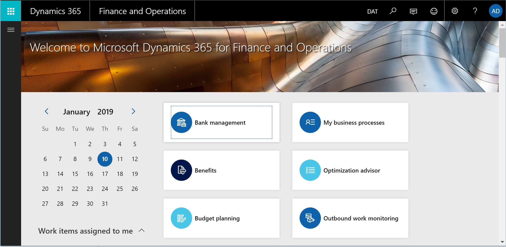

---
# required metadata

title: What's new or changed in Finance and Operations platform update 24 (March 2019)
description: This topic describes features that are in preview in Dynamics 365 for Finance and Operation platform update 24 (March 2019). 
author: tonyafehr
manager: AnnBe
ms.date: 3/14/2019
ms.topic: article
ms.prod: 
ms.service: dynamics-ax-platform
ms.technology: 

# optional metadata

# ms.search.form: 
# ROBOTS: 
audience: Developer, IT Pro
# ms.devlang: 
ms.reviewer: tfehr
ms.search.scope:  Operations
# ms.tgt_pltfrm: 
ms.custom: 
ms.assetid:
ms.search.region: Global
# ms.search.industry: 
ms.author: tfehr
ms.search.validFrom: 20189-XX-XX
ms.dyn365.ops.version: Platform 24

---
# What's new or changed in Finance and Operations platform update 24 (March 2019)

[!include [banner](../includes/banner.md)]

This topic describes features that are new or changed in Dynamics 365 for Finance and Operations platform update 24. This version has a build number of 7.0.5179. For more information about Platform update 24, see [Additional resources](whats-new-platform-update-24.md#additional-resources).

## New APIs

New APIs have been added to help data integration retrieve errors that occurred during the import execution runs in a data project. For more information, see [Data management package REST API](../../dev-itpro/data-entities/data-management-api.md).

## Clear identification of preview builds
Some partners, ISVs, and customers have access to preproduction builds of Finance and Operations by being part of the Preview Early Access Program (PEAP) or by using public previews of the service. This preview phase is intended as a mechanism for feedback on the latest features and for validation of customizations. These early releases, however, are not authorized to be used in production. See the [Standard and First release service updates](public-preview-releases.md) topic for more information about the Finance and Operations release process.

To make the **preview** status clear to users, each preproduction build will be tagged in two different ways: 

- Users will see the word "Preview" as a suffix to the product name in the navigation bar.  

      

- The title of the **About** box will include the word "Preview". 

    
    

## Updated navigation bar that aligns with the Office header
Dynamics 365 products are working to align their respective headers with the Office header to provide a more cohesive shell experience for users across Microsoft products. For Finance and Operations users, this header update will be seen as a completely restyled navigation bar that more prominently features navigation search. Notably, the new design does not include a breadcrumb.

The updated navigation bar is shown by default in Platform update 24. For customers wanting to continue using the older navigation bar, this can temporarily be done via the **Client performance options** page, specifically using the **Enable legacy navigation bar** toggle. Note that we plan to make this toggle available through Platform update 28 only, at which time all customers will see the updated navigation bar.  

The following image shows the updated navigation bar in Platform update 24.

The following image shows how the navigation bar appeared in Platform update 23.

## Extensibility enhancements

The [first wave of platform extensibility enhancements](https://docs.microsoft.com/business-applications-release-notes/April19/dynamics365-finance-operations/platform-extensibility), included in Platform update 24, are documented in the April 2019 Release notes. There are nine enhancements detailed, with one of the highlights being a new onClicking event for form button controls.

## Client Alert support for email notifications
Stay on top of your business data with integrated change tracking tools.  With Platform update 24, users are able to create Alert Rules that automatically dispatch email notifications to contacts when triggered by an event.  This capability has the distinction of being the number 1 requested feature in the Dynamics Ideas customer forum.  With Dynamics 365 for Finance and Operations, users are able to define custom Alert rules to monitor filtered views of their data.  The option of receiving email notifications is available for all supported Alert types and can be enabled for existing Alert rules.  

Supported scenarios include using intuitive controls to create Alerts rules that monitor filtered views of System batch jobs.  Move beyond the burden of constantly checking reports for changes to business data and let the Dynamics 365 for Finance and Operations intelligent change detection service do the monitoring for you.

## Business events (Private preview)
This new capability will provide a framework that will allow business processes in Finance and Operations to capture business events as business processes are executed, and send the events to an external system or application.

> [!Note]
> This feature is available as a private preview. For information about when the feature is scheduled for generally availability, see the [Release notes](https://docs.microsoft.com/business-applications-release-notes/April19/dynamics365-finance-operations/planned-features). For information about how to enable the feature, see [Enabling business events](../../dev-itpro/business-events/home-page.md#enabling-business-events).

This will allow, for example, a purchase order approval to quickly trigger a fulfillment in the vendor organization sooner than later; a receipt of a damaged part to trigger the vendor claim process in real time; and so on. Because these events happen in the context of business processes they are called *business events*, which enable *business process integration*.

External business processes will subscribe to specific business events from Finance and Operations to get notified when they occur. The business events can also be consumed as "triggers" in the Finance and Operations connector.

Some capabilities that will be included are:

-   Business events framework, for partner and customer implemented business events.

-   Business events administrator experience.

-   Application business events.

-   Workflow business events.

-   Out-of-the-box integration with Azure Event Grid and Azure Service Bus for
    advanced integration scenarios.

-   Exposing business events as 'triggers' in Microsoft Flow.

For more information, see [Business events](../../dev-itpro/business-events/home-page.md).

## Additional resources
### Platform update 24 bug fixes

For information about the bug fixes included in each of the updates that are part of Platform update 24, sign in to Lifecycle Services (LCS) and view this [KB article](https://fix.lcs.dynamics.com/Issue/Details?bugId=287129&qc=6daf0a1b735f67d827cf6f643a2ef482dc0d66a220ce23ba6f3cba32ece56015).

### Dynamics 365 April '19 release notes

Wondering about upcoming and recently released capabilities in any of our business apps or platform?

[Check out the April '19 release notes](https://docs.microsoft.com/en-us/business-applications-release-notes/April19/index). We've captured all the details, end to end, top to bottom, in a single document that you can use for planning.

### Removed and deprecated features
The [Removed or deprecated features](../../dev-itpro/migration-upgrade/deprecated-features.md) topic describes features that have been removed or deprecated for Dynamics 365 for Finance and Operations.

- A *removed* feature is no longer available in the product.
- A *deprecated* feature is not in active development and may be removed in a future update.

Before any feature is removed from the product, the deprecation notice will be announced in the [Removed or deprecated features](../../dev-itpro/migration-upgrade/deprecated-features.md) topic 12 months prior to the removal.

For breaking changes that only affect compilation time, but are binary compatible with sandbox and production environments, the deprecation time will be less than 12 months. Typically these are functional updates that need to made to the compiler.

