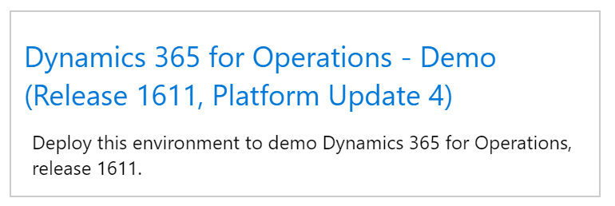
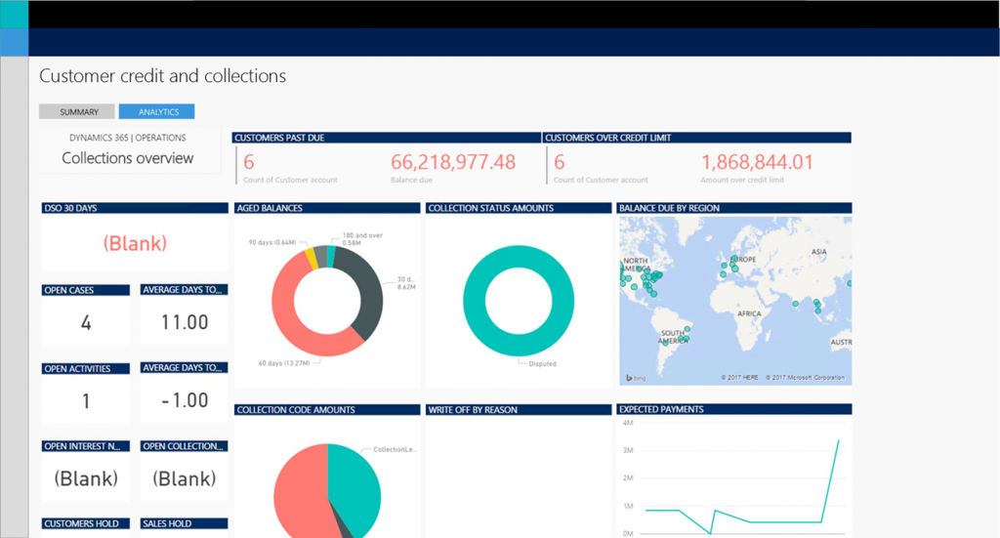
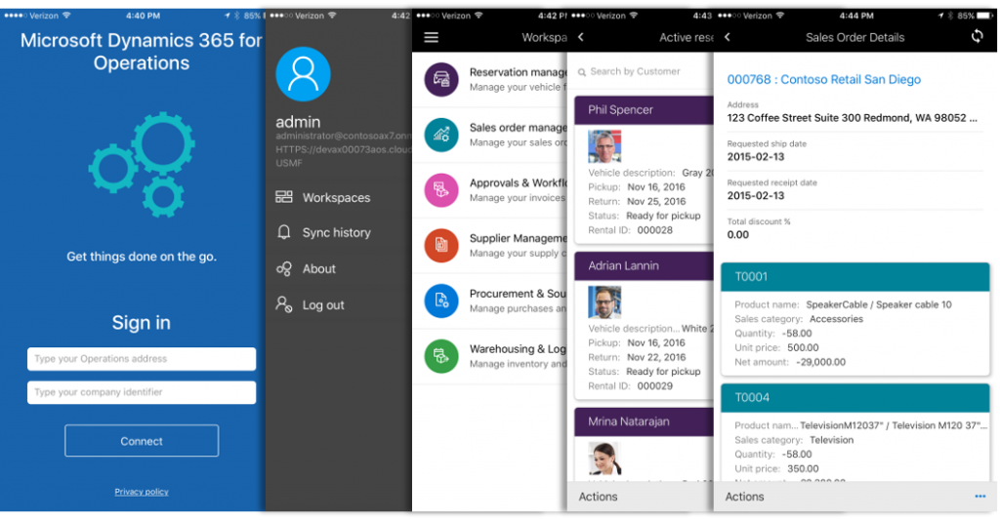
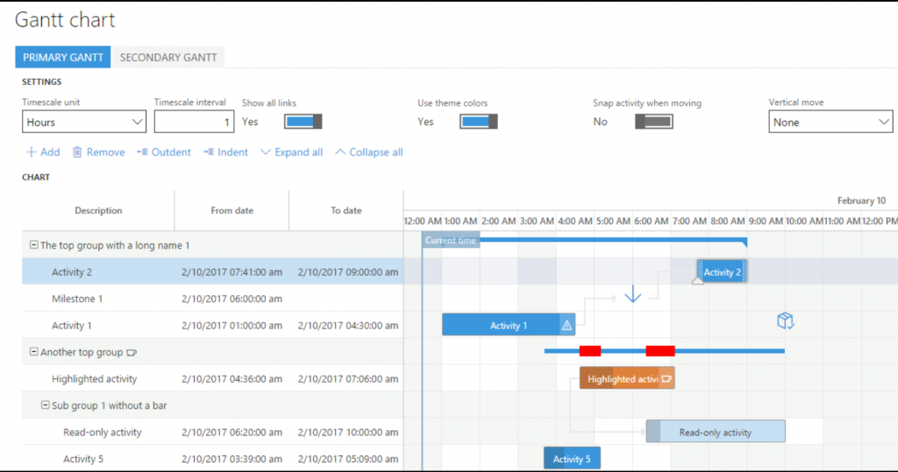
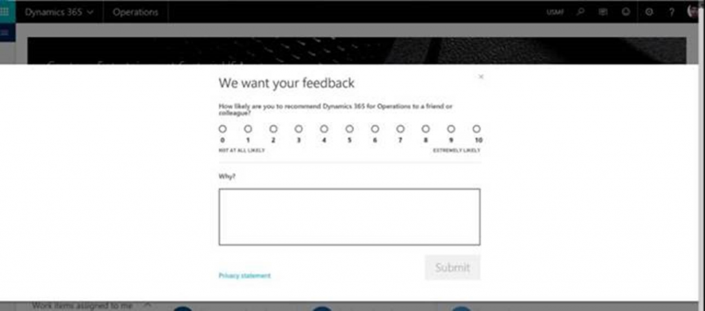

---
# required metadata

title: What's new or changed in Dynamics 365 for Operations platform update 4 (February 2017)
description: This topic describes features that are either new or changed in Dynamics 365 for Operations platform update 4. This version was released in February 2017 and has a build number of 7.0.4425.16161.
author: sericks007
manager: AnnBe
ms.date: 04/20/2017
ms.topic: article
ms.prod: 
ms.service: dynamics-ax-platform
ms.technology: 

# optional metadata

# ms.search.form: 
# ROBOTS: 
audience: Developer, IT Pro
# ms.devlang: 
ms.reviewer: tfehr
ms.search.scope: Operations
# ms.tgt_pltfrm: 
ms.custom: 271823
ms.assetid: a98f6291-347c-4616-ad80-84d3eb648cba
ms.search.region: global
# ms.search.industry: 
ms.author: sericks
ms.dyn365.ops.version: Platform update 4
ms.search.validFrom: 2017-02-28

---

# What's new or changed in Dynamics 365 for Operations platform update 4 (February 2017)

[!include [banner](../includes/banner.md)]

This topic describes features that are either new or changed in Dynamics 365 for Operations platform update 4. This version was released in February 2017 and has a build number of 7.0.4425.16161.

## Overview

We are happy to announce that we have moved to a continuous update cycle for the Microsoft Dynamics cloud platform. This month, some exciting updates are being delivered:

- **Monthly updates**: We are moving to a monthly cadence and providing a simpler update process to help keep new and existing systems up to date.
- **Embedded Power BI reports are licensed for all users**: Embedded Microsoft Power BI reports are licensed for all users. Additional functionality is available for users who have Power BI Pro licenses.
- **Build and release workspaces that have embedded Power BI reports**: You can build and release workspaces that have embedded Power BI reports, to provide interactive and visually engaging experiences for users.
- **Mobility**: We updated the mobile framework so that you can build unique online and offline experiences that now also support iOS and Android devices.
- **Visual scheduling**: We updated Gantt chart integration, added new visual icons, localized formats, updated user efficiencies, and improved resource management features.
- **Feedback**: You can provide your feedback to help us improve Microsoft Dynamics 365 for Operations.

## Monthly updates

As you know, the cloud platform is [locked](whats-new-platform-update-3.md) as of update 3. A locked platform not only enables rich customizations that use extensions but also lets you to make updates without doing costly code upgrades. Starting with update 4, the cloud platform will release monthly updates. Therefore, you can keep new and existing environments up to date with the latest innovations at the click of a button.

To install the latest monthly platform updates in an existing environment, on [LCS](https://lcs.dynamics.com/), go to the Shared asset library, and select the **Software deployable package** tab. There, you will see that the platform update 4 package is ready for deployment, as shown in the following illustration. You can import this package into the project's asset library and then apply it to a specific environment through the update flows. For more details, see the [upgrade topic](../../dev-itpro/migration-upgrade/update-platform-each-release.md).

For new environments, the topology will include update 4.

In [Dynamics 365 for Operations version 1611](whats-new-platform-update-3.md), the platform models can't be overlayered. Therefore, because all the updates are binary from this release forward, the **Platform X++ Updates** tile is no longer required. Customers who are on versions that are earlier than Dynamics 365 for Operations version 1611 will continue to see the **Platform X++ Updates** tile for any customizations to the platform models. Because binary updates are cumulative, we recommended that you always apply the latest update. For more details, see the [LCS blog](https://blogs.msdn.microsoft.com/lcs/2017/01/26/january-2017-release-notes/). Here's an overview of some of the other features in Microsoft Dynamics 365 for Operations platform update 4.

## Embedded Power BI reports are licensed for all users

[Power BI Embedded](../../dev-itpro/analytics/embed-power-bi-workspaces.md) lets all users access rich graphical views of analytical data that is bundled with Dynamics 365 for Operations applications. The reports are embedded in the Dynamics 365 for Operations application. No additional licenses are required in order to access them.

Support for the existing [tile pinning experience](https://blogs.msdn.microsoft.com/dynamicsaxbi/2016/07/06/pinning-power-bi-reports-to-dynamics-ax-client/) that is provided through PowerBI.com service integration will continue. To access some PowerBI.com functionality outside this embedded experience, you must obtain a Pro license separately.

## Build and release workspaces that have embedded Power BI reports

You can now embed full-page, Power BI driven interactive reports in workspaces. By using the rich infographics and visuals that Power BI supports (even the many controls that are provided by third parties), workspaces can provide a highly visual but interactive experience for the user.

If you're a power user or business analyst, you can use Power BI tools to tweak the ready-made reports or create new reports. If you're a developer, you can use the reports that your users develop as workspaces to create rich navigation experiences within the product. If you're in the partner and independent software vendor (ISV) community, you can now build rich workspaces that include Power BI experiences, and you can release these workspaces as part of your solution.

If you're an ISV or a systems integrator, you can [package Power BI enabled workspaces](../../dev-itpro/analytics/power-bi-embedded-integration.md) (together with navigational experiences) as part of a Microsoft Dynamics Lifecycle Services (LCS) solution. Your customers get the same experience but don't have to have a PowerBI.com subscription. The solution works with just Dynamics 365 for Operations.

For more details about these features and other Power BI features, see the [BI blog](https://blogs.msdn.microsoft.com/dynamicsaxbi/).

## Mobility

We have made major progress on the mobile framework for Dynamics 365 for Operations that lets partners build workspaces that are unique and fully functional mobile experiences. These new capabilities make it easier for users to interact with Dynamics 365 for Operations both online and offline. The mobile framework now supports iOS and Android devices. For more details, see the upcoming [mobility blog](https://blogs.msdn.microsoft.com/Dynamics365forOperationsMobile/).

## Visual scheduling

We have made updates to [visual scheduling](../../dev-itpro/user-interface/gantt-development-guide.md) in this release:

- You can now explicitly order activities in the Gantt chart. You can set the order of activities in the Gantt chart and move tasks within the same project.
- Visual icons are available for tasks. For example, there are icons for warning and errors.
- Date and time formats are now localized.
- You can perform drag-and-drop operations on multiple selected tasks.
- A resource capacity bar clearly flags time intervals where there is overbooking.

## Feedback

We always value your feedback. As part of this update, we periodically prompt you to rate your recommendation of the product. We encourage you to provide this feedback to help us continually improve your experience. We also encourage you to provide details about areas where we can improve.

