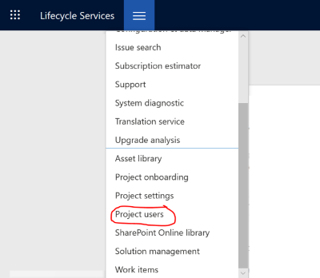

---
# required metadata

title: Onboard a Finance and Operations implementation project
description: This topic describes how to onboard a Microsoft Dynamics 365 for Finance and Operations project by using Microsoft Dynamics Lifecycle Services (LCS).
author: ClaudiaBetz-Haubold
manager: AnnBe
ms.date: 02/09/2018
ms.topic: article
ms.prod: 
ms.service: dynamics-ax-platform
ms.technology: 

# optional metadata

# ms.search.form:  
audience: IT Pro
# ms.devlang: 
ms.reviewer: margoc
ms.search.scope: Operations
# ms.tgt_pltfrm: 
# ms.custom: 
ms.search.region: Global
# ms.search.industry: 
ms.author: chaubold
ms.search.validFrom: 2018-01-31
ms.dyn365.ops.version: July 2017 update
---

# Onboard a Finance and Operations implementation project

[!include [banner](../includes/banner.md)]

This topic describes how to onboard a Microsoft Dynamics 365 for Finance and Operations project by using Microsoft Dynamics Lifecycle Services (LCS).

## Microsoft 365 Admin Center

After your organiation has purchased a subscription to Finance and Operations, it must be activated on your organization's Azure Active Directory (AAD) tenant by your Tenant Administrator, who completes the following steps:
1. Open an Inprivate/Incognito browser session and navigate to the [Microsoft 365 Admin Center](https://admin.microsoft.com/)
2. Login with the Tenant Administrator credentials.
3. Navigate to Billing > Subscriptions and confirm that there is an active **Dynamics 365 Unified Operations** subscription. **Note** that if you do not see a subscription, consult with your Licensing Partner to confirm the status of the subscription transaction as well as the tenant for the subscription. By default, all Microsoft Online Services should be running on the same AAD tenant.
4. If there is an active **Dynamics 365 Unified Operations** subscription displayed, you may proceed to the next step by logging in to LCS to trigger the Implementation Project creation flow.
5. Open another private browser tab and naviate to [Lifecycle Services](https://lcs.dynamics.com). Click **Login** to access LCS with your current Tenant Admin credentials.
6. Accept and confirm any other prompts displayed to complete the Implementation Project provisioning.
7. The Tenant Administrator is assigned the Project Owner to the provisioned Implementation Project. As a final step, the Tenant Administrator must add additional organization and/or partner team members who will be participating in the Dynamics 365 Finance and Operations implementation. This is perfomed in LCS Project User Management, selected from the LCS Implementation Project menu:

   
   
   For an overview of the security roles that can be assigned to users, see [Configuring LCS Project Security](../../dev-itpro/lifecycle-services/configure-lcs-security#configuring-project-security)

## LCS Implementation project workspace

After the Tenant Administrator has completed the Finance and Operations subscription activation and added the appropriate users, team members can access the **Implementation project** workspace. 

To get started with LCS, see [Lifecycle Services for Finance and Operations customers](../../dev-itpro/lifecycle-services/lcs-works-lcs.md). For a comprehensive overview of LCS, see [Overview of Lifecycle Services](../../dev-itpro/lifecycle-services/lcs-works-lcs.md).

## FastTrack onboarding services

After the LCS **Implementation project** workspace is provisioned, the Microsoft FastTrack team will email the project team to request a call to discuss onboarding services. (Note that this email will originate from ond365@microsoft.com, so please insure that any spam blocker/filter allows email from this address.) For more information about the FastTrack program and the services provided, see [Microsoft FastTrack for Dynamics 365](../get-started/fasttrack-dynamics-365-overview.md).

The FastTrack Onboarding meeting is a 60-minute call via Skype. During this call, the team will introduce the implementation team to the FastTrack program as well as assist with the initial configuration of the LCS project and related tasks:

- Tenant validation
- Introduction to LCS
- Setup of LCS project users
- Setup of Microsoft Azure DevOps
- Subscription estimator/Usage profiler
- Environment planning
- Environment deployment
- Introduction to servicing, support, and service health
- Readiness planning

It is suggested that the following project roles participate in the onboarding meeting. Other roles are optional.

**Customer**

- Project owner
- Microsoft Business Center administrator, if the license was procured through a Volume Service agreement with Microsoft

**Partner**

- Delivery lead/solution architect
- Project manager

## Key data to keep current in LCS

We recommend that you add key project members (such as project managers) to the LCS Implementation project. Be sure to include each person's work email address. In this way, you help us work best with you and help guarantee that project members don't miss important communication from us.

Be sure to keep the milestone dates in your LCS project current. In this way, you help us connect with you at different project stages. When you're closer to your go-live date, we will contact you for a project Go-live assessment before we deploy your production environment.

Milestone dates are stored in the LCS implementation methodology. For more information, see the [Methodologies](../../dev-itpro/lifecycle-services/lcs-works-lcs.md#methodologies) section of the "LCS for Customers" topic.

The onboarding call is an optional service. Partners who are experienced with Finance and Operations implementations can work through the tasks with their customers without the help of the FastTrack team. In these cases, it's especially important that you keep the project users and milestone dates current.
