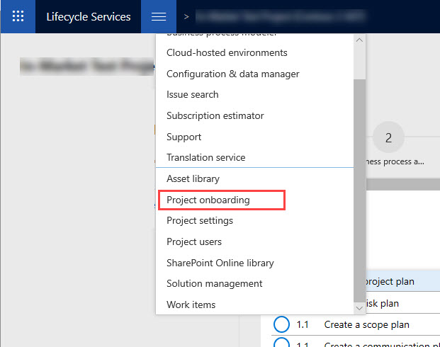

---
# required metadata

title: Onboard a Finance and Operations implementation project
description: This topic describes how to onboard a Microsoft Dynamics 365 for Finance and Operations project by using Microsoft Dynamics Lifecycle Services (LCS).
author: ClaudiaBetz-Haubold
manager: AnnBe
ms.date: 07/09/2019
ms.topic: article
ms.prod: 
ms.service: dynamics-ax-platform
ms.technology: 

# optional metadata

# ms.search.form:  
audience: IT Pro
# ms.devlang: 
ms.reviewer: sericks
ms.search.scope: Operations
# ms.tgt_pltfrm: 
# ms.custom: 
ms.search.region: Global
# ms.search.industry: 
ms.author: chaubold
ms.search.validFrom: 2018-01-31
ms.dyn365.ops.version: July 2017 update
---

# Onboard a Finance and Operations implementation project

[!include [banner](../includes/banner.md)]

This topic describes how to onboard a Microsoft Dynamics 365 for Finance and Operations project by using Microsoft Dynamics Lifecycle Services (LCS).

## LCS Implementation project workspace

After you've purchased and activated a subscription to Finance and Operations, an **Implementation project** workspace is provisioned in LCS when the tenant administrator signs in for the first time. If you're a customer and require help to get started with LCS, see [Lifecycle Services for Finance and Operations customers](../../dev-itpro/lifecycle-services/lcs-works-lcs.md). For a comprehensive overview of LCS, see [Overview of Lifecycle Services](../../dev-itpro/lifecycle-services/lcs-works-lcs.md).

## LCS Project onboarding 
For a new Finance and Operations implementation project in LCS, it is recommended to complete the **Project onboarding** setup before start deploying new environments.  

>[!Note] 
> Project onboarding is only available for implementation project type. 

**Project onboarding** is a step-by-step, self-paced, wizard-driven onboarding experience.  It guides the tenant administrator to set up the key configuration components for the new implementation project provisioned in LCS.  At each of the project onboarding steps, there is video reference and description that provide guidance on the information needed to complete the onboarding process for a successful implementation.  During the project onboarding setup, you can save and exit the wizard anytime and return to continue it throughout the implementation.   After you complete the project onboarding, the Microsoft FastTrack team will contact your project team and provide information about the FastTrack program. 

You can access **Project onboarding** from the hamburger dropdown menu of an implementation project.  Besides the tenant administrator, only users in the **project owner** or **environment manager** LCS security roles will be able to access the project onboarding tool.  

## FastTrack onboarding services

After completing your LCS **project onboarding** set up, the Microsoft FastTrack team will contact your project team to discuss onboarding services. For more information about the FastTrack program and the services that it offers, see [Microsoft FastTrack for Dynamics 365](../get-started/fasttrack-dynamics-365-overview.md).

The FastTrack team will contact all the partner and customer users in your LCS project to schedule a 60-minute onboarding call via Skype. During this call, the team will introduce the FastTrack program and help you with the initial configuration of the LCS project and related tasks:

- Tenant validation
- Introduction to LCS
- Setup of LCS project users
- Setup of Microsoft Azure DevOps
- Subscription estimator/Usage profiler
- Environment planning
- Environment deployment
- Introduction to servicing, support, and service health
- Readiness planning

We recommend that the people in the following project roles participate in the meeting. People in other roles are optional.

**Customer**

- Project owner
- Microsoft Business Center administrator, if the license was procured through a Volume Service agreement with Microsoft

**Partner**

- Delivery lead/solution architect
- Project manager

## Key data to keep current in LCS

We recommend that you add key project members (such as project managers) to the LCS project. Be sure to include each person's work email address. In this way, you help us work best with you and help guarantee that project members don't miss important communication from us.

Keep the milestone dates in your LCS project current to help us connect with you at different project stages. When you're closer to your go-live date, we will contact you for a project Go-live assessment before we deploy your production environment.

Milestone dates are stored in the LCS implementation methodology. For more information, see the [Methodologies](../../dev-itpro/lifecycle-services/lcs-works-lcs.md#methodologies) section of the "LCS for Customers" topic.

The onboarding call is an optional service. Partners who are experienced with Finance and Operations implementations can work through the tasks with their customers without the help of the FastTrack team. In these cases, it's especially important that you keep the project users and milestone dates current.
