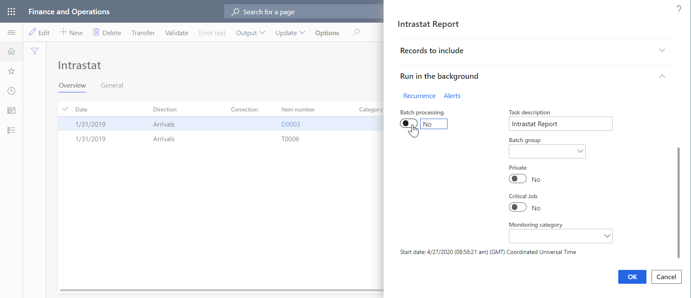
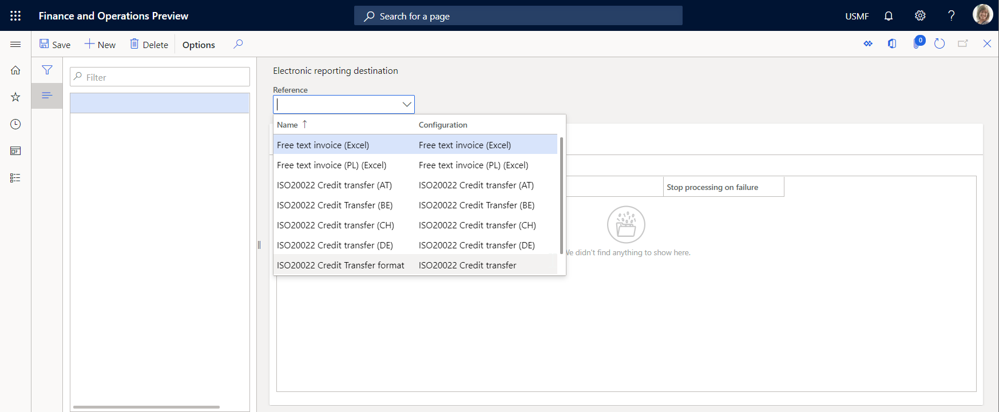
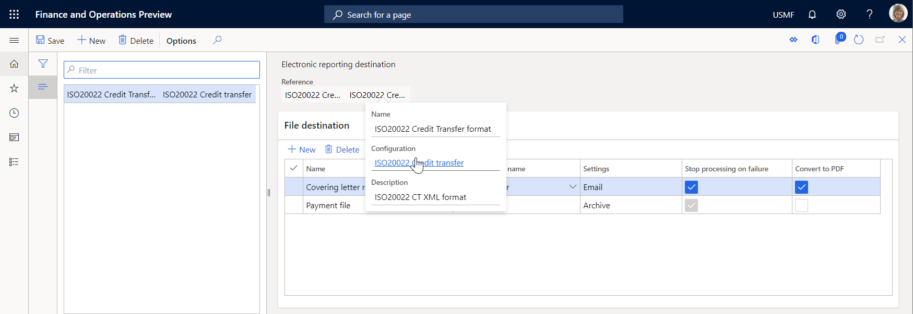
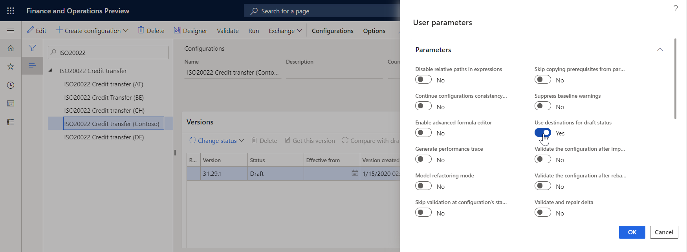
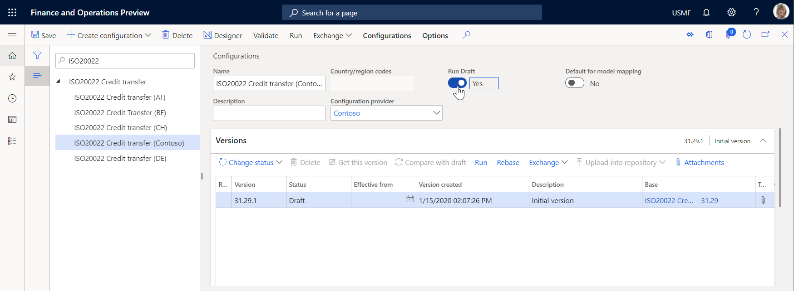
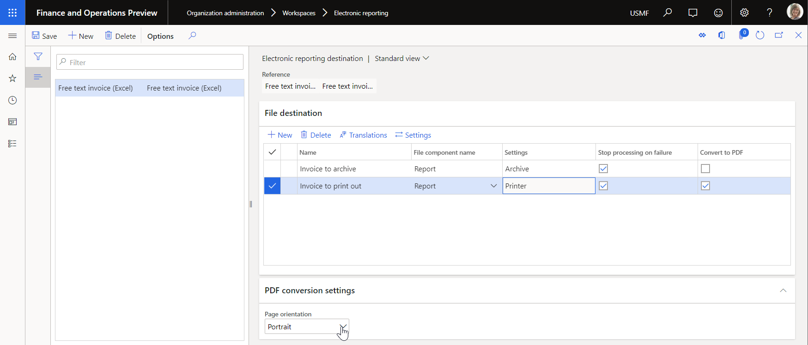

---
# required metadata

title: Electronic reporting (ER) destinations
description: This topic provides information about the management of Electronic reporting (ER) destinations, the types of destinations that are supported, and security considerations.
author: nselin
manager: AnnBe
ms.date: 03/17/2020
ms.topic: article
ms.prod: 
ms.service: dynamics-ax-platform
ms.technology: 

# optional metadata

ms.search.form: DocuType, ERSolutionTable
# ROBOTS: 
audience: Application User
# ms.devlang: 
ms.reviewer: kfend
ms.search.scope: Core, Operations
# ms.tgt_pltfrm: 
ms.custom: 97423
ms.assetid: f3055a27-717a-4c94-a912-f269a1288be6
ms.search.region: Global
# ms.search.industry: 
ms.author: mrolecki
ms.search.validFrom: 2016-05-31
ms.dyn365.ops.version: AX 7.0.1

---

# Electronic reporting (ER) destinations

[!include [banner](../includes/banner.md)]

You can configure a destination for each Electronic reporting (ER) format configuration and its output component (a folder or a file). Users who have appropriate access rights can also modify destination settings at runtime. This topic explains ER destination management, the types of destinations that are supported, and security considerations.

ER format configurations usually contain at least one output component: a file. Typically, configurations contain multiple file output components of different types (for example, XML, TXT, XLSX, DOCX, or PDF) that are grouped into either a single folder or multiple folders. ER destination management lets you preconfigure what occurs when each component is run. By default, when a configuration is run, a dialog box appears that lets you save or open the file. The same behavior also occurs when you import an ER configuration and don't configure any specific destinations for it. After a destination is created for a main output component, that destination overrides the default behavior, and the folder or file is sent according to the destination's settings.

## Availability and general prerequisites

The functionality for ER destinations isn't available in Microsoft Dynamics AX 7.0 (February 2016). Therefore, you must install Microsoft Dynamics 365 for Operations version 1611 (November 2016) or later to use the following destination types:

- [Email](er-destination-type-email.md)
- [Archive](er-destination-type-archive.md)
- [File](er-destination-type-file.md)
- [Screen](er-destination-type-screen.md)
- [Power BI](er-destination-type-powerbi.md)

Alternatively, you can install one of the following prerequisites. However, be aware that these alternatives provide a more limited ER destination experience.

- Microsoft Dynamics AX application version 7.0.1 (May 2016)
- [Electronic reporting destination management application hotfix](https://fix.lcs.dynamics.com/issue/results/?q=3160213)

There is also a [Print](er-destination-type-print.md) destination type. To use it, you must install Microsoft Dynamics 365 Finance version 10.0.9 (April 2020).

## Overview

You can set up destinations only for ER configurations that have been [imported](general-electronic-reporting.md#importing-an-er-component-from-lcs-to-use-it-internally) into the current Finance instance, and for the formats that are available on the **Electronic reporting configurations** page. The functionality for ER destination management is available at **Organization administration** \> **Electronic reporting** \> **Electronic reporting destination**. 

### Default behavior

The default behavior for an ER format configuration depends on the execution type that you specify at the dialog page that is offered when an ER format is started.

When you access the **Run in the background** tab and set the **Batch processing** option to **No**, an ER format is executed immediately in interactive mode. When this execution successfully succeeded, a generated outbound document is offered by using web browser for downloading.

When you access the **Run in the background** tab and set the **Batch processing** option to **Yes**, an ER format is executed in
[batch](https://docs.microsoft.com/dynamics365/fin-ops-core/dev-itpro/sysadmin/batch-processing-overview) mode. The appropriate batch job is created based on parameters that you specify on the ER parameters dialog page in the **Run in the background** tab. 

> [!NOTE]
> The job description is initiated to inform about the run of an ER format mapping. It also contains the name of the executed ER component.

You can find information about this job in sevaral places.

-   Open the **Common \> Inquiries \> Batch jobs \> My batch jobs** page to check the status of the scheduled job.
-   Open the **Organization administration \> Electronic reporting \> Electronic reporting jobs** page to check the status of the scheduled job and execution results of completed job. When the job execution successfully succeeded, on the **Electronic reporting jobs** page select **Show files** to get a generated outbound document.

    > [!NOTE]
    > This document is stored as an attachment of the current job record and controlled by the [Document
    management](https://docs.microsoft.com/dynamics365/fin-ops-core/fin-ops/organization-administration/configure-document-management)
    framework. The [document
    type](https://docs.microsoft.com/dynamics365/fin-ops-core/fin-ops/organization-administration/configure-document-management#configure-document-types) for storing such ER artifacts is configured in [ER
    parameters](electronic-reporting-er-configure-parameters.md#parameters-to-manage-documents).

-   On the **Electronic reporting jobs** page, select **Show files** to get the list of errors and warnings that could be generated during this job’s execution.

### User configured behavior

On the **Electronic reporting destination** page, you can override the default behavior for a configuration. Imported configurations aren't shown on this page until you select **New** and then, in the **Reference** field, select a configuration to create destination settings for.

After you create a reference, you can create a file destination for each **Folder** or **File** output component of the referenced ER format.

Next, in the **Destination settings** dialog box, you can enable and disable individual destinations for the file destination. The **Settings** button is used to control all the destinations for a selected file destination. In the **Destination settings** dialog box, you can control each destination separately by setting the **Enabled** option for it.

In versions of Finance **before version 10.0.9**, you can create **one file destination** for each output component of the same format, such as a folder or a file that is selected in the **File Name** field. However, in **version 10.0.9 and later**, you can create **multiple file destinations** for each output component of the same format.

For example, you can use this capability to configure file destinations for a file component that is used to generate an outbound document in Excel format. One destination ([Archive](er-destination-type-archive.md)) can be configured to store the original Excel file in the ER jobs archive, and another destination ([Email](er-destination-type-email.md)) can be configured to simultaneously [convert](#OutputConversionToPDF) the Excel file to PDF format and send the PDF file by email.

## Destination types

The following destinations are currently supported for ER formats. You can disable or enable all types at the same time. In this way, you can either do nothing or send the component to all configured destinations.

- [Email](er-destination-type-email.md)
- [Archive](er-destination-type-archive.md)
- [File](er-destination-type-file.md)
- [Screen](er-destination-type-screen.md)
- [Power BI](er-destination-type-powerbi.md)
- [Print](er-destination-type-print.md)

## Applicability

You can set up destinations only for ER configurations that have been imported, and for the formats that are available on the **Electronic reporting configurations** page.

> [!NOTE]
> Configured destinations are company-specific. If you plan to use an ER format in different companies of the current Finance instance, you must configure destinations for that ER format for each of those companies.

When you configure file destinations for a selected format, you configure them for the whole format.

At the same time, you might have multiple [versions](general-electronic-reporting.md#component-versioning) of the format that have been imported into the current Finance instance. You can view them if you select the **Configuration** link that is offered when you select the **Reference** field.

By default, configured destinations are applied only when you run an ER format version that has a status of either **Completed** or **Shared**. However, you must sometimes use configured destinations when the draft version of an ER format is run. For example, you modify a draft version of your format, and you want to use configured destinations to test how generated output will be delivered. Follow these steps to apply destinations for an ER format when the draft version is run.

1. Go to **Organization administration** \> **Electronic reporting** \> **Configurations**.
2. On the **Configurations** page, on the Action Pane, on the **Configurations** tab, in the **Advanced settings** group, select **User parameters**.
3. Set the **Use destinations for draft status** option to **Yes**.

To use the draft version of an ER format, you must mark the ER format accordingly.

1. Go to **Organization administration** \> **Electronic reporting** \> **Configurations**.
2. On the **Configurations** page, on the Action Pane, on the **Configurations** tab, in the **Advanced settings** group, select **User parameters**.
3. Set the **Run setting** option to **Yes**.

After you complete this setup, the **Run draft** option becomes available for ER formats that you modify. Set this option to **Yes** to start to use the draft version of the format when the format is run.

## Destination failure handling

Usually, an ER format is run within the scope of a specific business process. However, the delivery of an outbound document that is generated during execution of an ER format must sometimes be considered part of that business process. In this case, if delivery of a generated outbound document to a configured destination is unsuccessful, execution of the business process must be canceled. To configure the appropriate ER destination, select the **Stop processing on failure** option.

For example, you configure vendor payment processing so that the **ISO20022 Credit Transfer** ER format is run to generate the payment file and supplementary documents (for example, the covering letter and control report). If a payment should be considered successfully processed only if the covering letter is successfully delivered by email, you must select the **Stop processing on failure** check box for the **CoveringLetter** component in the appropriate file destination, as shown in the following illustration. In this case, the status of the payment that is selected for processing will be changed from **None** to **Sent** only when the covering letter that is generated is successfully accepted for delivery by an email provider that is configured in the Finance instance.

If you clear the **Stop processing on failure** check box for the **CoveringLetter** component in the destination, a payment will be considered successfully processed even if the covering letter isn't successfully delivered by email. The status of the payment will be changed from **None** to **Sent** even if the covering letter can't be sent because, for example, the email address of the recipient or sender is missing or incorrect.

## Output conversion to PDF

You can use the PDF conversion option to convert output in Microsoft Office format (Excel/Word) to PDF format.

### Make PDF conversion available

To make the PDF conversion option available in the current Finance instance, open the **Feature management** workspace, and turn on the **Convert Electronic Reporting outbound documents from Microsoft Office formats to PDF** feature.

### Applicability

The PDF conversion option can be turned on only for file components that are used to generate output in Microsoft Office Excel or Word format (**Excel file**). When this option is turned on, output that is generated in Office format is automatically converted to PDF format.

### Limitations

> [!NOTE]
> This feature is a preview feature and is subject to the terms of use that are described in [Supplemental Terms of Use for Microsoft Dynamics 365 Previews](https://go.microsoft.com/fwlink/?linkid=2105274).

> [!NOTE]
> The PDF conversion option is only available for cloud deployments.
>
> The produced PDF is limited to a maximum number of 300 pages.
>
> At this time, only landscape page orientation is supported in the PDF document that is produced from an Excel output.
>
> Only the common system fonts of the Window operating system are used for the conversion of an output that contains no embedded fonts.

### Use the PDF conversion option

To turn on PDF conversion for a file destination, select the **Convert to PDF** check box.

### <a name="SelectPdfPageOrientation">Select a page orientation for PDF conversion</a>

If you generate an ER configuration in Excel format and want to convert it to PDF format, you can specify the page orientation of the PDF. When you select the **Convert to PDF** check box to turn on PDF conversion for a file destination that produces an output file in Excel format, the **Page orientation** field becomes available on the **PDF conversion settings** FastTab. In the **Page orientation** field, select the preferred orientation.

> [!NOTE]
> To have the option to select the PDF page orientation, you must install Microsoft Dynamics 365 Finance version 10.0.10 (May 2020) or later.
>
> The selected page orientation is applied to all ER configurations that are generated in Excel format and then converted to PDF format.
>
> If a converted PDF is created from an ER configuration in Word format, the page orientation of the PDF is taken from the Word document.

## Security considerations

Two types of privileges and duties are used for ER destinations. One type controls a user's overall ability to maintain the destinations that are configured for a legal entity (that is, it controls access to the **Electronic reporting destinations** page). The other type controls an application user's ability to override, at runtime, the destination settings that an ER developer or ER functional consultant has configured.

| Role (AOT name)                     | Role name                                  | Duty (AOT name)                     | Duty name                                                        |
|-------------------------------------|--------------------------------------------|-------------------------------------|------------------------------------------------------------------|
| ERDeveloper                         | Electronic reporting developer             | ERFormatDestinationConfigure        | Configure electronic reporting format destination                |
| ERFunctionalConsultant              | Electronic reporting functional consultant | ERFormatDestinationConfigure        | Configure electronic reporting format destination                |
| PaymAccountsPayablePaymentsClerk    | Accounts payable payments clerk            | ERFormatDestinationRuntimeConfigure | Configure electronic reporting format destination during runtime |
| PaymAccountsReceivablePaymentsClerk | Accounts receivable payments clerk         | ERFormatDestinationRuntimeConfigure | Configure electronic reporting format destination during runtime |

> [!NOTE]
> Two privileges are used in the preceding duties. These privileges have the same names as the corresponding duties: **ERFormatDestinationConfigure** and **ERFormatDestinationRuntimeConfigure**.

## Frequently asked questions

### I have imported electronic configurations, and I see them on the Electronic reporting configurations page. But why don't I see them on the Electronic reporting destinations page?

Make sure that you select **New** and then select a configuration in the **Reference** field. The **Electronic reporting destinations** page shows only configurations that destinations have been configured for.

### Is there any way to define which Microsoft Azure Storage account and Azure Blob storage are used?

No. The default Microsoft Azure Blob storage that is defined and used for the document management system is used.

### What is the purpose of the File destination in the destination settings? What does that setting do?

The **File** destination is used to control a dialog box. If you enable this destination, or if no destination is defined for a configuration, an open or save dialog box appears after an output file is created.

### Can you give an example of the formula that refers to a vendor account that I can send email to?

The formula is specific to the ER configuration. For example, if you use the ISO 20022 Credit Transfer configuration, you can use **'$PaymentsForCoveringLetter'.Creditor.Identification.SourceID** or **model.Payments.Creditor.Identification.SourceID** to get an associated vendor account.

### One of my format configurations contains multiple files that are grouped into one folder (for example, Folder1 contains File1, File2, and File3). How do I set up destinations so that Folder1.zip isn't created at all, File1 is sent by email, File2 is sent to SharePoint, and I can open File3 immediately after the configuration is run?

Your format must first be available in the ER configurations. If this prerequisite is met, open the **Electronic reporting destination** page, and create a new reference to the configuration. You must then have four file destinations, one for each output component. Create the first file destination, give it a name such as **Folder**, and select a file name that represents a folder in your configuration. Then select **Settings**, and make sure that all the destinations are disabled. For this file destination, the folder won't be created. By default, because of hierarchical dependencies between files and parent folders, the files will behave in the same way. In other words, they won't be sent anywhere. To override that default behavior, you must create three more file destinations, one for each file. In the destination settings for each, you must enable the destination that the file should be sent to.

## Additional resources

[Electronic reporting (ER) overview](general-electronic-reporting.md)
