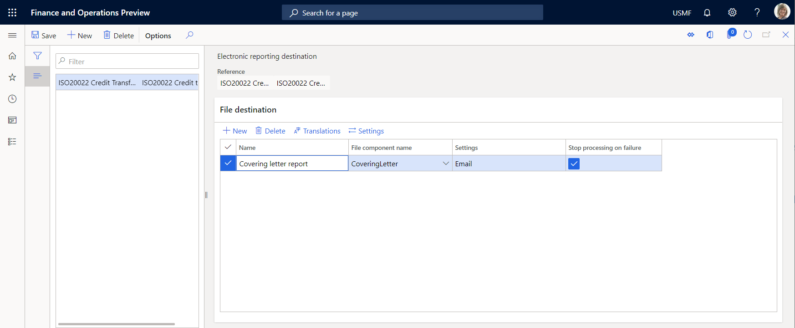
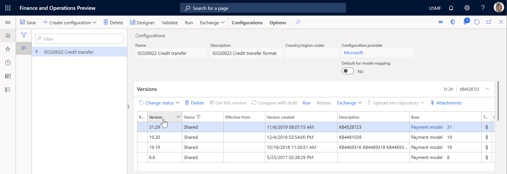
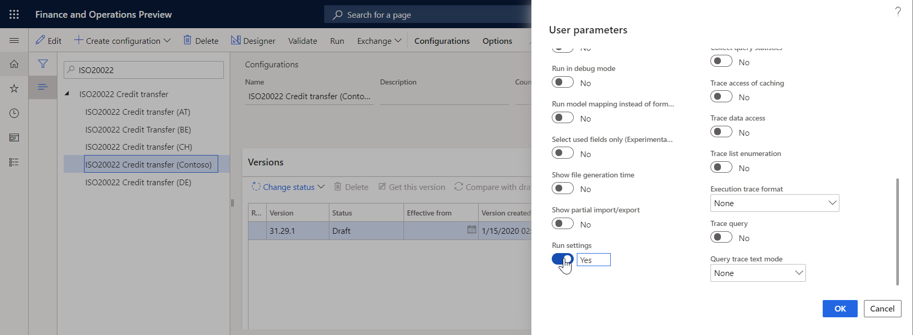
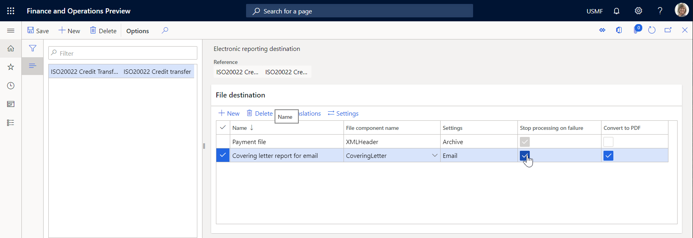
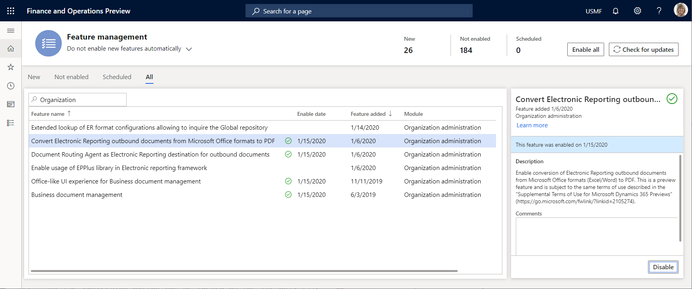

---
# required metadata

title: Electronic reporting (ER) destinations
description: This topic provides information about ER destination management, the types of destinations that are supported, and security considerations.
author: nselin
manager: AnnBe
ms.date: 01/17/2020
ms.topic: article
ms.prod: 
ms.service: dynamics-ax-platform
ms.technology: 

# optional metadata

ms.search.form: DocuType, ERSolutionTable
# ROBOTS: 
audience: Application User
# ms.devlang: 
ms.reviewer: kfend
ms.search.scope: Core, Operations
# ms.tgt_pltfrm: 
ms.custom: 97423
ms.assetid: f3055a27-717a-4c94-a912-f269a1288be6
ms.search.region: Global
# ms.search.industry: 
ms.author: mrolecki
ms.search.validFrom: 2016-05-31
ms.dyn365.ops.version: AX 7.0.1

---

# Electronic reporting (ER) destinations

[!include [banner](../includes/banner.md)]

You can configure a destination for each Electronic reporting (ER) format configuration and its output component (a folder or a file). Users who are granted appropriate access rights can also modify destination settings at run time. This article explains ER destination management, the types of destinations that are supported, and security considerations.

Electronic reporting (ER) format configurations usually contain at least one output component: a file. Typically, configurations contain multiple file output components of different types (for example, XML, TXT, XLSX, DOCX, PDF, etc.) that are grouped into either a single folder or multiple folders. ER destination management lets you preconfigure what occurs when each component is run. By default, when a configuration is run, a dialog box appears that lets the user save or open the file. The same behavior is also used when you import an ER configuration and don't configure any specific destinations for it. After a destination is created for a main output component, that destination overrides the default behavior, and the folder or file is sent according to the destination's settings.

## Availability and general prerequisites
The ER destinations functionality isn't available in the Microsoft Dynamics AX 7.0 (February 2016). Therefore, you must install Dynamics 365 Finance version 1611 (November 2016) to use the following destination types:

- [Email](er-destination-type-email.md)
- [Archive](er-destination-type-archive.md)
- [File](er-destination-type-file.md)
- [Screen](er-destination-type-screen.md)
- [Power BI](er-destination-type-powerbi.md)

Alternatively, you can install one of the following prerequisites. However, be aware that these alternative provide a more limited ER destination experience.

- Microsoft Dynamics AX application version 7.0.1 (May 2016)
- ER destination management [application hotfix](https://fix.lcs.dynamics.com/issue/results/?q=3160213)

You must install Dynamics 365 Finance version 10.0.9 (April 2020) to use the  destination type, [Print](er-destination-type-print.md).

## Overview

You can set up destinations only for ER configurations that have been [imported](general-electronic-reporting.md#importing-an-er-component-from-lcs-to-use-it-internally) to the current Finance instance, and for the formats that are available on the **Electronic reporting configurations** page. The ER destination management functionality is available at **Organization administration** \> **Electronic reporting** \> **Electronic reporting destination**. Here, you can override the default behavior for a configuration. Imported configurations aren't shown here until you click **New** and then, in the **Reference** field, select a configuration to create destination settings for.

After you've created a reference, you can create a file destination for each **Folder** or **File** output component of the referred ER format. 

Next, you can enable and disable individual destinations for the file destination in the **Destination settings** dialog box. The **Settings** button is used to control all of the destinations for a selected file destination. In the **Destination settings** dialog box, you can control each destination separately by setting the **Enabled** option for it.

In any Microsoft Dynamics 365 Finance version prior to **10.0.9**, you can create one file destination for each output component of the same format, such as a folder or a file that is selected in the **File Name** field.

Starting from the Microsoft Dynamics 365 Finance version **10.0.9**, you can create **multiple file destinations** for a single output component of the same format, such as a folder or a file that is selected in the **File Name** field.

For example, you can use this capability to configure file destinations for a file component used to generate an outbound document in Excel format. One destination ([Archive](er-destination-type-archive.md)) can be configured to store the original Excel file in the ER jobs archive while another destination ([Email](er-destination-type-email.md)) can be configured to simultaneously [convert](#OutputConversionToPDF) this Excel file to PDF and send the PDF file over email.

## Destination types

Various types of destinations are supported. You can disable or enable all types at the same time. In this way, you can either do nothing or send the component to all configured destinations. The following destinations are currently supported for ER formats:

- [Email](er-destination-type-email.md)
- [Archive](er-destination-type-archive.md)
- [File](er-destination-type-file.md)
- [Screen](er-destination-type-screen.md)
- [Power BI](er-destination-type-powerbi.md)
- [Print](er-destination-type-print.md)

## Applicability

You can set up destinations only for ER configurations that have been imported, and for the formats that are available on the **Electronic reporting configurations** page.

> [!NOTE]
> Be aware that configured destinations are company-specific. If you plan to use an ER format in different companies of the current Finance instance, you need to configure destinations for this ER format for each such company.

When you configure file destinations for a selected format, you configure them for the entire format. 

At the same time, you might have multiple [versions](general-electronic-reporting.md#component-versioning) of this format that have been imported to the current Finance instance. You can observe them if you select the **Configuration** link that is offered when you select the **Reference** field.

By default, configured destinations are applied only when you run an ER format version in either **Completed** or **Shared** status. Sometimes you need to use configured destinations when the draft version of an ER format is executed. For example, you modify a draft version of your format and want to test how a generated output will be delivered by using configured destinations. Complete the following steps to apply destinations for an ER format when the draft version is executed.

1. Go to **Organization administration** \> **Electronic reporting** \> **Configurations**.
2. On the **Configurations** page, on the Action Pane, on the **Configurations** tab, in the **Advanced settings** group, select **User parameters**.
3. Set the **Use destinations for draft status** field to **Yes**.

To use the draft version of an ER format, you need to mark this ER format accordingly.

1. Go to **Organization administration** \> **Electronic reporting** \> **Configurations**.
2. On the **Configurations** page, on the Action Pane, on the **Configurations** tab, in the **Advanced settings** group, select **User parameters**.
3. Set the **Run setting** field to **Yes**.

After that, the **Run draft** option becomes available for an ER format that you modify. Set this option to **Yes** to start using the draft version of this format when this format is executed.

## <a name="DestinationFailure">Destination failure handling</a>

Usually, an ER format is executed within the scope of a certain business process. Sometimes the delivery of an outbound document that is generated during this ER format execution must be considered as part of that business process. In this case, the execution of that process must be canceled whenever the delivery of a generated outbound document to a configured destination fails. To configure the appropriate ER destination, select the **Stop processing on failure** option.

For example, you may configure vendor payments processing as running the **ISO20022 Credit Transfer** ER format to generate the payment file as well as supplementary documents (covering letter, control report, etc.). If you want to consider a payment processing as successfully completed only when the delivery of the covering letter of this payment using email succeeded, you need to check the **Stop processing on failure** option for the appropriate file destination as shown in the following illustration. With this setting, the status of the payment that is selected for processing will be changed from **None** to **Sent** only when the generated covering letter has been successfully accepted for sending by an email provider that is configured in the Finance instance.

If you deselect the **Stop processing on failure** option for the **CoveringLetter** component in this sample destination, a payment will be considered as successfully processed regardless of the results of the covering letter emailing. The status of the processing payment will be changed from **None** to **Sent** even when the emailing of the covering letter failed due to, for example, missing or incorrect email address of a recipient or a sender. 

## <a name="OutputConversionToPDF">Output conversion to PDF</a>

You can use this option to convert an output in Microsoft Office format (Excel/Word) to PDF one.

### Enable PDF conversion

To make this option available in the current Finance instance, you need to open the **Feature management** workspace and enable the **Convert Electronic Reporting outbound documents from Microsoft Office formats to PDF** feature.

### Applicability

The PDF conversion option can be turned on only for tfile components that are used to generate an output in Microsoft Office Excel or Word formats (**Excel file**). When this option is enabled, a generated Office format output is automatically converted to PDF format.

### Limitations

> [!NOTE]
> This is a preview feature and is subject to the same terms of use described in the [Supplemental Terms of Use for Microsoft Dynamics 365 Previews](https://go.microsoft.com/fwlink/?linkid=2105274).

> [!NOTE]
> This option is implemented only for cloud deployments.

### Usage

To enable the PDF conversion for the entered file destination, select **Convert to PDF**.

## Security considerations
Two types of privileges and duties are used for ER destinations. One type controls the ability to maintain the overall destinations that are configured for a legal entity (that is, it controls access to the **Electronic reporting destinations** page). The other type controls the ability of an application user to override, at run time, the destination settings that are configured by an ER developer or ER functional consultant.

| Role (AOT name)                     | Role name                                  | Duty (AOT name)                     | Duty name                                                        |
|-------------------------------------|--------------------------------------------|-------------------------------------|------------------------------------------------------------------|
| ERDeveloper                         | Electronic reporting developer             | ERFormatDestinationConfigure        | Configure electronic reporting format destination                |
| ERFunctionalConsultant              | Electronic reporting functional consultant | ERFormatDestinationConfigure        | Configure electronic reporting format destination                |
| PaymAccountsPayablePaymentsClerk    | Accounts payable payments clerk            | ERFormatDestinationRuntimeConfigure | Configure electronic reporting format destination during runtime |
| PaymAccountsReceivablePaymentsClerk | Accounts receivable payments clerk         | ERFormatDestinationRuntimeConfigure | Configure electronic reporting format destination during runtime |

> [!NOTE]
> Two privileges are used in the preceding duties. These privileges have the same names as the corresponding duties: **ERFormatDestinationConfigure** and **ERFormatDestinationRuntimeConfigure**.

## Frequently asked questions
### I have imported electronic configurations, and I see them on the Electronic reporting configurations page. But why don't I see them on the Electronic reporting destinations page?

Make sure that you click **New** and then select a configuration in the **Reference** field. On the **Electronic reporting destinations** page, you can see only configurations that destinations have been configured for.

### Is there any way to define which Azure Storage account and Azure Blob storage are used?

No. The default Azure Blob storage that is defined and used for the document management system is used.

### What is the purpose of the File destination in the destination settings? What does that setting do?

The **File** destination is used to control a dialog box. If you enable this destination, or if no destination is defined for a configuration, you see an open or save dialog box after an output file is created.

### Can you give an example of the formula that refers to a vendor account that I can send email to?

The formula is specific to the ER configuration. For example, if you use the ISO 20022 Credit Transfer configuration, you can use **'$PaymentsForCoveringLetter'.Creditor.Identification.SourceID** or **model.Payments.Creditor.Identification.SourceID** to get an associated vendor account.

### One of my format configurations contains multiple files that are group into one folder (for example, Folder1 contains File1, File2, and File3). How do I set up destinations so that Folder1.zip isn't created at all, File1 is sent by email, File2 is sent to SharePoint, and I can open File3 immediately after the configuration is run?

The prerequisite is that your format must be available in the ER configurations. If you have your format, open the **Electronic reporting destination** page, and create a new reference to this configuration. You must then have four file destinations, one for each output component. Create the first file destination, give it a name such as **Folder**, and select a file name that represents a folder in your configuration. Then click **Settings**, and make sure that all the destinations are disabled. For this file destination, the folder won't be created. By default, because of hierarchical dependencies between files and parent folders, the files will behave in the same way. In other words, they won't be sent anywhere. To override that default behavior, you must create three more file destinations, one for each file. In the destination settings for each, you must enable the destination that the file should be sent to.

## Additional resources

[Electronic reporting (ER) overview](general-electronic-reporting.md)
