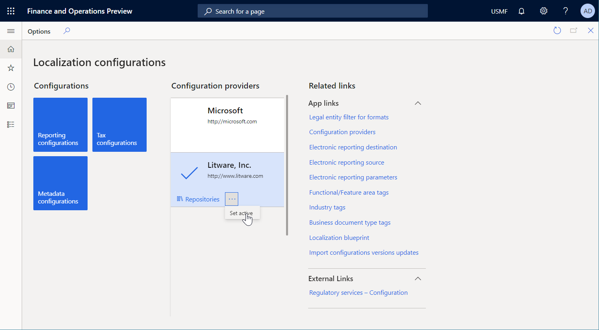
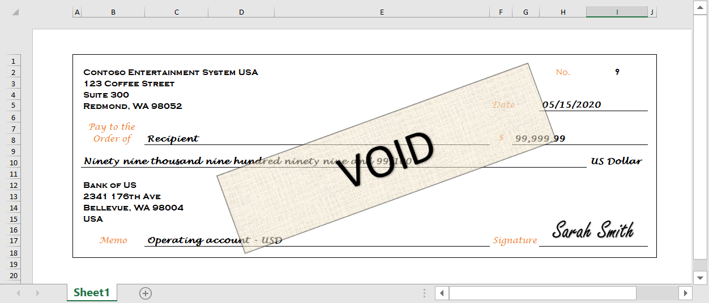
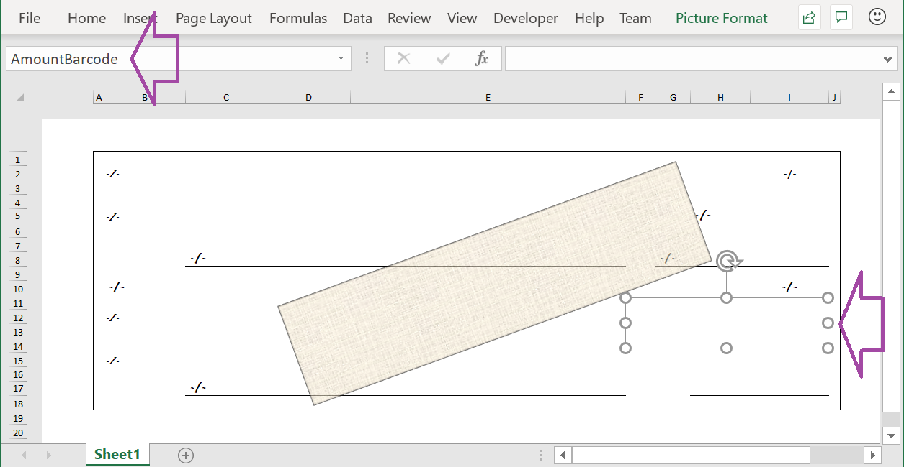
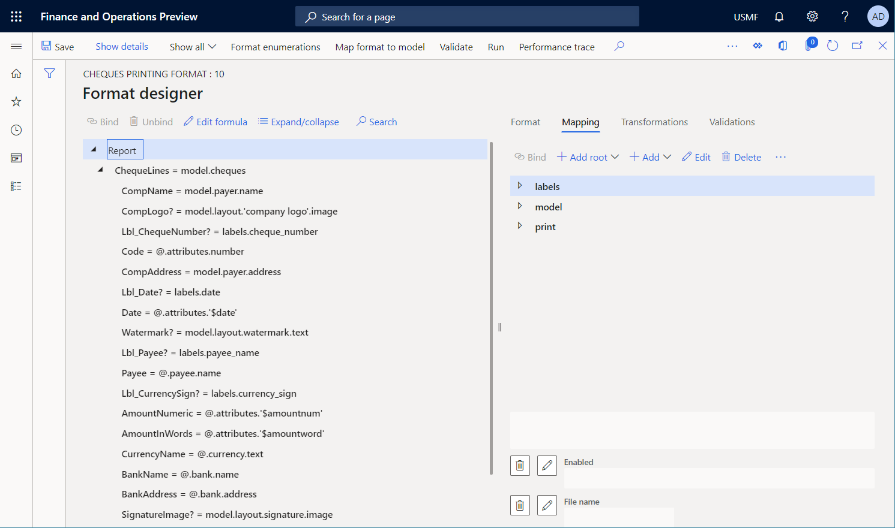
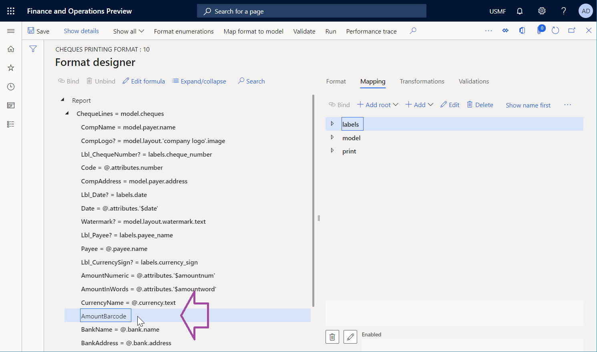
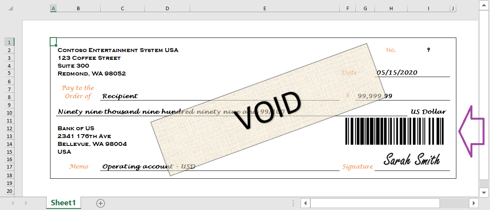

---
# required metadata

title: ER Use BARCODE data sources to generate barcode images
description: This topic explains how to use BARCODE data sources to generate barcode images.
author: NickSelin
manager: AnnBe
ms.date: 05/19/2020
ms.topic: article
ms.prod: 
ms.service: dynamics-ax-platform
ms.technology: 

# optional metadata

ms.search.form: ERWorkspace, ERSolutionTable, ERModelMappingDesigner, EROperationDesigner
# ROBOTS: 
audience: Application User, Developer, IT Pro
# ms.devlang: 
ms.reviewer: kfend
ms.search.scope: Core, Operations
# ms.tgt_pltfrm: 
ms.custom: 220314
ms.assetid: 
ms.search.region: Global
# ms.search.industry: 
ms.author: nselin
ms.search.validFrom: 2020-05-01
ms.dyn365.ops.version: Version 10.0.13

---

# Use the BARCODE data source to generate barcode images

[!include[banner](../includes/banner.md)]

You can use the [Electronic reporting (ER)](general-electronic-reporting.md) framework to design [ER format components](general-electronic-reporting.md#FormatComponentOutbound) that you can run to generate required electronic and printable outbound
documents. To generate an outbound document in Microsoft Office format, you must use either a Microsoft Excel or Microsoft Word document as a report template to specify the layout of the report. The [ER Operations designer](general-electronic-reporting.md#building-a-format-that-uses-a-data-model-as-a-base) lets you attach the Excel or Word document as a template for the ER
format. The named elements in the attached template are associated with the elements of the configured format component:

-   Content controls in Word
-   Named sheets, ranges, cells, shapes, and images in Excel

These named elements are used as placeholders of data that is populated to a generated document when an ER format is executed. ER format elements are bound to data sources. These data sources specify the data that will be entered at run time, in the documents that are generated. For more information, see [Embed images and shapes in documents that you generate by using ER](electronic-reporting-embed-images-shapes.md).

The **Barcode** data source type is now supported by ER and allows you to generate an image that represents a barcode for a given text. When you configure an ER format, you can specify **Barcode** type data sources to generate barcode images and then add them to generated business documents such as orders, invoices, packing slips, and receipts, or different kind of labels such as product and shelf labels, and packaging and shipping labels.

The following placeholders can be used in report templates to populate barcode images:

-   [Picture](https://docs.microsoft.com/office/client-developer/word/content-controls-in-word) content control for Word
-   [Picture](https://support.office.com/article/insert-pictures-3c51edf4-22e1-460a-b372-9329a8724344) object in Excel

By using a **Barcode** type data source, you can generate barcodes in the following formats:

- One-dimensional barcodes:

    - Codabar
    - Code 39
    - Code 93
    - Code 128
    - EAN-8
    - EAN-13
    - ITF-14
    - PDF417
    - UPC-A
    - UPC-E
    - MSI
    - Plessey

-   Two-dimensional barcodes:
    
    - Aztec
    - DataMatrix
    - QR Code

When you configure your barcode data source, you can define specific rendering conditions to generate an image:

- Set the value of the **Width** parameter to specify a barcode width in pixels. Zero value indicates that the default width is used. The meaning can vary for different formats.
- Set the value of the **Height** parameter to specify a barcode height in pixels. Zero value indicates that the default height is used. The meaning can vary for different formats.
- Set the value of the **Margin** parameter to specify a barcode margin in pixels as the size of the areas to each side of a barcode that must be kept clear (quiet zone). A zero margin value indicates that the default margin is used. The meaning can vary for different formats.
- Set the value of the **Output content** parameter to **Yes** to generate a barcode image containing the encoded information as text. The default value is **No**.
- Set the value of the **Encoding** parameter to specify what kind of characters are encoded in a generated barcode image. By default, the **UTF-8** encoding is offered.

>[!Important]
> When you add a new **Barcode** data source, you must place it under another item (container) as a nested element.
>
> When you bind this data source to a format **Cell** element, that represents either a Word content control or an Excel picture, this data source is presented in this binding as a function that has a single **String** type parameter. You must use this parameter to specify the text that must be transformed to a barcode image and that must be read when a generated barcode is scanned.

To learn more about this feature, complete the examples in this topic.

## Example: Generate a payment cheque containing a barcode that encodes a payable amount

The following steps explain how a user in the System administrator or Electronic reporting functional consultant role can configure an ER format that contains a template to generate an outbound document in Excel format containing a barcode.

1. [Prerequisites](#ExamplePrerequisites)
2. [Activate a configurations provider](#ExampleProvider)
3. [Import the provided ER solution](#ExampleImportSolution)
4. [Generate payment cheque](#ExampleGenerateCheque)
5. [Review the generated payment cheque](#ExampleReviewGeneratedCheque)
6. [Modify the format of the provided ER solution](#ExampleModifyFormat)

	i. [Apply a new cheque template](#ExampleModifyFormatApplyTemplate)
	
	ii. [Add a new barcode data source](#ExampleModifyFormatAddDataSource)

	iii. [Bind a new format element](#ExampleModifyFormatBindFormatElement)
	
	iv. [Make the modified version available for test runs](#ExampleModifyFormatMakeVersionAvailable)
	
	  1. [Complete the modified format version](#CompleteToRun)
	  
	  2. [Make draft version available for usage](#MarkToRun)
		
7. [Generate payment cheque](#ExampleGenerateCheque2)

8. [Convert the generated cheque to PDF](#ExampleConvertToPDF)

In this example, you will use the provided solution that has been configured to generate payment checks. This solution generates payment checks that havein which the payable amount written as a number and as text. You will modify this ER solution to also present a generated barcode where the payable amount is encoded and can be read by using a barcode scanner.

These steps can be performed in the **USMF** company in Microsoft Dynamics 365 Finance.

### <a name="ExamplePrerequisites">Prerequisites</a>

To complete this example, you must have access to the USMF company in Finance for one of the following roles:

-   Electronic reporting functional consultant
-   System administrator

If you haven't yet completed the example in the [Embed images and shapes in documents that you generate by using ER](electronic-reporting-embed-images-shapes.md) topic, download the following configurations of the sample ER solution.

| **Content description**     | **File name**               |
|-----------------------------|-----------------------------|
| ER data model configuration | Model for cheques.xml       |
| ER format configuration     | Cheques printing format.xml |

In addition, download the Excel file containing the modified template for the provided ER solution.

| **Content description** | **File name**              |
|-------------------------|----------------------------|
| Report template         | Check template Excel.xlsx |

### <a name="ExampleProvider">Activate a configurations provider</a>

1.  Go to **Organization administration** \> **Workspaces** \> **Electronic reporting**.
2.  On the **Localization configurations** page, in the **Configuration providers** section, make sure that the [configuration
    provider](general-electronic-reporting.md#Provider) for the **Litware, Inc. (http://www.litware.com)** sample company is listed, and
    that it's marked as active. If this configuration provider isn't listed, or if it's not marked as active, follow the steps in the topic, [Create a configuration provider and mark it as active](tasks/er-configuration-provider-mark-it-active-2016-11.md).

### <a name="ExampleImportSolution">Import the provided ER solution</a>

1.  Go to **Organization administration** \> **Workspaces** \> **Electronic reporting**.
2.  Select **Reporting configurations** to open the **Configurations** page.
3.  If the **Model for cheques** configuration isn't available in the configuration tree, import the ER data model configuration:
    1.  Select **Exchange** > **Load from XML file**.
    2.  Select **Browse**, find and select the **Model for cheques.xml** file, and then select **OK**.
4.  If the **Cheques printing format** configuration isn't available in the configuration tree, import the ER format configuration:
    1.  Select **Exchange** > **Load from XML file**.
    2.  Select **Browse**, find and select the **Cheques printing format.xml** file, and then select **OK**.
5.  In the configuration tree, expand **Model for cheques**.
6.  Review the list of imported ER configurations in the configuration tree.

### <a name="ExampleGenerateCheque">Generate a payment cheque</a>

1.  Go to **Cash and bank management** \> **Bank accounts** and select the account, **USMF OPER**.
2.  On the **Bank accounts** page, on the Action Pane, select the **Set up** tab, and in the **Layout** group, select **Check**.
3.  Select **Edit** to make the content of the current page editable.
4.  On the **General** Fast tab, set the **Generic Electronic Export format** field to **Yes**.
5.  In the **Export format configuration** field, select the **Cheques printing format** ER format that was imported earlier.
6.  Select **Print test** and on the dialog page, set **Negotiable check format** to **Yes**.
7.  Select **OK**.

    

### <a name="ExampleReviewGeneratedCheque">Review the generated payment check</a>

1.  Open the generated check in Excel.
2.  Review the generated check.

    

### <a name="ExampleModifyFormat">Modify the format of the provided ER solution</a>

#### <a name="ExampleModifyFormatApplyTemplate">Apply a new check template</a>

You can open the **Cheque template Excel.xlsx** file that you imported earlier by using the Excel desktop application. Note that it differs from the template used generate payment cheques in the ER solution that was provided. In addition, the imported file contains the **AmountBarcode** image.

You must modify the ER solution and [re-apply](modify-electronic-reporting-format-reapply-excel-template.md) the modified template.

1.  Go to **Organization administration** \> **Workspaces** \> **Electronic reporting**.
2.  Select **Reporting configurations** to open the **Configurations** page.
3.  In the configuration tree, expand **Model for cheques**.
4.  Select **Cheques printing format** > **Designer**.
5.  Select the **Mapping** tab, and in the format tree pane, on the Action Pane, select **Expand/Collapse**.  
     > [!NOTE] 
     > All cell format elements are bound to the appropriate data sources.
     >
     > 

8.  Select the **Format** tab.
9.  On the **Format designer** page, on the Action Pane, select the **Import** tab.
10. In the **Import** group, select **Update from Excel**.
11. Select **Update template**.
12. Browse and point to the locally saved **Cheque template Excel.xlsx** file.
13. Select **OK** to confirm the appliance of a selected template.
14. Select the **Mapping** tab.
15. In the format tree pane, on the Action Pane, select **Expand/Collapse**.  
    
    >
    > Note that the new **AmountBarcode** element has been added to the format. This element is associated with the **AmountBarcode** picture of the modified Excel template that has been added as a placeholder for a barcode.

    

#### <a name="ExampleModifyFormatAddDataSource">Add a new barcode data source</a>

You must add a new data source of the **Barcode** type.

1.  In the **Mapping** tab, select **print** data source.
2.  Select **Add**.
3.  Select **Barcode** data source type in the **Functions** group.

    

4.  In the **Name** field, type **barcode**.
5.  In the **Barcode format**, select **Code 128** to specify the format of a barcode.
6.  In the **Width** field, type **500**.
7.  Select **OK**.

    

#### <a name="ExampleModifyFormatBindFormatElement">Bind a new format element</a>

You must bind the added format element to the added data source.

1.  In the **Mapping** tab, select **print\\barcode** data source.
2.  In the format tree, select the **AmountBarcode** cell element.
3.  Select **Bind**.
4.  Select **Show details**.

    > 
    > Note that since the **Barcode** data source is represented in the binding as a function containing a single parameter, the name of the bound format element has been automatically taken as the argument of that parameter.

    

4.  Select **Edit formula** to adjust this binding.

    >
    > Instead of the cell element name you need to configure an expression returning the text containing a payable amount of the current cheque. As the parent **ChequeLines** range is bound to the **model.cheques** data source, the payable amount of the current cheque is available in the **model.cheques.attributes.amount** field of the **Real** data type.

5.  In the **Formula** field, type `print.barcode(NUMBERFORMAT(@.attributes.amount, "F2"))`.
6.  Select **Save** and close the [ER formula designer](general-electronic-reporting-formula-designer.md) page.
7.  Select **Save** and close the designer page.

    

#### <a name="ExampleModifyFormatMakeVersionAvailable">Make the modified version available for test runs</a>

By default, the only **Completed** and **Shared** versions are used when you run an ER format.

If you finalized your changes, you could complete your work with the current draft version making your changes available for usage. Complete the steps of the residing below [Complete the modified format version](#CompleteToRun) section for that.

If you want to continue working with the current draft version but need to use it for cheques generation, you must explicitly define that you want to use the draft version of this format for execution. Complete the steps of the residing below [Make draft version available for usage](#MarkToRun) section for that.

##### <a name="CompleteToRun">Complete the modified format version</a>

1.  Go to **Organization administration** \> **Workspaces** \> **Electronic reporting**.
2.  Select **Reporting configurations** to open the **Configurations** page.
3.  In the configuration tree, expand **Model for cheques**.
4.  Select **Cheques printing format**.
5.  In the **Versions** Fast tab, select the record with the **Draft** status.
6.  Select **Change status**.
7.  Select **Complete**.
8.  Select **OK**.

The status of the current version has been changed from **Draft** to **Completed**. New version in **Draft** status is created allowing you to use it for applying further changes.

##### <a name="MarkToRun">Make draft version available for usage</a>

1.  Go to **Organization administration** \> **Workspaces** \> **Electronic reporting**.
2.  Select **Reporting configurations** to open the **Configurations** page.
3.  On the **Configurations**  page, on the Action Pane, select the **Configurations** tab.
4.  In the **Advance settings** group, select **User parameters**.
5.  Set **Run setting** to **Yes**.
6.  In the configuration tree, expand **Model for cheques**.
7.  Select **Cheques printing format**.
8.  Set **Run draft** to **Yes**.
9.  Select **Save**.

The version of the selected format in **Draft** status is marked as available for usage when the selected format is executed.

### <a name="ExampleGenerateCheque2">Generate payment cheque</a>

1.  Go to **Cash and bank management** \> **Bank accounts**.
2.  Select **USMF OPER** account.
3.  On the **Bank accounts** page, on the Action Pane, select the **Set up** tab.
4.  In the **Layout** group, select **Check**.
5.  Select **Print test**.
6.  On the dialog page, set **Negotiable check format** to **Yes**.
7.  Select **OK**.
8.  Review the generated cheque.

Note that the barcode is generated to encode the payable amount of the current cheque.

> [!Important]
>
> An exception is thrown when the argument of a **Barcode** data source is not compliant with the appropriate requirements that are barcode format specific. For example, when the **Barcode** data source is called to generate an [EAN-8](https://en.wikipedia.org/wiki/EAN-8) barcode for the provided text the length of which exceeds 7 characters.

### <a name="ExampleConvertToPDF">Convert the generated cheque to PDF</a>

As described in the [Generate printable FTI forms](er-generate-printable-fti-forms.md#finland) topic, you can use a special
font to produce barcodes in a generated document. When you do it in this way, your further transformations of a generated document might be dependable on the availability of this font in the transformation environment. For example, when you want to convert such a document to PDF format or preview this document in an environment where this fonts is missing, barcodes will not be properly rendered.

Unlike this approach, when you produced barcodes by using the **Barcode** data source, the rendering of those barcodes is not dependable on any font. You can easily convert containing such barcodes documents to PDF. The picture below
presents the preview of a generated payment cheque that has been [converted](electronic-reporting-destinations.md#OutputConversionToPDF) to PDF based on the setting of the configured ER [destination](electronic-reporting-destinations.md).

## Limitations

> [!Note]
>
> Note that barcodes of some types are generated with a fixed aspect ratio. It makes sense when you enabled the **Enable usage of EPPlus library in Electronic reporting framework** feature to work in ER with Excel documents. When this feature is enabled, an image is populated to a placeholder with a locked aspect ratio. Therefore, when dimensions of a placeholder in a template do to correspond with a ratio of a populated image, a real picture in a generated document might be resized to keep the required aspect ratio. To prevent picture
resizing, use in a template a placeholder with an expected aspect ratio.

## Additional resources

-   [Electronic Reporting overview](general-electronic-reporting.md)
-   [Electronic Reporting destinations](electronic-reporting-destinations.md)
-   [Electronic reporting formula language](er-formula-language.md)
-   [NUMBERFORMAT function](er-functions-text-numberformat.md)
