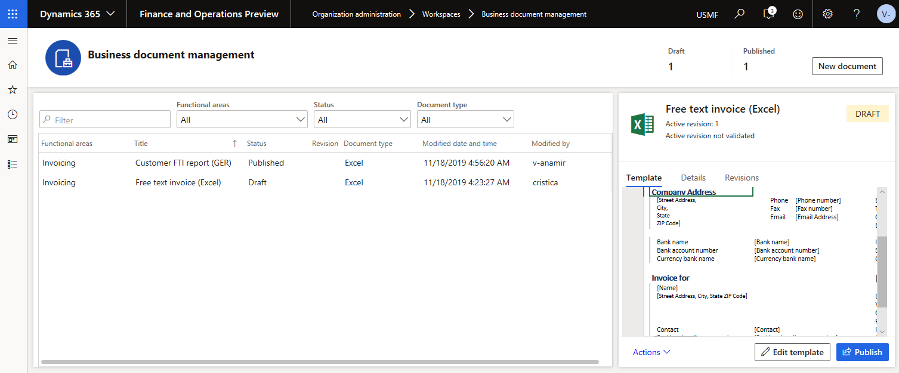
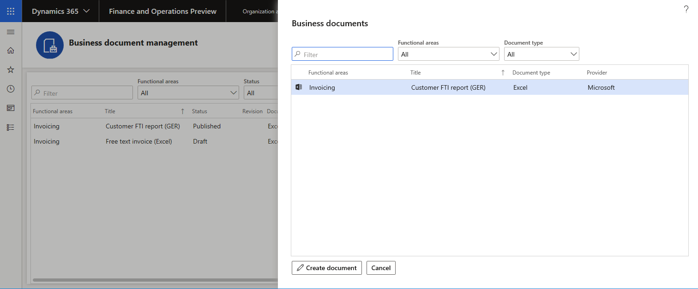
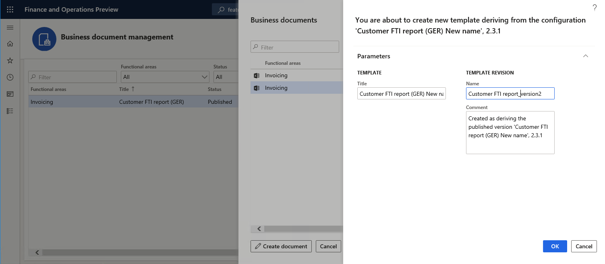

---
# required metadata

title: Using the new user interface in Business document management
description: This topic provides information about how to use the new document user interface (UI) in the Business document management feature of the ER framework.
author: v-anamir
manager: AnnBe
ms.date: 05/12/2019
ms.topic: article
ms.prod: 
ms.service: dynamics-ax-platform
ms.technology: 

# optional metadata

ms.search.form: ERBDWorkspace, ERBDParameters
# ROBOTS: 
audience: Application User, Developer, IT Pro
# ms.devlang: 
ms.reviewer: kfend
ms.search.scope: Core, Operations
# ms.tgt_pltfrm: 
ms.custom: 
ms.assetid: 
ms.search.region: Global
# ms.search.industry: 
ms.author: v-anamir
ms.search.validFrom: 2019-08-01
ms.dyn365.ops.version: 10.0.5

---

# New document user interface in Business document management 

[!include [banner](../includes/banner.md)]

Business document management enables business users to edit business document templates by using a Microsoft Office 365 service or the appropriate Microsoft Office desktop application. Edits to the documents might include design changes, adding placeholders for additional data without source code changes, and new deployments. 
For more information about how to work with Business document managment, see [Business document managment overview](er-business-document-management.md) 
The new document user interface provide for business user more comfortable and clear interface. User will see only available templates for the current provider in the Business document area.
The **New document** option is available for create and edit a template in an ER format configuration provided by another provider (Microsoft in this example).

## Enable the new document user interface for Business document management 

To start using the new document UI in Business document management, you must enable the **Office-like UI experience for Business document mangement** in the **Feature management** workspace.

Use the following procedure to enable this functionality for all legal entities.

1. Go to the **Feature management** workspace, and on the **New** tab, select the **Office-like UI experience for Business document management** feature in the list.
2. Select **Enable now** to turn on the selected feature.
3. Refresh the page to access the new feature.

### Editg templates owned by other providers

1. In the Business document management workspace, select **New document**.

2. Select the document that you want to use as a template, and then select **Create document**.

3. In the **Title** field, change the title if necessary. The title text is used to name the new ER format configuration that is automatically created. The draft version of this configuration (**Customer FTI report (GER) Copy**) that will contain the edited template will be marked to run this ER format for the current user. At the same time, the original template from the base ER format configuration will be used to run this ER format for any other user.
4. In the **Name** field, change the name of the first revision of the editable template that will be created automatically.
5. In the **Comment** field, update the remarks for the automatically created revision of the editable template.
6. Select **OK** to confirm the start of the editing process.

The **New document** option is used to create and edit a template in an ER format configuration provided by another provider. In this example, Microsoft. When you select **New document**,  you can view all of the templates that are owned by current and other providers. After you select the template, it will open for editing. The edited template will then be stored in a new ER format configuration that is automatically generated.

For more information, see [Business document managment overview](er-business-document-management.md).

