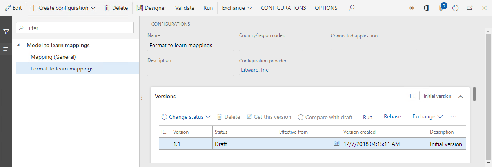
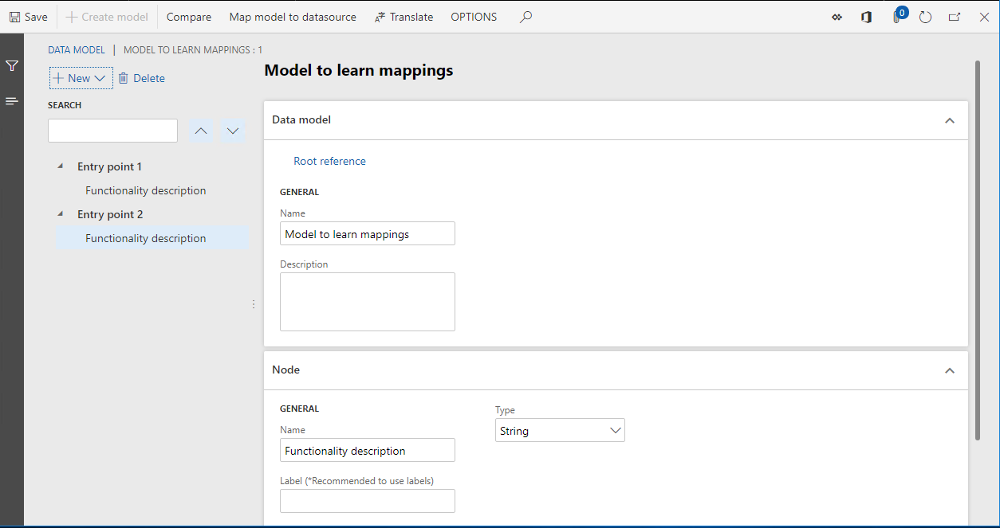

---
# required metadata

title: Configure country context dependent ER model mappings
description: This topic explains how you can set up ER model mappings so that they depend on the country/region context of the legal entity that controls their use.
author: NickSelin
manager: AnnBe
ms.date: 11/11/2019
ms.topic: article
ms.prod: 
ms.service: dynamics-ax-platform
ms.technology: 

# optional metadata

ms.search.form: ERSolutionTable
# ROBOTS: 
audience: Application User, Developer, IT Pro
# ms.devlang: 
ms.reviewer: kfend
ms.search.scope: Core, Operations
# ms.tgt_pltfrm: 
ms.custom: 
ms.assetid: 
ms.search.region: Global
# ms.search.industry: 
ms.author: nselin
ms.search.validFrom: 2019-01-01
ms.dyn365.ops.version: Release 8.1.2

---

# Configure ER model mappings so that they depend on the country/region context of the legal entity that controls their use

[!include[banner](../includes/banner.md)]

You can configure Electronic reporting (ER) model mappings so that they implement a generic ER data model but are specific to Dynamics 365 Finance. This topic explains how to design multiple ER model mappings for an ER data model to control how they are used by corresponding ER formats that are run from companies that have different country/region contexts.

## Prerequisites

To complete the examples in this topic, you must have the following access:

- Access to Finance for one of the following roles:
    - Electronic reporting developer
    - Electronic reporting functional consultant
    - System administrator

- Access to the instance of Regulatory Configuration Services (RCS) that has been provisioned for the same tenant as Finance for one of the following roles:
    - Electronic reporting developer
    - Electronic reporting functional consultant
    - System administrator

Some steps in this topic require execution of an ER format. In some cases, execution of an ER format is affected by the country/region context of the company that you're currently signed in to. You can run an ER format in the current RCS instance if the company that has the required country/region context is available in RCS. Otherwise, you must upload a completed version of the ER model mapping and ER format configurations that use the ER data model to your Finance instance, and then run the ER format in that Finance instance. For information about how to import configurations that reside in RCS into a Finance instance, see [Import configurations from RCS](rcs-download-configurations.md).

## Single model mapping case

Follow the steps in [Appendix 1](#appendix1) of this topic to design the required ER components. You now have the **Mapping (General)** model mapping configuration that contains the model mapping for the **Entry point 1** definition.

##  Appendix 1

### Configure a sample data model

Sign in to your RCS instance.

In this example, you will create a configuration for sample company, Litware, Inc. To complete these steps, you must first complete, in RCS, the steps in the [Create a configuration provider and mark it as active](tasks/er-configuration-provider-mark-it-active-2016-11.md) procedure.

#### Create an ER data model configuration

1.	On the default dashboard, select **Electronic reporting**.
2.	Select the **Reporting configurations** tile.
3.	On the **Configurations** page, select **Create configuration**.
4.	In the drop-down dialog box, in the **Name** field, enter **Model to learn mappings**.
5.	Select **Create configuration**.
6.	Select the **Configuration components** FastTab.

Notice that draft version 1 of this ER configuration is ready for editing. This version contains the data model component.

#### Design a sample data model

1.	On the **Configurations page**, select **Designer**.
2.	Select **New**.
3.	In the drop-down dialog box, in the **Name** field, enter **Entry point 1**.
4.	Select **Add**.
5.	Select **New**.
6.	In the drop-down dialog box, in the **Name** field, enter **Functionality description**.
7.	Select **Add**.
8.	Select **New**.
9.	In the drop-down dialog box, in the **New node** field group, select **Model root**.
10.	In the **Name** field, enter **Entry point 2**.
11.	Select **Entry point 2**.
12.	Select **Add**.
13.	Select **New**.
14.	In the drop-down dialog box, in the **Name** field, enter **Functionality description**.
15.	Select **Add**.

    

16.	Select **Save**.
17.	Close the page.

#### Complete the modified version of the model configuration

1.	On the **Configurations** page, on the **Versions** FastTab, select **Change status**.

    > Change the status of designed model configuration from **Draft** to **Completed**, so that it can be used to design the required model mappings and formats.

2.	Select **Complete**.
3.	Select **OK**.

Notice that the configuration that you created is saved as completed version 1.

### Configure a sample model mapping

#### Create an ER model mapping configuration

1.	On the **Configurations** page, select **Create configuration**.
2.	In the drop-down dialog box, in the **New** field group, select **Model mapping based on data model Model to learn mappings**.
3.	In the **Name** field, enter **Mapping (General)**.
4.	In the **Data model definition** field, select **Entry point 1**.
5.	Select **Create configuration**.

Notice that draft version 1 of this ER configuration is ready for editing. This version contains the model mapping component.

#### Design a sample model mapping

1.	On the **Configurations** page, select **Designer**.

    Notice that the model mapping of the **To model** direction type has been automatically added to this component for the **Entry point 1** definition.
    
2.	Select **Designer** to start editing the added model mapping.
3.	In the **Data model** section, select **Edit**.
4.	In the **Formula** field, enter **"Generic functionality 1"**.
5.	Select **Save**.
6.	Close the **Formula designer** page.

    

7.	Select **Save**.
8.	Close the **Model mapping designer** page.
9.	Select **New**.
10.	In the **Definition** field, select **Entry point 2**.
11.	In the **Name** field, enter **Mapping (General) 2**.
12.	Select **Designer**.
13.	In the **Data model** section, select **Edit**.
14.	In the **Formula** field, enter **"Generic functionality 2"**.
15.	Select **Save**.
16.	Close the **Formula designer** page.

    

17.	Select **Save**.
18.	Close the **Model mapping designer** page.

    

19.	Close the **Model mappings** page.

#### Complete the modified version of the model mapping configuration

1.	On the **Configurations page**, on the **Versions** FastTab, select **Change status**.

    > Change the status of designed model mapping configuration from **Draft** to **Completed**, so that it can be used by ER formats.

2.	Select **Complete**.
3.	Select **OK**.

Notice that the configuration that is created is saved as completed version 1.

### Configure a sample format

#### Create an ER format configuration

1.	On the **Configurations** page, in the configurations tree, select **Model to learn mappings**.
2.	Select **Create configuration**.
3.	In the drop-down dialog box, in the **New** field group, select **Format based on data model Model to learn mappings**.
4.	In the **Name** field, enter **Format to learn mappings**.
5.	In the **Data model definition** field, select **Entry point 1**.
6.	Select **Create configuration**.

Notice that draft version 1 of this ER configuration is ready for editing. This version contains the format component.

#### Design a sample format

1.	On the **Configurations** page, select **Designer**.
2.	Select **Add root**.
3.	In the **Text** group, select the **String** item.
4.	Select **OK**.

#### Bind format elements to a data source

1.	On the **Format designer** page, on the **Mapping** tab, expand the model data source.
2.	Select the **Functionality description** field.
3.	Select **Bind**.

    

4.	Select **Save**.
5.	Close the page.
