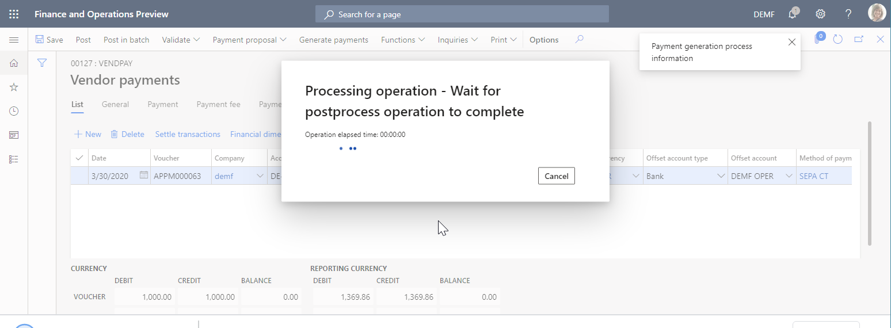
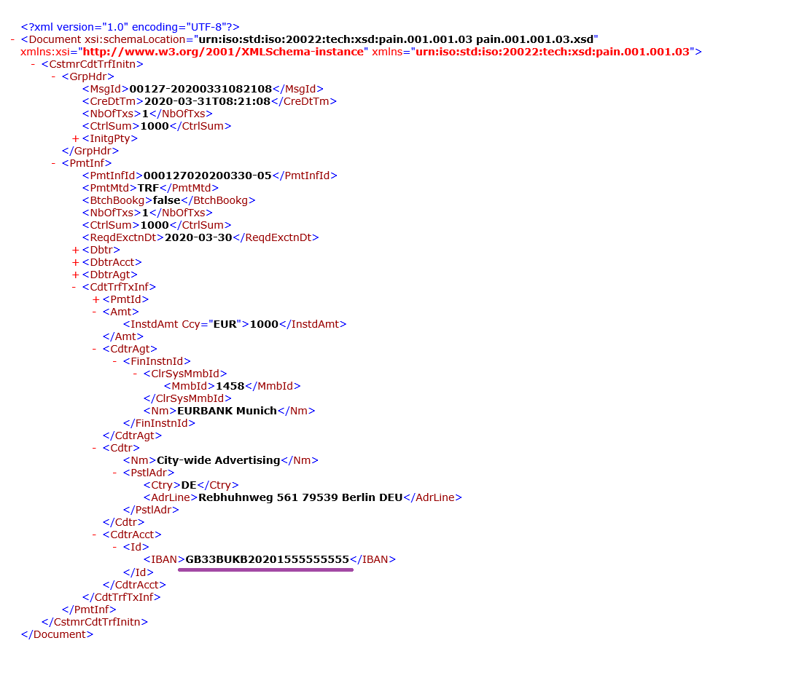
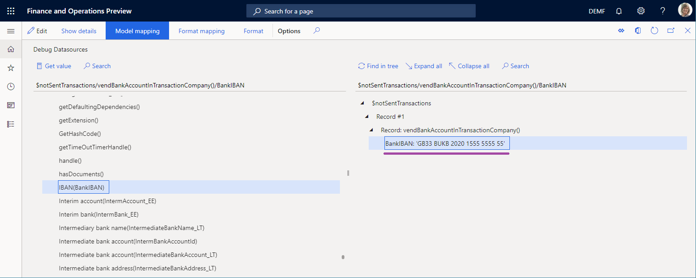
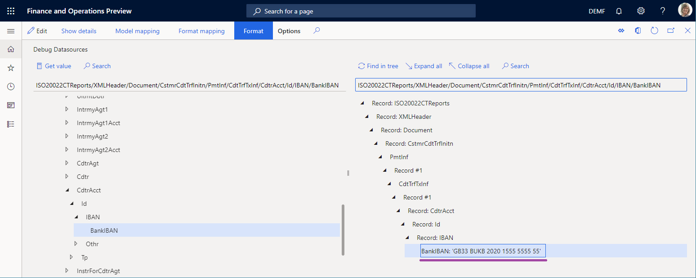
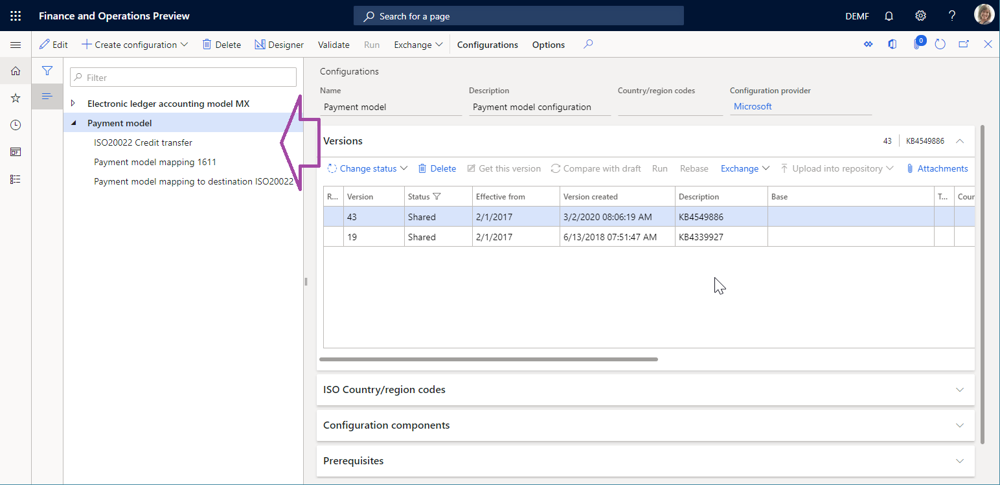
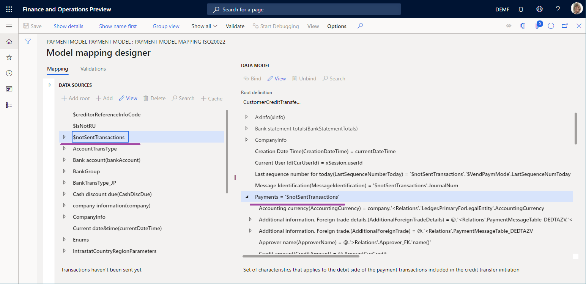
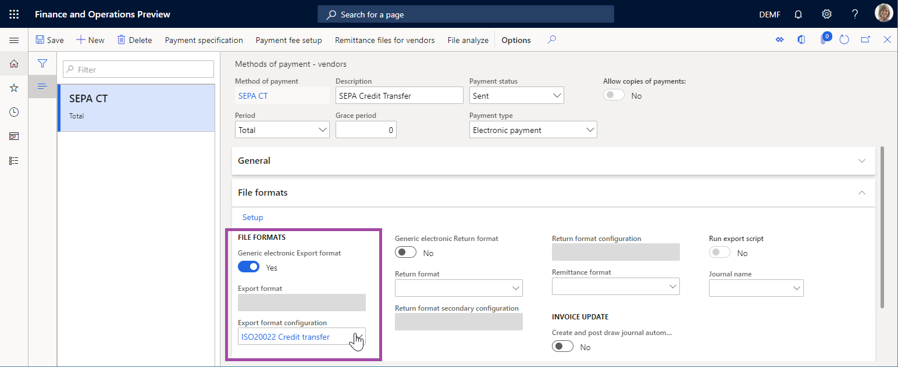

---
# required metadata
title: Debug data sources of an executed ER format to analyze data flow and transformation
description: This topic explains how you can debug data sources of an executed ER format for better understanding configured data flow and transformation.
author: NickSelin
manager: AnnBe
ms.date: 03/31/2020
ms.topic: article
ms.prod: 
ms.service: dynamics-ax-platform
ms.technology: 

# optional metadata

ms.search.form: ERSolutionTable, EROperationDesigner
# ROBOTS: 
audience: Application User, Developer, IT Pro
# ms.devlang: 
ms.reviewer: kfend
ms.search.scope: Core, Operations
# ms.tgt_pltfrm: 
ms.custom: 
ms.assetid: 
ms.search.region: Global
# ms.search.industry: 
ms.author: nselin
ms.search.validFrom: 2020-04-01
ms.dyn365.ops.version: Release 10.0.11

---

# Debug data sources of an executed ER format to analyze data flow and transformation

[!include[banner](../includes/banner.md)]

When you [configure](tasks/er-format-configuration-2016-11.md) an Electronic reporting (ER) solution for generating particular outbound documents, you define the methods that are used to get data out of the application and enter it in the output that is generated. To make the life cycle support of such an ER solution more efficient, you design your ER solution as consisting of ER [data
model](general-electronic-reporting.md#DataModelComponent) and its [mapping](general-electronic-reporting.md#ModelMappingComponent)
components as well as ER [format](general-electronic-reporting.md#FormatComponentOutbound) and its mapping components to make the model mapping application specific keeping other components as application agnostic. Therefore, several ER components may
[affect](general-electronic-reporting.md#FormatComponentOutbound) the process of entering data in a generated output.

Sometimes, when you analyze a generated output and find data that looks different comparing with same data in the application database, you need to discover an ER component that is responsible for such data transformation. The ER data sources debugger feature helps significantly reduce the time and cost that are involved in such investigation. This debugger allows you to interrupt the execution of an ER format and open the data sources debugger interface offering you the possibility to browse available data sources and select an individual data source for execution. This manual execution simulates its execution during the real run of an ER format. The result of such execution is presented in the page allowing you to analyze the received data.

To enable data sources debugging, you need to set the ER user parameters **Enable data debugging at format run** field to **Yes**. When you enable this function, you can start data sources debugging while you run an ER format for generation of outbound documents. You can also use the **Start debugging** option to initiate data sources debugging for an ER format that is configured in the ER Operation
[designer](./tasks/er-format-configuration-2016-11.md#design-the-format-of-an-electronic-document).

This tutorial provides guidelines about how to initiate data sources debugging for executed ER formats, and how to use the information from it to help you in understanding data flow and data transformations. The vendor payments processing business process is used in this tutorial.

## Limitations

Data sources debugger can be used for accessing data of data sources using in ER formats that are executed for generation of outbound documents. It can’t be used for debugging data sources of ER formats that are designed to parse inbound documents.

The following settings of ER formats are not currently accessible for data sources debugging:

-   Format transformations
-   Format and mapping validation rules

## Prerequisites

To complete the examples in this tutorial, you must have the access to one of the following [roles](https://docs.microsoft.com/dynamics365/fin-ops-core/dev-itpro/sysadmin/tasks/assign-users-security-roles):

-   Electronic reporting developer
-   Electronic reporting functional consultant
-   System administrator

You need to change the company to **DEMF**.

Follow the steps in [Appendix 1](#appendix1) of this topic to download the required components of the provided by Microsoft ER
solution to process vendor payments.

Follow the steps in [Appendix 2](#appendix2) of this topic to prepare accounts payable for vendor payment processing by using
the downloaded ER solution.

## Process vendor payment to get a payment file

1.  Follow the steps in [Appendix 3](#appendix3) of this topic to process vendor payment.

    

2.  Save locally the offered for downloading by using web browser zip file.
3.  Extract from the saved zip file the **ISO20022 Credit transfer.xml** payment file.
4.  Open the extracted payment file by using the XML files viewer.

    Note that the vendor bank account IBAN code in the payment file differs from the value that has been [entered](#enteredIBANcode) in the **Bank accounts** page – it contains no spaces.

    

    You can use the ER data sources debugger to find a component of the ER solution that is used for truncating spaces of the IBAN code.

## Enable data sources debugging

1.  Go to **Organization administration \> Electronic reporting \> Configurations**.
2.  On the **Configurations** page, on the Action Pane, on the **Configurations** tab, in the **Advanced settings** group, select **User
    parameters**.
3.  Set the **Enable data debugging at format run** field to **Yes**.

    Note that this parameter is user and company specific.

    

## Process vendor payment for debugging

1.  Follow the steps in [Appendix 3](#appendix3) of this topic to process vendor payment.
2.  Select **Yes** to confirm that you want to interrupt vendor payment processing and, instead of it, start data sources debugging on the **Debug data sources** page.

    

## Debug data sources using in payment processing

### Debug model mapping

1.  On the Action Pane, select **Model mapping** to start debugging from this ER component.
2.  On the left-hand-side data sources panel, select **\$notSentTransactions** data source.
3.  Select **Read all records**.

    >
    > You can select either **Read 1 record** or **Read 10 records** or **Read 100 records** or **Read all records** action to force reading the appropriate number of records from the selected data source. This will simulate access to this data source from the running ER format.

4.  On the right-hand-side data panel, select **Expand all**.

    >
    > You can see that the selected data source of the *Record list* type contains a single record.

5.  Expand the **\$notSentTransactions** data source and select the nested **vendBankAccountInTransactionCompany()** method.
6.  Expand the **vendBankAccountInTransactionCompany()** method and select the nested **IBAN** field.
7.  Select **Get value**.

    >
    > You can select **Get value** action to force reading value of a selected field of the chosen data source. This will simulate access to this field from the running ER format.
    
8.  Select **Expand all**.

    

    You can see that the model mapping is not responsible for the truncation spaces as it returns the vendor bank account IBAN code with non-truncated spaces. You need to continue your data source debugging.

### Debug format mapping

1.  On the Action Pane, select **Format mapping** to continue debugging with this ER component.
2.  Select the **\$PaymentByDebtor** data source.
3.  Select **Read all records**.
4.  Expand **\$PaymentByDebtor**.
5.  Expand **\$PaymentByDebtor.Lines**.
6.  Select **Read all records**.
7.  Expand **\$PaymentByDebtor.Lines.CreditorAccount**.
8.  Expand **\$PaymentByDebtor.Lines.CreditorAccount.Identofication**.
9.  Select **\$PaymentByDebtor.Lines.CreditorAccount.Identofication.IBAN**.
10. Select **Get value**.
11. Select **Expand all**.

    

    You can see that the format mapping data sources are not responsible for the truncation spaces as they return the vendor bank account IBAN code with non-truncated spaces. You need to continue your data source debugging.

### Debug format

1.  On the Action Pane, select **Format** to continue debugging with this ER component.
2.  Expand format elements to select **ISO20022CTReports \> XMLHeader \> Document \> CstmrCdtTrfInitn \> PmtInf**.
3.  Select **Read all records**.
4.  Expand format elements to select **ISO20022CTReports \> XMLHeader \> Document \> CstmrCdtTrfInitn \> PmtInf \> CdtTrfTxInf**.
5.  Select **Read all records**.
6.  Expand format elements to select **ISO20022CTReports \> XMLHeader \> Document \> CstmrCdtTrfInitn \> PmtInf \> CdtTrfTxInf \> CdtrAcct \> Id \> IBAN \> BankIBAN**.
7.  Select **Get value**.
8.  Select **Expand all**.

    

    You can see that the format binding is not responsible for the truncation spaces as it returns the vendor bank account IBAN code with non-truncated spaces. It means that the **BankIBAN** element is configured to use a format transformation that performs the truncation of spaces.

9.  Close data sources debugger.

### Review format transformations

1.  Open the **Organization administration \> Electronic reporting \> Configurations** page.
2.  Select the **Payment model \> ISO20022 Credit transfer** configuration.
3.  Select **Designer**.
4.  Expand necessary elements to select the **Document \> CstmrCdtTrfInitn \> PmtInf \> CdtTrfTxInf \> CdtrAcct \> Id \> IBAN \> BankIBAN** element.

    

    Note that the **BankIBAN** element is configured to use the **Remove not alphanumeric** transformation.

5.  Select the **Transformations** tab.

    

    Note that the **Remove not alphanumeric** transformation is configured to use an expression that truncates spaces from the provided text string.

## Start debugging in Operation designer

When you configure an ER format the draft version of which can be executed right from the Operation designer, you can directly call data sources debugger by selecting the **Start debugging** option.

## <a name="appendix1">Appendix 1: Get an ER solution</a>

### Download an ER solution

Assume that you want to use an ER solution to generate an electronic payment file for a processed vendor payment. You decided to
[download](download-electronic-reporting-configuration-lcs.md) the available **ISO20022 Credit transfer** ER payment format from the Microsoft Dynamics Lifecycle Services (LCS) shared asset library or Global repository.

Along with the selected ER format, the following ER [configurations](general-electronic-reporting.md#Configuration) must be automatically imported to your Finance instance as part of the **ISO20022 Credit transfer** ER solution:

-   **Payment model** ER [data model](general-electronic-reporting.md#DataModelComponent) configuration
-   **ISO20022 Credit transfer** ER [format](general-electronic-reporting.md#FormatComponentOutbound) configuration
-   **Payment model mapping 1611** ER [model mapping](general-electronic-reporting.md#ModelMappingComponent) configuration
-   **Payment model mapping to destination ISO20022** ER model mapping configuration

You can find them in the **Organization administration \> Electronic reporting \> Configurations** page of the ER framework.

If some of the mentioned configurations are missing in the configurations tree, they must be manually downloaded from the LCS shared asset library in the same manner as the described above **ISO20022 Credit transfer** ER payment format.

### Analyze the downloaded ER solution

#### Review model mapping

1.  Open the **Organization administration \> Electronic reporting \> Configurations** page.
2.  Select the **Payment model \> Payment model mapping 1611** configuration.
3.  Select **Designer**.
4.  Select the **Payment model mapping ISO20022 CT** mapping record.
5.  Select **Designer**.
6.  Review the opened model mapping.

Note that the **Payments** field of the data model is bound to the **\$notSentTransactions** data source returning the list of processing vendor payment lines.

#### Review format mapping

1.  Open the **Organization administration \> Electronic reporting \> Configurations** page.
2.  Select the **Payment model \> ISO20022 Credit transfer** configuration.
3.  Select **Designer**.
4.  Select the **Mapping** tab.
5.  Review the opened format mapping.

Note that the **Document \> CstmrCdtTrfInitn \> PmtInf** element of the **ISO20022CTReports \> XMLHeader** file is bound to the **\$PaymentByDebtor** data source that is configured to do grouping of records of the **Payments** field of the data model.

#### Review format

1.  Open the **Organization administration \> Electronic reporting \> Configurations** page.
2.  Select the **Payment model \> ISO20022 Credit transfer** configuration.
3.  Select **Designer**.
4.  Review the opened format.

Note that the **Document \> CstmrCdtTrfInitn \> PmtInf \> CdtTrfTxInf \> CdtrAcct \> Id \> IBAN \> BankIBAN** format element is configured to populate the vendor account’s IBAN code to the payment file.

## <a name="appendix2">Appendix 2: Configure accounts payable</a>

### Modify a vendor property

1.  Open the **Accounts payable \> Vendors \> All vendors** page.
2.  Select **DE-01002** vendor.
3.  On the **All vendors** page, on the Action Pane, on the **Vendor** tab, in the **Set up** group, select **Bank accounts**.
4.  On the **Identification** FastTab, in the **IBAN** field, <a name="enteredIBANcode">enter</a> **GB33 BUKB 2020 1555 5555 55**.
5.  Select **Save**.

### Set up a method of payment

1.  Open the **Accounts payable \> Payment setup \> Methods of payment** page.
2.  Select the **SEPA CT** payment method.
3.  On the **File format** FastTab, set the **Generic electronic export format** field to **Yes**.
4.  In the **Export format configuration**, select the downloaded **ISO20022 Credit transfer** ER format.
5.  Select **Save**.

### Add a vendor payment

1.  Open the **Accounts payable \> Payments \> Vendor payment journal** page.
2.  Add a new payment journal.
3.  Select **Lines**.
4.  Add a new payment line.
5.  In the **Account** field, select **DE-01002** vendor.
6.  In the **Debit** field, enter a value.
7.  In the **Method of payment** field, select **SEPA CT**.
8.  Select **Save**.

## <a name="appendix3">Appendix 3: Process vendor payment</a>

1.  Open the **Accounts payable \> Payments \> Vendor payment journal** page.
2.  Select the added earlier payment journal.
3.  Select **Lines**.
4.  Select the payment line.
5.  Select **Payment status** and choose **None**.
6.  Select **Generate payments**.
7.  In the **Method of payment** field, select **SEPA CT**.
8.  In the **Bank account** field, select **DEMF OPER**.
9.  On the **Generate payments** dialog page, select **OK**.
10. On the **Electronic report parameters** dialog page, select **OK**.
