---
# required metadata

title: Defer the execution of XML elements in ER formats
description: This topic explains how to defer the execution of an XML element in an ER format.
author: NickSelin
manager: kfend
ms.date: 01/15/2020
ms.topic: article
ms.prod: 
ms.service: dynamics-ax-platform
ms.technology: 

# optional metadata

ms.search.form: EROperationDesigner
# ROBOTS: 
audience: Application User, IT Pro
# ms.devlang: 
ms.reviewer: kfend
ms.search.scope: Core, Operations
# ms.tgt_pltfrm: 
ms.custom: 58771
ms.assetid: 
ms.search.region: Global
# ms.search.industry: 
ms.author: nselin
ms.search.validFrom: 2020-01-01
ms.dyn365.ops.version: AX 10.0.9

---

# Defer execution of an XML element in ER format

[!include [banner](../includes/banner.md)]

[!include [banner](../includes/preview-banner.md)]

## Overview

You can use the Operations designer of the [Electronic reporting (ER)](general-electronic-reporting.md) framework to [configure](./tasks/er-format-configuration-2016-11.md) the [format component](general-electronic-reporting.md#FormatComponentOutbound) of an ER solution that is used to generate outbound documents in XML format. The hierarchical structure of the configured format component consists of format elements of various types that are used to populate necessary information to generated documents at run timme. By default, when you run an ER format, these format elements are executed in the same sequence as they are presented in the format hierarchy – one by one from top to bottom order. At design time, you can change this default execution order for any of XML elements of the configured format component. 

You can turn on the **Deferred execution** option for an XML element to postpone the execution of this element. When the option for an XML element is on in the configured format, execution of this element is deferred until all other elements of its parent have been executed.

To learn more about this feature, complete the example in this topic.

## Limitations

The **Deferred execution** option is supported only for the XML elements that are configured for an ER format used to generate **outbound** documents in XML format.

The **Deferred execution** option is supported only for the XML element that resides in only one other XML element. Therefore, this option is not applicable for an XML element that resides in other type of format elements. For example, in an **XML sequence** element.

The **Deferred execution** option is not supported for XML elements that reside in the **Common\\File** format element when the option **Split file** is set to **Yes**. For more information about how to split XML files, see [Split generated XML files based on file size and content quantity](er-split-files.md).

### Example: Defer execution of an XML element in ER format

The following steps explain how a [System administrator or Electronic reporting functional consultant](https://docs.microsoft.com/dynamics365/fin-ops-core/dev-itpro/sysadmin/tasks/assign-users-security-roles) can configure an ER format that contains an XML element when the order of execution odiffers from its order in the format’s hierarchy.

These steps can be performed in the **USMF** company of Dynamics 365 Finance.

## Prerequisites

To complete the examples in this topic, you must have access to the **USMF** company of Finance for one of the following roles:

- Electronic reporting functional consultant
- System administrator

If you have not yet completed the example in the topic [Defer execution of a sequence element in ER format](er-defer-sequence-element.md#Example), download the following [configurations](http://general-electronic-reporting.md/#Configuration) of the sample ER solution.

| **Content description**        | **File name**                      |
|--------------------------------|------------------------------------|
| ER data model configuration    | [Model to learn deferred elements.version.1.xml](https://mbs.microsoft.com/customersource/Global/AX/downloads/hot-fixes/365optelecrepeg)   |
| ER model mapping configuration | [Mapping to learn deferred elements.version.1.1.xml](https://mbs.microsoft.com/customersource/Global/AX/downloads/hot-fixes/365optelecrepeg) |

Additionally, you must also download and save the following configuration of the sample ER solution to your local machine.

| **Content description**        | **File name**                      |
|--------------------------------|------------------------------------|
| ER format configuration        | [Format to learn deferred XML elements.version.1.1.xml](https://mbs.microsoft.com/customersource/Global/AX/downloads/hot-fixes/365optelecrepeg) |

## Import sample ER configurations

1.  Go to **Organization administration** \> **Workspaces** \> **Electronic reporting**.
2.  Select **Reporting configurations**.
3.  If the **Model to learn deferred elements** configuration is not available in the tree, import the ER data model configuration.

    1. Select **Exchange**, and then select  **Load from XML file**.
    2. Select **Browse** to find the **Model to learn deferred elements.1.xml** file, and then select **OK**.
    
4.  If the **Mapping to learn deferred elements** configuration is not available in the tree, import the ER model mapping configuration.
    
    1. Select **Exchange** and then select  **Load from XML file**.
    2. Select **Browse** to find the **Mapping to learn deferred elements.1.1.xml** file, and then select **OK**.
    
5.  Import the ER format configuration.
    
    1. Select **Exchange** and then select **Load from XML file**.
    2. Select **Browse** to find the **Format to learn deferred XML elements.1.1.xml** file, and then select **OK**.
    
6.  In the configurations tree, expand the **Model to learn deferred elements**.
7.  Observe the list of imported ER configurations in the tree.
    
    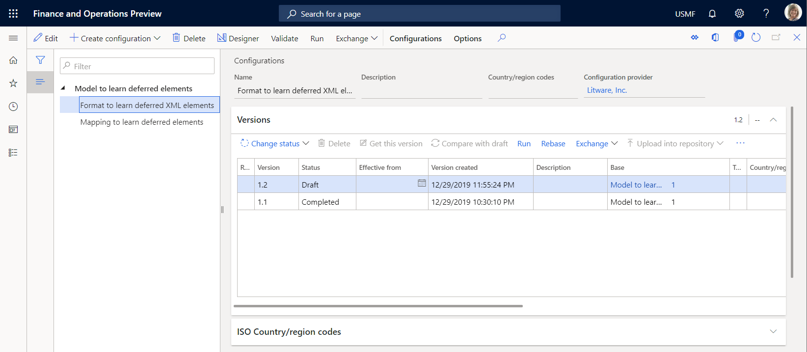

## Activate a configurations provider

1.  Go to **Organization administration** \> **Workspaces** \> **Electronic reporting**.
2.  On the **Localization configurations** page, in the **Configuration providers** section, make sure that the [configuration provider](general-electronic-reporting.md#Provider) for the sample company, Litware, Inc. (<http://www.litware.com>), is listed, and that it's marked as **Active**. If you don't see this configuration provider or it is not marked as **Active**, follow the steps in the topic, [Create a configuration provider and mark it as active](./tasks/er-configuration-provider-mark-it-active-2016-11.md.
    
    

## Review the imported model mapping

Review the settings of the ER model mapping component that is configured to access tax transactions and expose accessed data upon request.

1.  Go to **Organization administration** \> **Workspaces** \> **Electronic reporting**.
2.  Select **Reporting configurations**.
3.  Expand **Model to learn deferred elements**.
4.  Select **Mapping to learn deferred elements** configuration.
5.  Select **Designer** to open the list of mappings.
6.  Select **Designer** to review the mapping details.
7.  Toggle **Show details** on.

Review data sources configured to access tax transactions.

- The **Transactions** data source of the *Table record* type is configured to access records of the **TaxTrans** application table.
- The **Vouchers** data source of the *Calculated field* type is configured to return required voucher codes **INV-10000349** and **INV-10000350** as the list of records.
- The **Filtered** data source of the *Calculated field* type is configured to select from the **Transactions** data source only tax transactions of the required vouchers.
- The **\$TaxAmount** field of the *Calculated field* type is added for the **Filtered** data source to expose tax value with the opposite sign.
- The **Grouped** data source of the *Group By* type is configured to group filtered tax transactions of the **Filtered** data source.
- The **TotalSum** aggregation field of the **Grouped** data source is configured to summarize values of the **\$TaxAmount** field of the **Filtered** data source for all filtered tax transactions of the **Filtered** data source.

     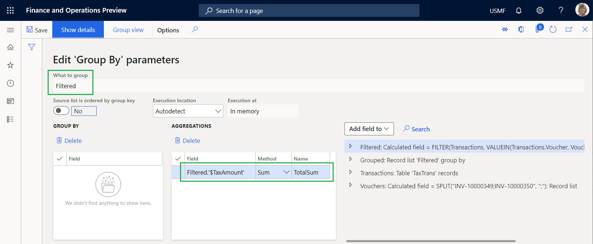

Review how configured data sources are bound to the data model exposing accessed data to make it available in an ER format.

- The **Filtered** data source is bound to the **Data.List** field of the data model.
- The **\$TaxAmount** field of the **Filtered** data source is bound to the **Data.List.Value** field of the data model.
- The **TotalSum** field of the **Grouped** data source is bound to the **Data.Summary.Total** field of the data model.

     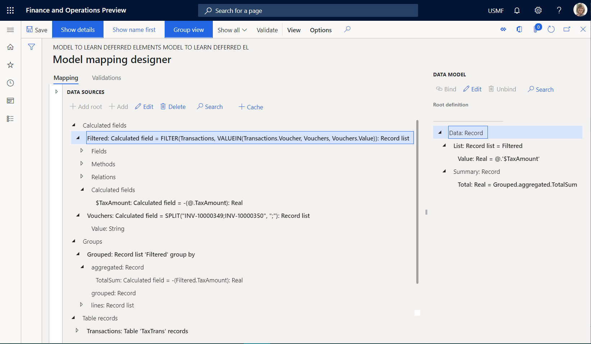

8.  Close the **Model mapping designer** and **Model mappings** pages.

## Review the imported format

1.  Select **Format to learn deferred XML elements** configuration.
2.  Select **Designer** to review the format details and then toggle **Show details** on.

    Review the settings of ER format components that are configured to generate an outbound XML document that includes details of tax transactions.

    The **Report\\Message** XML element is configured to populate an outbound document with a single node that includes the nested XML elements **Header**, **Record**, and **Summary**.

    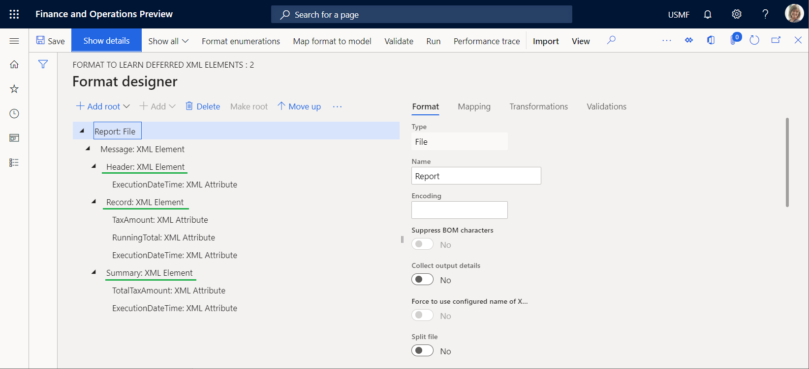

    The **Report\\Message\\Header** XML element is configured to populate an outbound document with a single header node that shows the date and time when the processing starts.

    The **Report \\Message\\Record** XML element is configured to populate an outbound document with a single record node that includes the details of a single tax transaction.
    
    The **Report\\Message\\Summary** XML element is configured to populate an outbound document wtih a single summary node of the sum of the tax values of the processed tax transactions.

4.  Select the **Mapping** tab.

    -   The **Report\\Message\\Header** element is not required to be bound to a source to output a single node to an outbound document.
    -   The **ExecutionDateTime** attribute outputs the date and time (including milliseconds) when the header node is added.
    -   The **Report\\Message\\Record** element is bound to **model.Data.List** list to output a single record node for every record from the bound list.
    -   The **TaxAmount** attribute is bound to **model.Data.List.Value** (shown as **\@.Value** by using the relative path view) to output the tax value of the current tax transaction.
    -   The **RunningTotal** attribute is a placeholder for the running total of the tax values. Currently, this attribute outputs nothing as neither a binding or a default value is configured for it.
    -   The **ExecutionDateTime** attribute outputs the date and time (including milliseconds) when the current transaction is processed in this report.
    -   The **Report\\Message\\Summary** element is not required to be bound to a data source to output a single node to an outbound document.
    -   The **TotalTaxAmount** attribute is bound to **model.Data.Summary.Total** to output the sum of the tax values of the processed tax transactions.
    -   The **ExecutionDateTime** attribute outputs the date and time (including milliseconds) when the summary node is added.

        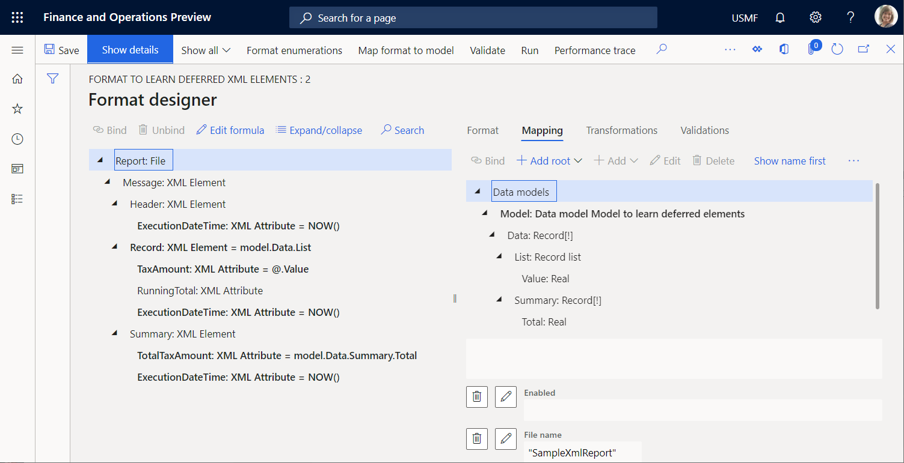

## Run the imported format

1.  Select **Run**.
2.  Download the offered by a web browser file and open it for review.

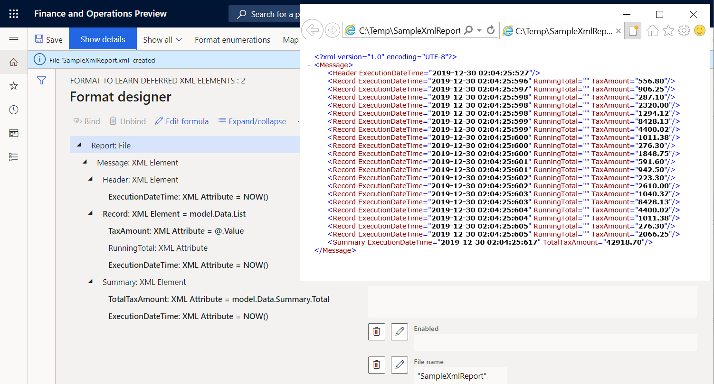

Notice that the summary node presents the sum of tax values of the processed transactions. As you have this format configured to return this sum by using the **model.Data.Summary.Total** binding, this sum is calculated by calling the **TotalSum** aggregation of the **Grouped** data source of the *GroupBy* type in the model mapping. To compute this aggregation, model mapping iterates over all transactions that have been selected in the **Filtered** data source. Comparing the execution time of the summary node and the last record node, you can see that it took 12 milliseconds to perform this summing. Comparing the execution time of the first and last record nodes, you can see that it took 9 milliseconds to generate all record nodes. In total, it took 21 milliseconds.

## Modify the format to calculate based on the generated output

With a much larger volume of transactions than in the current example, the calculation time may increase causing performance issues. You can change the setting of this format to prevent the appearance of such performance issues. As you access tax values to output them to generated report, you can re-use this information to calculate tax values. For more information, see [Configure format to do counting and summing](./tasks/er-format-counting-summing-1.md).

1.  Select the **Format** tab, and then select the **Report** file element in the format tree.
2.  Set the **Collect output details** option to **Yes**.  
      
    By turning this option on, you can configure this format using the content of a generated report as the data source accessible by using the ER built-in functions of the [Data collection](er-functions-category-data-collection.md) category.

3.  Select the **Mapping** tab, and then select the **Report\\Message\Record** XML element.
4.  Configure the **Collected data key name** expression as `WsColumn`.
5.  Configure the **Collected data key value** expression as `WsRow`.

    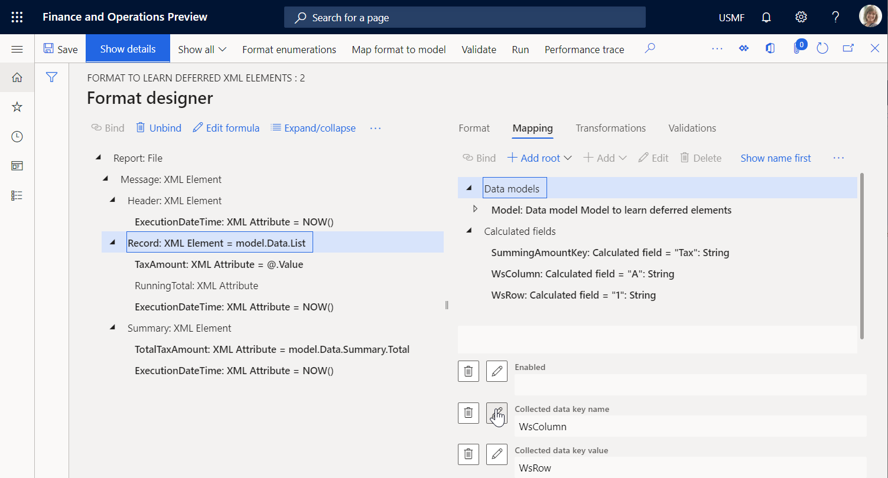

6.  Select the **Report\\Message\\Record\\TaxAmount** attribute.
7.  Configure the **Collected data key name** expression as `SummingAmountKey`.

    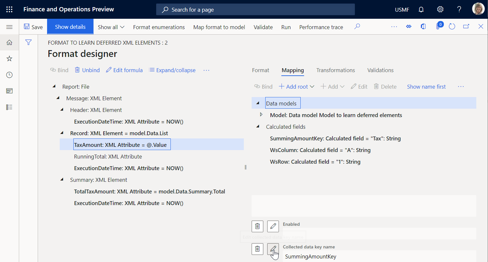

    You may consider this setting as the fulfillment of a virtual worksheet when the value of the A1 cell is appended by the value of tax amount from every processed tax transaction.

8.  Select the **Report\\Message\\Record\\RunningTotal** attribute and select **Edit formula**.
9.  Configure the `SUMIF(SummingAmountKey, WsColumn, WsRow)` expression by using the [SUMIF](er-functions-datacollection-sumif.md) built-in ER function and then select **Save**.

     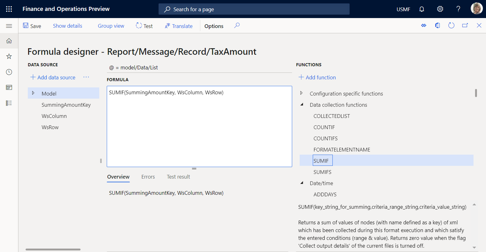

10.  Close the formula designer page.
11.  Select **Save** and then select **Run**.
12.  Download and open the file.

     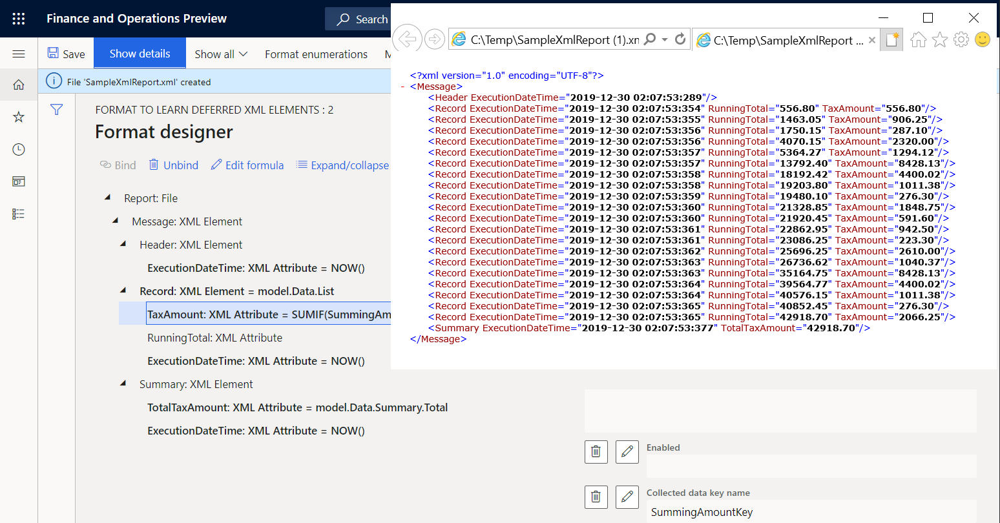

     The last record node contains the tax value running total that is computed for all processed transactions by using the generated output as a data source. The data souce is calculated starting from the beginning of the report up to the last tax transaction, inclusively. The summary node contains the sum of the tax values for all processed transactions that are computed in the model mapping by using the data source of the **GroupBy** type. Notice that these values are equal which means that the output-based summing can be used instead of **GroupBy**. Comparing the execution time of the first record node and the summary node, you can see that it took 11 milliseconds to generate all record nodes and perform summing. From the record nodes generation and tax values summing perspective, the modified format is approximately two times faster than the original one.

13.  Select the **Report\\Message\\Summary\\TotalTaxAmount** attribute and then select **Edit formula**.
14.  Enter the `SUMIF(SummingAmountKey, WsColumn, WsRow)` expression instead of the existing one.
15.  Select **Save** and then select **Run**.
16.  Download and open the file.

     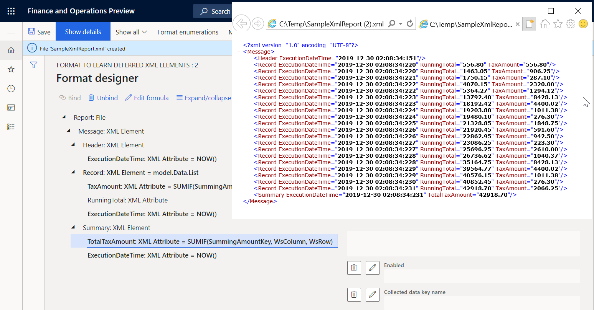

     Now the tax value running total in the last record node is equal to the sum in the summary node.

## Place values of output-based summing on the report header

Assume that you must present the sum of tax values in the header of your report. You can modify your format for doing this by completing the following steps.

1.  Select the **Format** tab. 
2.  Select the **Report\\Message\\Summary** XML element.
3.  Select **Move up**.
4.  Select **Save**.
5.  Select **Run**.
6.  Download and view the file.

     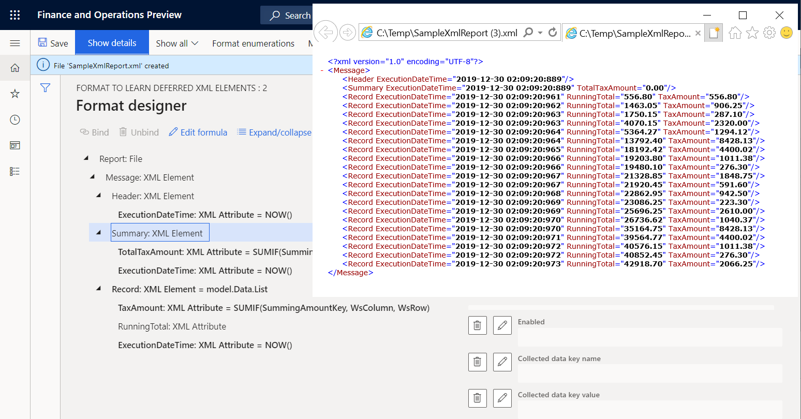

     Notice that the sum of tax values in the summary node equals zero (0). This is because this sum is now calculated based on the generated output. At the time when the first record node is generated, the generated output contains no record nodes with transaction details yet. You can configure this format to defer the execution of the **Report\\Message\\Summary** element until the **Report\\Message\\Record** element has been executed for all tax transactions.

## Defer the execution of the summary XML element to use the calculated total

1. Select the **Report\\Message\\Summary** XML element.
2. Set the **Deferred execution** option to **Yes**.

     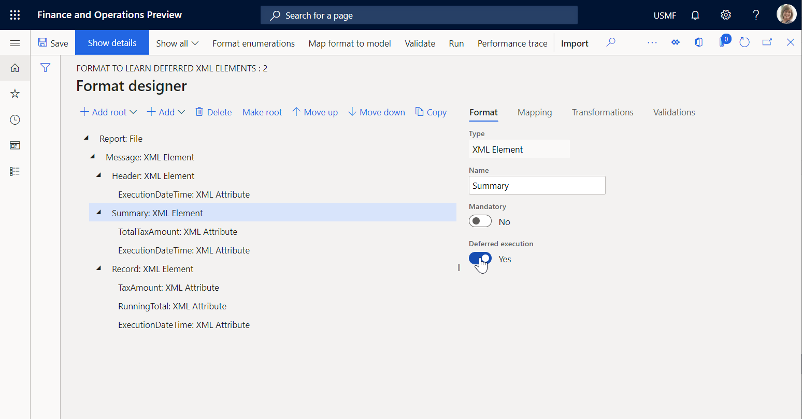

3. Select **Save**.
4. Select **Run**.
5. Download and open the file.

     

     The execution of the **Report\\Message\\Summary** element is now performed at the end of execution of all other items nested under the **Report\\Message** element which is the parent element of **Report\\Message\\Summary**. Therefore, the execution occurs after the execution of the **Report\\ Message\\Record** element for all tax transactions of the **model.Data.List** data source. The execution time of the first and last record nodes, and the execution time of the header and summary nodes illustrates this.

## Additional resources

- [Configure format to do counting and summing](./tasks/er-format-counting-summing-1.md)
- [Trace execution of ER format to troubleshoot performance issues](trace-execution-er-troubleshoot-perf.md)
- [Defer execution of a sequence element in ER format](er-defer-sequence-element.md#Example)
