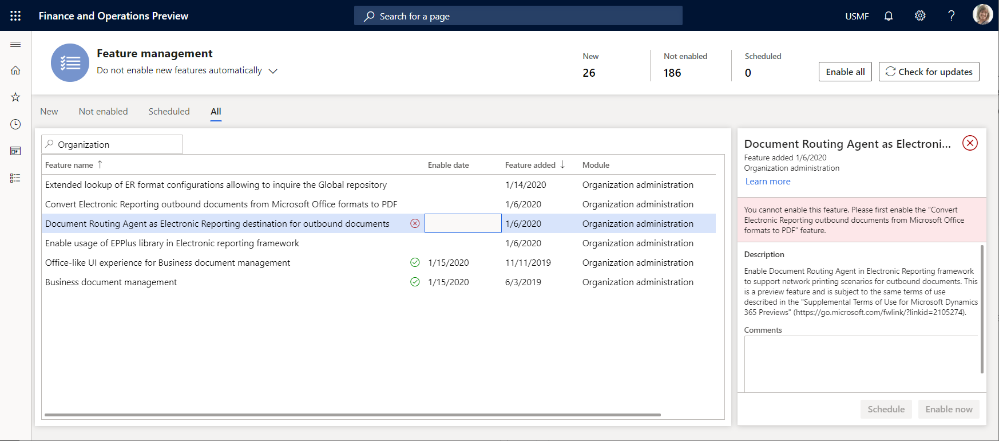

---
# required metadata

title: Printer ER destination type
description: You can configure a printer destination for each FOLDER or FILE component of an Electronic reporting (ER) format that is configured to generate outbound documents in either PDF or Microsoft Office formats (Excel\Word). 
author: NickSelin
manager: AnnBe
ms.date: 01/16/2020
ms.topic: article
ms.prod: 
ms.service: dynamics-ax-platform
ms.technology: 

# optional metadata

ms.search.form: DocuType, ERSolutionTable, ERFormatDestinationTable
# ROBOTS: 
audience: Application User
# ms.devlang: 
ms.reviewer: kfend
ms.search.scope: Core, Operations
# ms.tgt_pltfrm: 
ms.custom: 97423
ms.assetid: 
ms.search.region: Global
# ms.search.industry: 
ms.author: nselin
ms.search.validFrom: 2020-04-01
ms.dyn365.ops.version: AX 10.0.9

---

# <a name="PrinterDestinationType">Printer destination</a>

[!include [banner](../includes/banner.md)]

You can send a generated document directly to a network printer for direct printing.

## Prerequisites

Before you begin, you must install and configure the Document Routing Agent, and then register the network printers. For more information, see [Install the Document Routing Agent to enable network printing](https://docs.microsoft.com/en-us/dynamics365/fin-ops-core/dev-itpro/analytics/install-document-routing-agent).

## Enable Printer destination

To make the **Printer** destination available in the current Dynamics 365 Finance instance, go to the **Feature management** workspace and enable the following features:

1. **Convert Electronic Reporting outbound documents from Microsoft Office formats to PDF**
2. **Document Routing Agent as Electronic Reporting destination for outbound documents** 

### Applicability
The Printer destination can be configured for the only file components that are used to generate an output in either printable PDF format (PDF Merger or PDF file format elements) or in Microsoft Office Excel/Word formats (Excel file). When an output is generated in PDF format, this output is sent to a printer. When an output is generated in Microsoft Office format, it is automatically converted to PDF format and sent to a printer.

### Limitations

This is a preview feature and is subject to the same terms of use described in the [Supplemental Terms of Use for Microsoft Dynamics 365 Previews](https://go.microsoft.com/fwlink/?linkid=2105274).

This destination type is implemented only for cloud deployments.

### Usage

1. Set the **Enabled** field to **Yes** to send a generated document to a printer.
2. In the **Printer name** field, select the required network printer.
3. Set the **Save in print archive** field to **Yes** if you want to store a generated output in the print archive for further printing. Archived outputs can be accessed later by using the going to **Organization administration** \> **Inquiries and reports** \> **Report archive**.

    

> [!NOTE]
> The **Convert to PDF** option doesn't have to be enabled when you configure the **Printer** destination. The PDF conversion will be performed for printing regardless.

## Additional resources

- [Electronic reporting (ER) overview](general-electronic-reporting.md)
- [Electronic reporting (ER) destinations](electronic-reporting-destinations.md)
