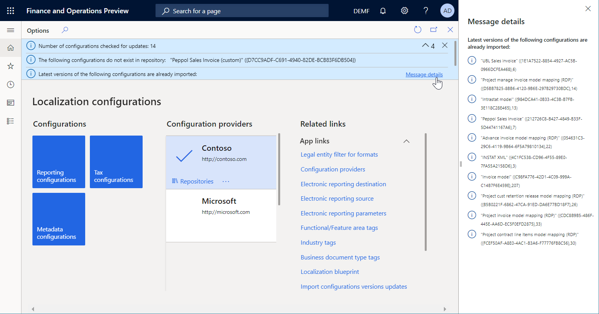
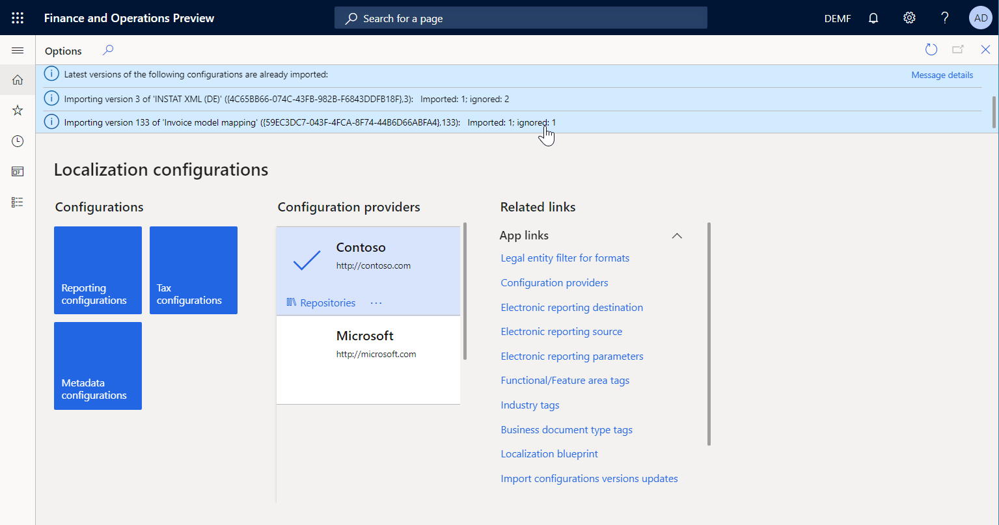

---
# required metadata

title: Import updated versions of ER configurations 
description: This topic explains how to import updated versions of ER configurations from the Global repository of the Configuration service.
author: NickSelin
manager: AnnBe
ms.date: 06/09/2020
ms.topic: article
ms.prod: 
ms.service: dynamics-ax-platform
ms.technology: 

# optional metadata

ms.search.form: ERSolutionImport, ERWorkspace, ERSolutionRepositoryTable
# ROBOTS: 
audience: Application User, IT Pro
# ms.devlang: 
ms.reviewer: kfend
ms.search.scope: Core, Operations
# ms.tgt_pltfrm: 
ms.custom: 105843
ms.assetid: dc44dea2-22ce-401e-98b9-d289e0e2825b
ms.search.region: Global
# ms.search.industry: 
ms.author: nselin
ms.search.validFrom: 2016-05-31
ms.dyn365.ops.version: AX 10.0.5

---

# Import updated versions of ER configurations

[!include [banner](../includes/banner.md)]

ER [repositories](general-electronic-reporting.md#Repository) are used to share [Electronic reporting (ER) configurations](general-electronic-reporting.md#Configuration). You can [import](download-electronic-reporting-configuration-lcs.md) ER configurations from different repositories to your Finance instance. When you import ER configurations, new [versions](general-electronic-reporting.md#component-versioning) can be published to repositories by configuration [providers](general-electronic-reporting.md#Provider) for sharing. This topic explains how to import updated versions of ER configurations from the Global repository of the Configuration service. For more information, see [Microsoft Dynamics 365 for Finance and Operations - Regulatory Services, Configuration service](https://docs.microsoft.com/business-applications-release-notes/october18/dynamics365-finance-operations/regulatory-service-configuration).

## Review available updated versions

1. Sign in to Dynamics 365 Finance using one of the following roles:
    - Electronic reporting developer
    - Electronic reporting functional consultant
    - System administrator
2. Go to **Organization administration** > **Workspaces** > **Electronic reporting**.
3. In the **Related links** section, select **Import configurations versions updates**.
     
4. On the **Import ER configurations versions updates** dialog page, in the **Run mode** field, select **Only show available updates** and then select **OK**. 
     
    This results in the following information about ER configurations of the current Finance instance in comparison with the content of the Global repository:
    - Total number of ER configurations.
    - ER configurations that are not presented in the Global repository.
    - ER configurations, the latest version of which are already available in the current Finance instance.
     
    - ER configurations, the latest version of which are available in the Global repository for import to the current Finance instance.
     

## Import available updated versions

1. Sign in to the Dynamics 365 Finance application using one of the following roles:
    - Electronic reporting developer
    - Electronic reporting functional consultant
    - System administrator
2. Go to **Organization administration** > **Workspaces** > **Electronic reporting**.
3. In the **Related links** section, select **Import configurations versions updates**.
4. On the **Import ER configurations versions updates** dialog page, in the **Run mode** field, select **Import latest updates** to import the latest versions of ER configurations from the Global repository to the current Finance instance.
5. In the **Run in background** section, set **Batch processing** to **Yes** if you want to schedule a batch job for the import. Configure the required recurrence if you want to repeat the import periodically.
     
6. When you run this import interactively, review the user Infolog to learn what configuration versions have been imported. 
     
7. When you run the import in batch mode, do the following to learn what configuration versions have been imported.
    1.  Open **Common** \> **Inquiries** \> **Batch jobs** \> **My batch jobs**.
    2.  Find the **Import electronic reporting configurations versions updates** job, and open the job history.
    3.  Open job log.
     
    > [!Note]
    > It is not recommended to schedule a recurrent batch job for importing updated versions of the ER configuration from the Global repository right to the production environment. This is because the imported versions will be immediately available for use. Instead, use this approach to deploy versions of the ER configuration to a sandbox environment where they can be evaluated before their deployment to a production environment.

## Additional resources

[Electronic reporting (ER) overview](general-electronic-reporting.md)
[Download ER configurations from the Global repository of Configuration service](er-download-configurations-global-repo.md)
