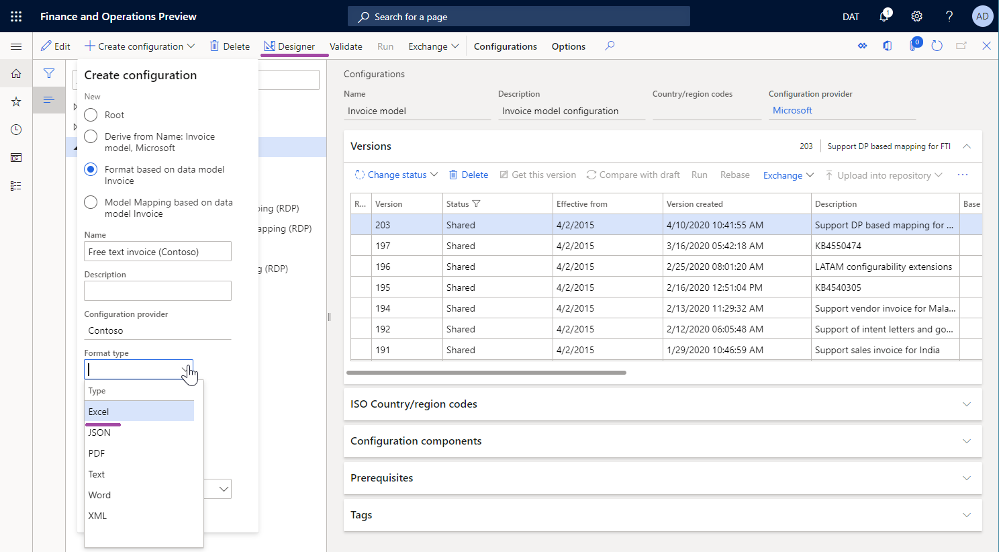
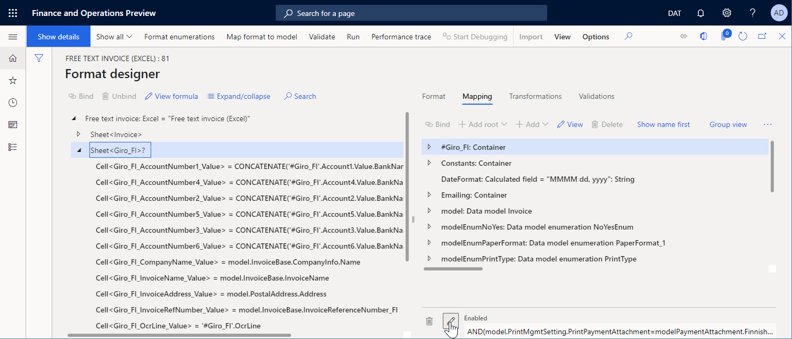
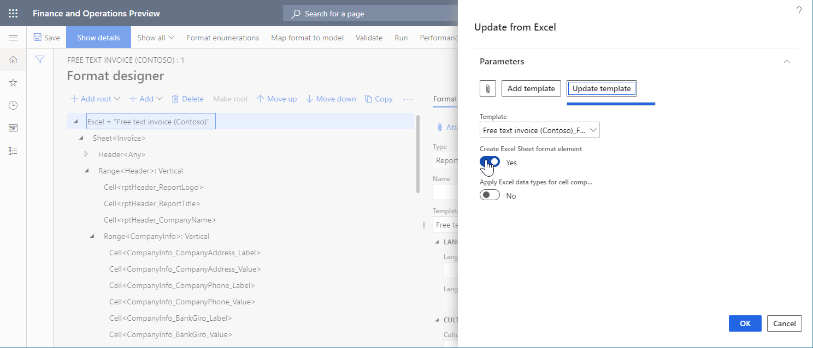

---
# required metadata

title: Design a configuration for generating documents in Excel format
description: This topic provides information about how to design an Electronic reporting (ER) format to fill in an Excel template and generate outbound documents in Excel format.
author: NickSelin
manager: AnnBe
ms.date: 05/04/2020
ms.topic: article
ms.prod: 
ms.service: dynamics-ax-platform
ms.technology: 

# optional metadata

ms.search.form: EROperationDesigner, ERParameters
# ROBOTS: 
audience: Application User, Developer, IT Pro
# ms.devlang: 
ms.reviewer: kfend
ms.search.scope: Core, Operations
# ms.tgt_pltfrm: 
ms.custom: 220314
ms.assetid: 2685df16-5ec8-4fd7-9495-c0f653e82567
ms.search.region: Global
# ms.search.industry: 
ms.author: nselin
ms.search.validFrom: 2016-06-30
ms.dyn365.ops.version: Version 7.0.0

---

# Design a configuration for generating documents in Excel format

[!include[banner](../includes/banner.md)]

You can design an [Electronic reporting (ER)](/general-electronic-reporting.md) format configuration containing an ER [format component](general-electronic-reporting.md#FormatComponentOutbound) that you can configure to generate an outbound document in Excel workbook format. Certain ER format components must be used for that.

## Add a new ER format

When you add a new ER format configuration to generate an outbound document in Excel workbook format, you must either select the **Excel** value for the **Format type** attribute of this format or keep the **Format type** attribute blank.

-   When you selected the **Excel** value for the **Format type** attribute for the added ER format, you can configure this format to generate an outbound document in the only Excel format.
-   When you keep the **Format type** attribute blank for the added ER format, you can configure this format to generate an outbound document in any format that is supported by the ER framework.

To configure the ER format component of the added ER format configuration, you need to select **Designer** and open the ER format component for editing in the ER Operation designer.

## Excel file component

### Manual entry

You must add an **Excel\\File** component to the configured ER format to generate an outbound document in Excel format. To specify the layout of an outbound document, you must attach to the added **Excel\\File** component an Excel workbook in XLSX format as a template of an outbound document.

> [!NOTE]
> When you manually attach a template, you must use a [document type](https://docs.microsoft.com/dynamics365/fin-ops-core/fin-ops/organization-administration/configure-document-management#configure-document-types) that has been configured for that in [ER
parameters](electronic-reporting-er-configure-parameters.md#parameters-to-manage-documents).

To specify how an attached template will be filled in when you run the configured ER format, you need to add for the inserted **Excel\\File** component additional nested **Sheet**, **Range** and **Cell** ER components. Every such component must be associated with an appropriate Excel named item.

### Template import

You can select **Import** and then **Import from Excel** to import a new template to a blank ER format. In this case an **Excel\\File** component will be created automatically. The imported template will be attached to it. All necessary ER components will be created automatically as well based on the list of discovered Excel named items.

> [!NOTE]
> Set **Create Excel Sheet format element** to **Yes** if you want to create the optional **Sheet** element in the editable ER format.

## Sheet component

**Sheet** component indicates a worksheet of the attached Excel workbook to be filled in. The name of this worksheet in an Excel template is defined in the **Sheet** property of this component.

> [!NOTE]
> This component is optional for Excel workbooks containing a single worksheet.

On the **Mapping** tab of the ER Operation designer you can configure the **Enabled** property for a **Sheet** component to specify whether it must be placed to a generated document.

-   When an expression of the **Enabled** property is configured to return **True** at runtime or not configured at all, the appropriate worksheet will be placed to a generated document.
-   When an expression of the **Enabled** property is configured to return **False** at runtime, a generated document will contain no such worksheet.

## Range component

**Range** component indicates a named Excel range that must be controlled by this ER component. The name of this range is defined in the **Excel range** property of this component.

The **Replication direction** property specifies whether this range will be repeated in a generated document.

-   When the **Replication direction** property is set to **No replication**, the appropriate Excel range is not repeated in a generated document.
-   When the **Replication direction** property is set to **Vertical**, the appropriate Excel range is replicated in a generated document. Every replicated range is placed below the original range in an Excel template. The number of repetitions is defined by the number of records in a data source of the **Record list** type that is bound to this ER component.
-   When the **Replication direction** property is set to **Horizontal**, the appropriate Excel range is replicated in a generated document. Every replicated range is placed on the right from the original range in an Excel template. The number of repetitions is defined by the number of records in a data source of the **Record list** type that is bound to this ER component.

To learn more about the horizontal replication, complete the steps of the [Use horizontally expandable ranges to dynamically add columns in Excel reports](tasks/er-horizontal-1.md) example.

**Range** component can have other nested ER components using to populate values to the appropriate Excel named ranges.

-   When any component of the **Text** group is used for that, this value is placed to an Excel range as a text value.  
    > [!NOTE]
    > Use this pattern to format populated values based on the locale that is defined in application.

-   When the **Cell** component of the **Excel** group is used for that, this value is placed to Excel range as a value of the data type that is defined by the binding of this **Cell** component (String, Real, Integer, etc.).  
    > [!NOTE]
    > Use this pattern allowing Excel application to format populated values based on the locale of the local computer opening an outbound document.

On the **Mapping** tab of the ER Operation designer you can configure the **Enabled** property for a **Range** component to specify whether it must be placed to a generated document.

-   When an expression of the **Enabled** property is configured to return **True** at runtime or not configured at all, the appropriate range will be filled in in a generated document.
-   When an expression of the **Enabled** property is configured to return **False** at runtime and this range does not represent the entire rows or columns, the appropriate range will not be filled in in a generated document.
-   When an expression of the **Enabled** property is configured to return **False** at runtime and this range represents the entire rows or columns, a generated document will contain such rows and columns as hidden ones.

## Cell component

**Cell** component indicates a named Excel cell that must be filled in by this ER component. The name of this cell is defined in the **Excel range** property of this component.

On the **Mapping** tab of the ER Operation designer you can configure the **Enabled** property for a **Cell** component to specify whether it must be filled in in a generated document:

-   When an expression of the **Enabled** property is configured to return **True** at runtime or not configured at all, the appropriate cell will be filled in in a generated document. The binding of this **Cell** component specifies a value that is placed to the appropriate cell of an ER template and the data type of this value (String, Real, Integer, etc.).
-   When an expression of the **Enabled** property is configured to return **False** at runtime, the appropriate cell will be filled in in a generated document.

**Cell** component is used to fill in Excel cells as well as images and shapes. To learn more about embedding images and shapes, review the [Embed images and shapes in documents that you generate by using ER](electronic-reporting-embed-images-shapes.md) page.

## Page break component

**PageBreak** component forces Excel to start a new page. When you want Excel to do paging, this component is not needed. Use this component when you want to do Excel paging in your ER format.

## Edit an added ER format

### Update template

You can select **Import** and then **Update from Excel** to import an updated template to an editable ER format. During this process, a template of the selected **Excel\\File** component will be replaced by a new one. The content of the editable ER format will be synchronized with the content of the updated ER template.

-   A new ER format component will be automatically created for every Excel name if such ER format component has not been found in the editable format.
-   Every ER format component will be deleted from the editable ER format if the appropriate Excel name has not been found for it.

> [!NOTE]
> Set **Create Excel Sheet format element** to **Yes** if you want to create the optional **Sheet** element in the editable ER format.

> [!NOTE]
> While you import an updated template, it is recommended to set the **Create Excel Sheet format element** attribute to **Yes** if the editable ER format initially contained **Sheet** elements. Otherwise, all nested elements of the initial **Sheet** element will be created from scratch. Consequently, all bindings of the recreated format elements will be lost in the updated ER format.

To learn more about this feature, complete the steps of the [Modify Electronic reporting formats by reapplying Excel
templates](modify-electronic-reporting-format-reapply-excel-template.md) example.

## Validate an ER format

When you validate an editable ER format, the consistency check is performed to make sure that every mentioned in the editable ER format Excel name is presented in the currently used Excel template. You will be notified about any found inconsistency. For some of them the option to automatically fix it will be offered.

## Example

To learn more about this feature, complete the steps of the [Design a configuration for generating reports in OPENXML format](tasks/er-design-reports-openxml-2016-11.md) example.

## Additional resources

[Electronic Reporting overview](general-electronic-reporting.md)

[Design a configuration for generating reports in OPENXML format](tasks\er-design-reports-openxml-2016-11.md)

[Modify Electronic reporting formats by reapplying Excel templates](modify-electronic-reporting-format-reapply-excel-template.md)

[Use horizontally expandable ranges to dynamically add columns in Excel reports](tasks/er-horizontal-1.md)

[Embed images and shapes in documents that you generate by using ER](electronic-reporting-embed-images-shapes.md)

[Configure Electronic reporting (ER) to pull data into Power BI](general-electronic-reporting-report-configuration-get-data-powerbi.md)
