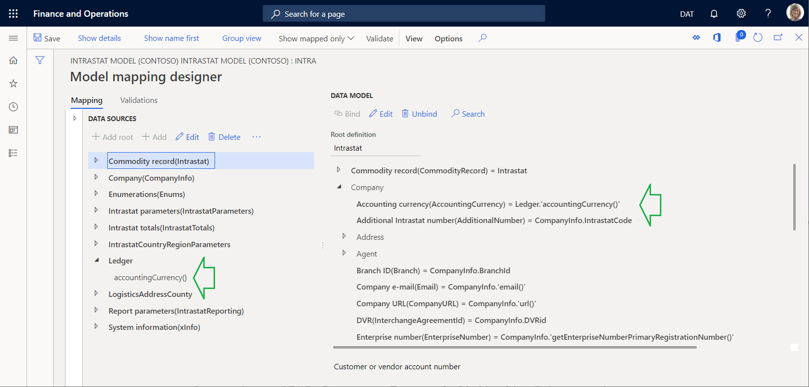
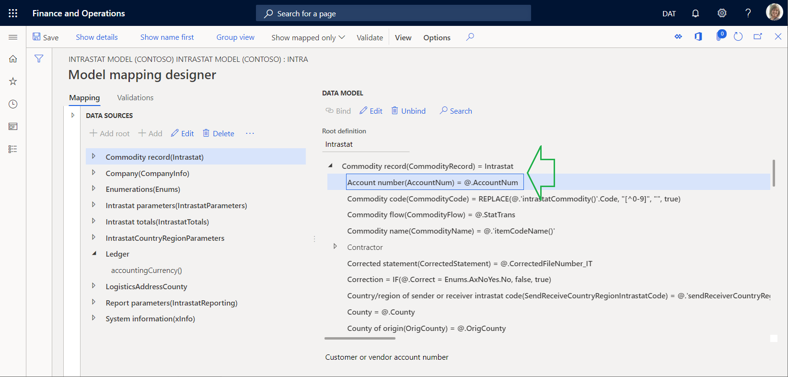
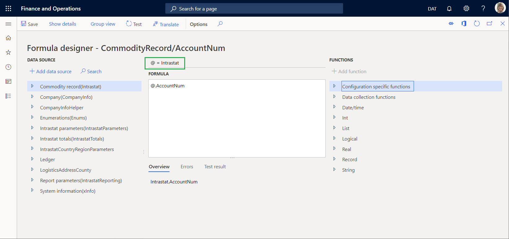

---
# required metadata

title: Electronic reporting formula language
description: This topic provides information about how to use the formula language in Electronic reporting (ER).
author: NickSelin
manager: kfend
ms.date: 12/18/2019
ms.topic: article
ms.prod: 
ms.service: dynamics-ax-platform
ms.technology: 

# optional metadata

ms.search.form: ERDataModelDesigner, ERExpressionDesignerFormula, ERMappedFormatDesigner, ERModelMappingDesigner
# ROBOTS: 
audience: Application User, IT Pro
# ms.devlang: 
ms.reviewer: kfend
ms.search.scope: Core, Operations
# ms.tgt_pltfrm: 
ms.custom: 58771
ms.assetid: 24223e13-727a-4be6-a22d-4d427f504ac9
ms.search.region: Global
# ms.search.industry: 
ms.author: nselin
ms.search.validFrom: 2016-02-28
ms.dyn365.ops.version: AX 7.0.0

---

# Electronic reporting formula language

[!include [banner](../includes/banner.md)]

Electronic Reporting (ER) provides a powerful data transformation experience. The Excel-like language is used to express the required data manipulations by using the ER formula designer.

## Basic syntax

ER expressions can contain any or all of the following elements:

- [Constants](#Constants)
- [Operators](#Operators)
- [References](#References)
- [Paths](#Paths)
- [Functions](#Functions)

## <a name="Constants">Constants</a>

When you design expressions, you can use text and numeric constants (that is, values that aren't calculated). For example, the expression `VALUE ("100") + 20` uses the numeric constant **20** and the string constant **"100"**, and returns the numeric value **120**. The ER formula designer supports escape sequences. Therefore, you can specify an expression string that should be handled differently. For example, the expression `"Leo Tolstoy ""War and Peace"" Volume 1"` returns the text string **Leo Tolstoy "War and Peace" Volume 1**.

## <a name="Operators">Operators</a>

The following table shows the arithmetic operators that you can use to do basic mathematical operations, such as addition, subtraction, multiplication, and division.

| Operator | Meaning               | Example     |
|----------|-----------------------|-------------|
| +        | Addition              | `1+2`       |
| -        | Subtraction, negation | `5-2`, `-1` |
| \*       | Multiplication        | `7\*8`      |
| /        | Division              | `9/3`       |

The following table shows the comparison operators that are supported. You can use these operators to compare two values.

| Operator | Meaning                  | Example      |
|----------|--------------------------|--------------|
| =        | Equal                    | `X=Y`        |
| &gt;     | Greater than             | `X>Y`        |
| &lt;     | Less than                | `X<Y`        |
| &gt;=    | Greater than or equal to | `X>=Y`       |
| &lt;=    | Less than or equal to    | `X<=Y`       |
| &lt;&gt; | Not equal to             | `X<>Y`       |

Additionally, you can use an ampersand (&) as a text concatenation operator. In this way, you can join, or concatenate, one or more text strings into a single piece of text.

| Operator | Meaning     | Example                                               |
|----------|-------------|-------------------------------------------------------|
| &        | Concatenate | `"Nothing to print:" & " " & "no records found"`      |

### Operator precedence

The order in which the parts of a compound expression are evaluated is important. For example, the result of the expression `1 + 4 / 2` varies, depending on whether the addition or division operation is done first. You can use parentheses to explicitly define how an expression is evaluated. For example, to indicate that the addition operation should be done first, you can change the preceding expression to `(1 + 4) / 2`. If you don't explicitly indicate the order of operations in an expression, the order is based on the default precedence that is assigned to the supported operators. The following table shows the precedence that is assigned to each operator. Operators that have a higher precedence, for example 7, are evaluated before operators that have a lower precedence, for example 1.

| Precedence | Operators      | Syntax                                                                  |
|------------|----------------|-------------------------------------------------------------------------|
| 7          | Grouping       | ( … )                                                                   |
| 6          | Member access  | … . …                                                                   |
| 5          | Function call  | … ( … )                                                                 |
| 4          | Multiplicative | … \* …<br>… / …                                                         |
| 3          | Additive       | … + …<br>… - …                                                          |
| 2          | Comparison     | … &lt; …<br>… &lt;= …<br>… =&gt; …<br>… &gt; …<br>… = …<br>… &lt;&gt; … |
| 1          | Separation     | … , …                                                                   |

If an expression includes multiple consecutive operators that have the same precedence, those operations are evaluated from left to right. For example, the expression `1 + 6 / 2 \* 3 > 5` returns **true**. We recommend that you use parentheses to explicitly indicate the desired order of operations in expressions, so that the expressions are easier to read and maintain.

## <a name="References">References</a>

All data sources of the current ER component that are available during the design of an expression can be used as named references. The current ER component can be either a model mapping or a format. For example, the current ER model mapping contains the **ReportingDate** data source, which returns a value of the data type, *DateTime*. To correctly format that value in the generating document, you can reference the data source in the expression as `DATETIMEFORMAT (ReportingDate, "dd-MM-yyyy")`.

All characters in the name of a referencing data source that don't represent a letter of the alphabet must be preceded by a single quotation mark ('). If the name of a referencing data source contains at least one symbol that doesn't represent a letter of the alphabet, the name must be enclosed in single quotation marks. For example, these non-alphabetic symbols can be punctuation marks or other written symbols. Here are some examples:

- The **Today's date & time** data source must be referred to in an ER expression as `'Today''s date & time'`.
- The **name()** method of the **Customers** data source must be referred to in an ER expression as `Customers.'name()'`.

If the methods of application data sources have parameters, the following syntax is used to call those methods:

- If the **isLanguageRTL** method of the **System** data source has an **EN-US** parameter of the *String* data type, this method must be referred to in an ER expression as `System.isLanguageRTL("EN-US")`.
- Quotation marks aren't required when a method name contains only alphanumeric symbols. However, they are required for a method of a table if the name includes brackets.

When the **System** data source is added to an ER mapping that refers to the **Global** application class, the expression `System.isLanguageRTL("EN-US ")` returns the *Boolean* value **FALSE**. The modified expression `System.isLanguageRTL("AR")` returns the *Boolean* value **TRUE**.

You can limit the way that values are passed to the parameters of this type of method:

- Only constants can be passed to methods of this type. The values of the constants are defined at design time.
- Only primitive (basic) data types are supported for parameters of this type. The primitive data types are *Integer*, *Real*, *Boolean*, *String*, and so on.

## <a name="Paths">Paths</a>

When an expression references a structured data source, you can use the path definition to select a specific primitive element of that data source. A dot character (.) is used to separate individual elements of a structured data source. For example, the current ER model mapping contains the **InvoiceTransactions** data source, and this data source returns a list of records. The **InvoiceTransactions** record structure contains the **AmountDebit** and **AmountCredit** fields, and both these fields return numeric values. Therefore, you can design the following expression to calculate the invoiced amount: `InvoiceTransactions.AmountDebit - InvoiceTransactions.AmountCredit`. The `InvoiceTransactions.AmountDebit` construction in this expression is the path to access the **AmountDebit** field of the **InvoiceTransactions** data source of the *Record list* type.

### Relative path

When a path to a structured data source is started from the **@** symbol, it means that this path is relative. The **@** symbol is shown instead of the remaining part of the absolute path of using a hierarchical tree structure. The following graphic illustrates this. The absolute path `Ledger.'accountingCurrency()'` is used to indicate that the accounting currency value from the Ledger data source is populated to the **AccountingCurrency** field of the data model.



The sample of the relative path usage is presented in the following graphic. The relative path `@.AccountNum` is used to express that **AccountNum** field of the **Intrastat** data source (shown one level up from the **AccountNum** field in the data model hierarchical tree) is used to populate to the data model **AccountNum** field the customer or vendor account number.



The remaining part of the absolute path is shown in the [ER formula editor](general-electronic-reporting-formula-designer.md) as well.



## <a name="Functions">Functions</a>

ER built-in functions can be used in ER expressions. All data sources of the expression context (the current ER model mapping or ER format) can be used as parameters of calling functions, in accordance with the list of arguments for calling functions. Constants can also be used as parameters of calling functions. For example, the current ER model mapping contains the **InvoiceTransactions** data source, and this data source returns a list of records. The **InvoiceTransactions** record structure contains the **AmountDebit** and **AmountCredit** fields, and both these fields return numeric values. Therefore, to calculate the invoiced amount, you can design the following expression that uses the built-in ER rounding function: `ROUND (InvoiceTransactions.AmountDebit - InvoiceTransactions.AmountCredit, 2)`.

You can use ER functions of the following categories while you design ER model mappings and ER reports:

-	[Date and time functions](er-functions-category-datetime.md)
-	[List functions](er-functions-category-list.md)
-	[Logical functions](er-functions-category-logical.md)
-	[Mathematical functions](er-functions-category-mathematical.md)
-	[Record functions](er-functions-category-record.md)
-	[Text functions](er-functions-category-text.md)
-	[Data collection functions](er-functions-category-data-collection.md)
-	[Other (business domain–specific) functions](er-functions-category-other.md)
-	[Type conversion functions](er-functions-category-type-conversion.md)

## Functions list extension

ER lets you extend the list of functions that are used in ER expressions. Some engineering effort is required. For detailed information, see [Extend the list of Electronic reporting (ER) functions](general-electronic-reporting-formulas-list-extension.md).

## Compound expressions

You can create a compound expressions using functions in different categories as long as the data types match. Match the data type of the output from one function to the input data type required by another function when you use them together. For example, combine functions from the [List](er-functions-category-list.md) category with a function from the [Logical](er-functions-category-logical.md) category to avoid a possible "list-is-empty" error in a binding of a field to an ER format element, as in the example below. The formula uses the [IF](er-functions-logical-if.md) function to test if the **IntrastatTotals** list is empty before it returns the value of the required aggregation from it; otherwise it returns zero.

```
IF(ISEMPTY(IntrastatTotals), 0.0, IntrastatTotals.aggregated.'$AmountMSTRounded') 
```

## Multiple solutions

There is often more than one way to get a data transformation result using functions of different categories or different functions from same category. For example, the previous expression can be configured in another way by using the [COUNT](er-functions-list-count.md) function of the [List](er-functions-category-list.md) category:

```
IF(COUNT (IntrastatTotals)=0, 0.0, IntrastatTotals.aggregated.'$AmountMSTRounded') 
```

## Additional resources

[Electronic Reporting overview](general-electronic-reporting.md)

[Formula designer in Electronic reporting](general-electronic-reporting-formula-designer.md)

[Extend the list of Electronic reporting functions](general-electronic-reporting-formulas-list-extension.md)
