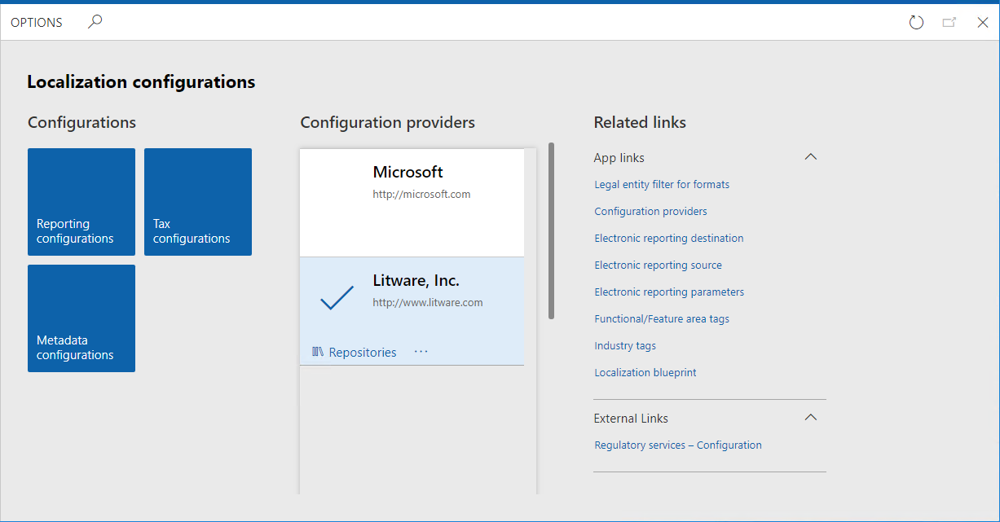
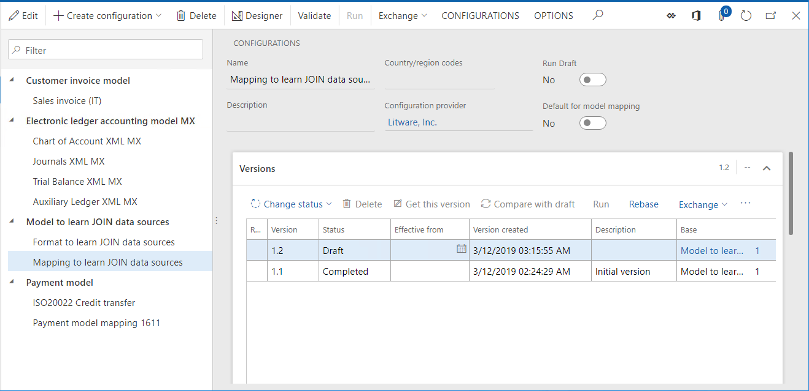
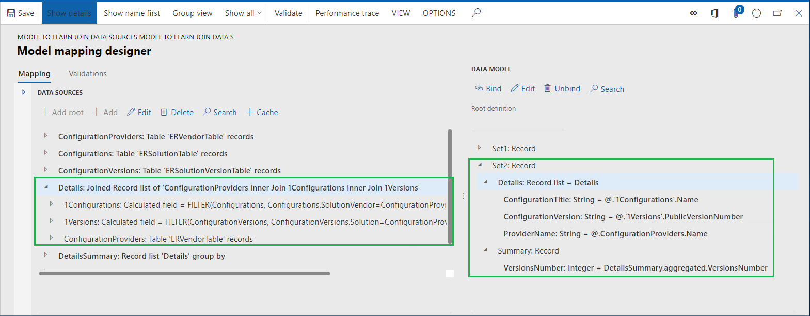
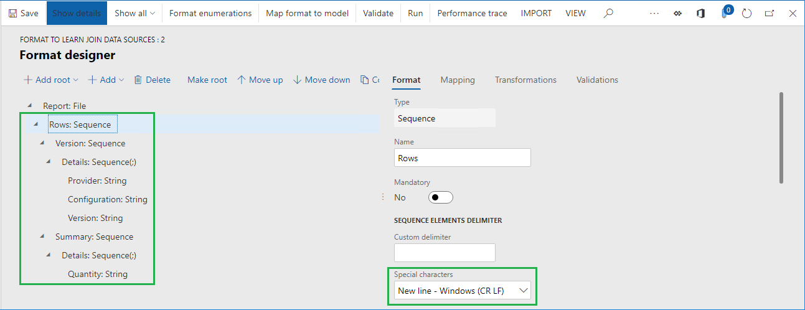
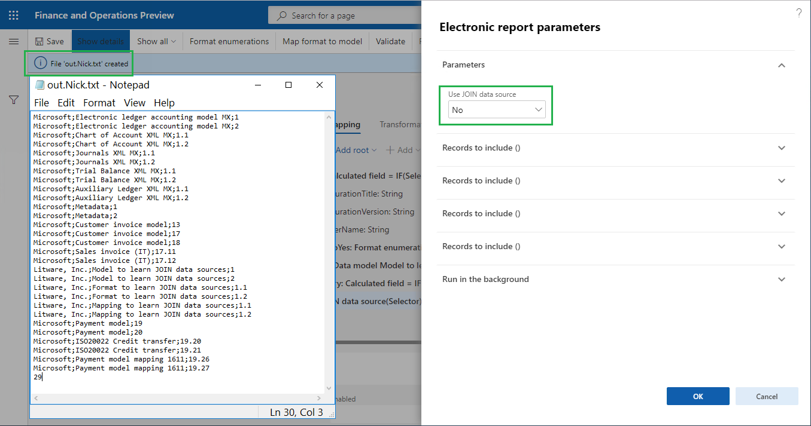
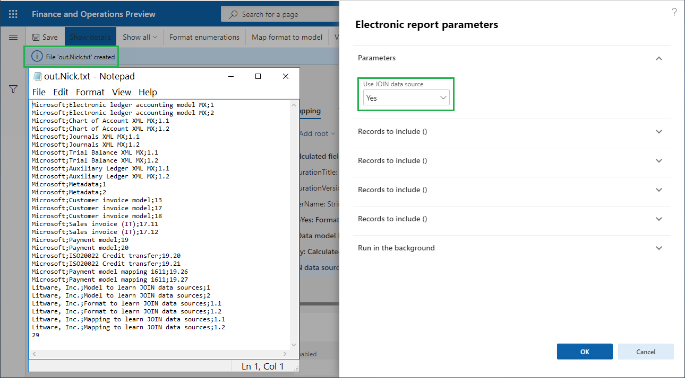
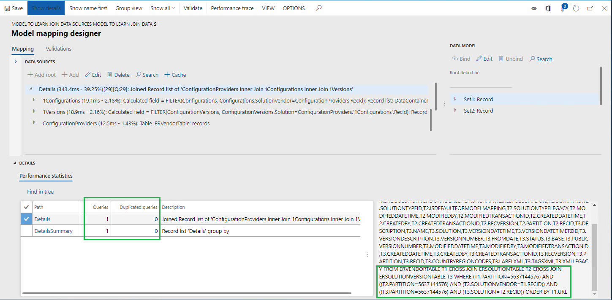
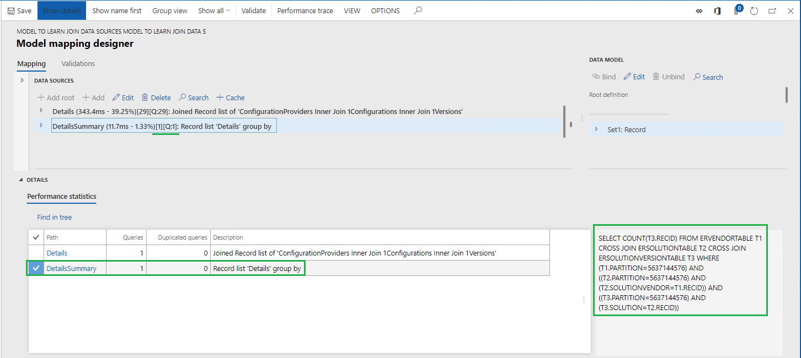

---
# required metadata

title: Use JOIN data sources in ER model mappings to get data from multiple application tables
description: This topic explains how you can use JOIN type data sources in Electronic reporting (ER).
author: NickSelin
manager: AnnBe
ms.date: 05/01/2020
ms.topic: article
ms.prod: 
ms.service: dynamics-ax-platform
ms.technology: 

# optional metadata

ms.search.form: ERModelMappingDesigner, EROperationDesigner
# ROBOTS: 
audience: Application User, Developer, IT Pro
# ms.devlang: 
ms.reviewer: kfend
ms.search.scope: Core, Operations
# ms.tgt_pltfrm: 
ms.custom: 
ms.assetid: 
ms.search.region: Global
# ms.search.industry: 
ms.author: nselin
ms.search.validFrom: 2019-03-01
ms.dyn365.ops.version: Release 10.0.1

---

# Use JOIN data sources to get data from multiple application tables in Electronic reporting (ER) model mappings

[!include[banner](../includes/banner.md)]

While configuring Electronic reporting (ER) model mappings or formats, you can [add](#review) required data sources of the **Join** type. At design time, a **Join** data source is configured as a set of several data sources each of which returns a list of records. For every data source except the first one, you need to define necessary conditions to join records of the current and previous data sources. At runtime, a configured data source of **Join** type [returns](#executeERformat) a single joined list of records containing fields from the records of nested data sources.

The following type of joins are currently supported:

- Outer (left) join:
    - Join all records of the first (left-most) data source and then any matching in accordance to configured conditions records of the second (right-most) data source.
- Inner (right) join:
    - Join only records of the first (left-most) data source and only records of the second (right-most) data source matching to each other in accordance to configured conditions.

In the configured **Join** data source, when all data sources are the **Table records** type, execution of the Join data source can be [performed at the database level](#analyze) using a single SQL statement. This reduces the number of database calls, which improves model mapping performance. Otherwise, execution of **Join data** source is performed in memory.

> [!NOTE]
> Using the **VALUEIN** function in ER expressions that specify conditions for joining records in data sources of Join type is not supported yet. Visit the [Formula designer in Electronic reporting](general-electronic-reporting-formula-designer.md) page for more details about this function.

To learn more about this feature, complete the example in this topic.

## Example: Use JOIN data sources in ER model mappings

The following steps explain how the System administrator or Electronic reporting developer can configure an Electronic reporting (ER) model mapping to get data from multiple application tables at once by using data sources of the **Join** type to improve data access performance. These steps can be performed for any company of Dynamics 365 Finance or Regulatory Configuration Services (RCS).

### Prerequisites

To complete the examples in this topic, you must have access to one of the following depending on what service is used to compete these steps:

**Access to Finance for one of the following roles:**

- Electronic reporting developer
- Electronic reporting functional consultant
- System administrator

**Access to RCS for one of the following roles:**

- Electronic reporting developer
- Electronic reporting functional consultant
- System administrator

You also must first complete the steps in the [Create a configuration provider and mark it as active](tasks/er-configuration-provider-mark-it-active-2016-11.md) procedure.

In advance, you must also download from [Microsoft Download Center](https://go.microsoft.com/fwlink/?linkid=000000) and save locally the following sample ER configuration files:

| **Content description**  | **File name**   |
|--------------------------|-----------------|
| Sample **ER data model** configuration file, which is used as the data source for the examples.| [Model to learn JOIN data sources.version.1.1.xml](https://mbs.microsoft.com/customersource/Global/AX/downloads/hot-fixes/365optelecrepeg) |
| Sample **ER model mapping** configuration file, which implements the ER data model for the examples. | [Mapping to learn JOIN data sources.version.1.1.xml](https://mbs.microsoft.com/customersource/Global/AX/downloads/hot-fixes/365optelecrepeg) |
| Sample **ER format** configuration file. This file describes the data to populate the ER format component for the examples. | [Format to learn JOIN data sources.version.1.1.xml](https://mbs.microsoft.com/customersource/Global/AX/downloads/hot-fixes/365optelecrepeg) |

### Activate a configurations provider

1. Access either Finance or RCS in the first session of your web browser.
2. Go to **Organization administration \> Workspaces \> Electronic reporting**.
3. On the **Localization configurations** page, in the **Configuration providers** section, make sure that the configuration provider for the Litware, Inc. (http://www.litware.com) sample company is listed, and that it's marked as **Active**. If you don't see this configuration provider, follow the steps in [Create a configuration provider and mark it as active](tasks/er-configuration-provider-mark-it-active-2016-11.md) procedure.

    

### Import sample ER configuration files

1. Select **Reporting configurations**.
2. Import the ER data model configuration file.
    1. Select **Exchange**.
    2. Select **Load from XML file**.
    3. Select **Browse** to find the **Model to learn JOIN data sources.version.1.1.xml** file.
    4. Select **OK**.
3. Import the ER model mapping configuration file.
    1. Select **Exchange**.
    2. Select **Load from XML file**.
    3. Select **Browse** to find the **Mapping to learn JOIN data sources.version.1.1.xml** file.
    4. Select **OK**.
4.	Import the ER format configuration file.
    1. Select **Exchange**.
    2. Select **Load from XML file**.
    3. Select **Browse** to find the **Format to learn JOIN data sources.version.1.1.xml** file.
    4. Select **OK**.
5.	In the configurations tree, expand the **Model to learn JOIN data sources** item as well as other model items (when available).
6.	Observe the list of ER configurations in the tree as well as version details on the **Versions** fast tab – they will be used as the source of data for your sample report.

    

### Turn on execution trace options
1.	Select **CONFIGURATIONS**.
2.	Select **User parameters**.
3.	Set execution trace parameters as shown on the screenshot below.

    

    With these parameters turned on, for every execution of the imported ER format file, the execution trace will be generated. Using details of generated execution trace, you can analyze the execution of ER format and ER model mapping components. Visit the [Trace execution of ER format to troubleshoot performance issues](trace-execution-er-troubleshoot-perf.md) page for more details about ER execution trace feature.

### Review ER model mapping (part 1)

Review settings of the ER model mapping component. The component is configured to access information about versions of ER configurations, details of configurations and configuration providers without using data sources of the **Join** type.

1.	Select **Mapping to learn JOIN data sources** configuration.
2.	Select **Designer** to open the list of mappings.
3.	Select **Designer** to review the mapping details. 
4.	Select **Show details**.
5.	In the configurations tree, expand the **Set1** and **Set1.Details** data model items:

    1. Binding **Details: Record list = Versions** indicates that the **Set1.Details** item is bound to the **Versions** data source returning records of the **ERSolutionVersionTable** table. Each record of this table represents a single version of an ER configuration. The content of this table is presented in the **Versions** fast tab on the **Configurations** page.
    2. Binding **ConfigurationVersion: String = @.PublicVersionNumber** means that the value of the public version of each ER configuration’s version is taken from the **PublicVersionNumber** field of the **ERSolutionVersionTable** table and placed to the **ConfigurationVersion** item.
    3. Binding **ConfigurationTitle: String = @.'>Relations'.Solution.Name** indicates that the name of an ER configuration is taken from the **Name** field of the **ERSolutionTable** table assessing by using the many-to-one relation (**'>Relations'**) between the **ERSolutionVersionTable** and **ERSolutionTable** tables. Names of ER configurations of the current application instance are presented in the configurations tree on the **Configurations** page.
    4. Binding **@.'>Relations'.Solution.'>Relations'.SolutionVendor.Name** means that the name of the configuration provider that owns the current configuration is taken from the **Name** field of the **ERVendorTable** table assessing by using the many-to-one relation between **ERSolutionTable** and **ERVendorTable** tables. Names of ER configuration providers are presented in the configurations tree on the **Configurations** page on the page header for each configuration. The entire list of ER configuration providers can be found on the **Organization administration \> Electronic reporting \> Configuration provider** table page.

    

6.	In the configurations tree, expand the **Set1.Summary** data model item:

    1. Binding **VersionsNumber: Integer = VersionsSummary.aggregated.VersionsNumber** indicates that the **Set1.Summary.VersionsNumber** item is bound to the **VersionsNumber** aggregation field of the **VersionsSummary** data source of the **GroupBy** type that was configured to return the number of records of the **ERSolutionVersionTable** table via the **Versions** data source.

    

7.	Close the page.

###  Review ER model mapping (part 2)

Review settings of the ER model mapping component. The component is configured to access information about versions of ER configurations, details of configurations and configuration providers with using a data source of the **Join** type.

1.	In the configurations tree, expand the **Set2** and **Set2.Details** data model items. Note that the binding **Details: Record list = Details** indicates that the **Set2.Details** item is bound to the **Details** data source configured as the data source of the **Join** type.

    

    The **Join** data source can be added by selecting the **Functions\Join** data source:

    

2.	Select **Detail**s data source.
3.	Select **Edit** in the **Data sources** pane.
4.	Select **Edit join**.
5.	Select **Show details**.

    

    This page is used to design the required data source of the **Join type**. At runtime, this data source will create a single joined list of records from the data sources in the **Joined list** grid. Join of records will start from the **ConfigurationProviders** data source that is in the grid as a first one (the **Type** column is blank for it). Records of every other data source will be joined consequently to records of the parent data source based on its order in this grid. Every joining data source must be configured as a data source nested under a target data source (**1Versions** data source is nested under **1Configurations** one; **1Configurations** data source is nested under **ConfigurationProviders** one). Each configured data source must contain the conditions for the join. In the data source for this particular **Join**, the following joins are defined:

    - Each record of the **ConfigurationProviders** data source (referred to the **ERVendorTable** table) is joined with only records of the **1Configurations** one (referred to in the **ERSolutionTable** table) having the same value in the **SolutionVendor** and **RecId** fields. The **Inner join** type is used for this join as well as the following conditions for matching records: 

    FILTER (Configurations, Configurations.SolutionVendor = ConfigurationProviders.RecId)

    - Each record of the **1Configurations** data source (referred to the **ERSolutionTable** table) is joined with the only records of the **1Versions** one (referred to the **ERSolutionVersionTable** table) having the same value in the **Solution** and **RecId** fields. **Inner join** type is used for this join as well as the following conditions for matching records:

    FILTER (ConfigurationVersions, ConfigurationVersions.Solution = ConfigurationProviders.'1Configurations'.RecId)

    - **Execute** option is configured as **Query** meaning that this join data source will be executed at runtime on database level as a direct SQL call.

    Note that for joining records of data sources representing application tables, you can specify join conditions by using pairs of fields other than ones that describe existing in AOT relations between these tables. This type of join can be configured to execute at the database level as well.

6.	Close the page.
7.	Select **Cancel**.
8.	In the configurations tree, expand the **Set2.Summary** data model item:

    - Binding **VersionsNumber: Integer = DetailsSummary.aggregated.VersionsNumber** indicates that the **Set2.Summary.VersionsNumber** item is bound to the **VersionsNumber** aggregation field of the **DetailsSummary** data source of the **GroupBy** type that was configured to return the number of joined records of the **Details** data source of the **Join** type.
    - Note that the **Execution** location option is configured as **Query** meaning that this **GroupBy** data source will be executed at runtime as a direct SQL call at the database level. This is possible because the base data source **Details** of the **Join** type is configured as executed at the database level.

    

9.	Close the page.
10.	Select **Cancel**.

###  Execute ER format

1.	Access Finance or RCS in the second session of your web browser using same credentials and company as in the first session.
2.	Go to **Organization administration \> Electronic reporting \> Configurations**.
3.	Expand **Model to learn JOIN data sources** configuration.
4.	Select **Format to learn JOIN data sources** configuration.
5.	Select **Designer**.
6.	Select **Show details**.
7.	Select **Mapping**.
8.	Select **Expand/Collapse**.

    Note that this format is designed to populate a generated text file with a new line for every version of an ER configuration (**Version** sequence). Each generated line will contain the name of a configuration provider owning the current configuration, the configuration name and the configuration version separated by semicolon mark. The final line of generated file will contain the number of discovered versions of ER configurations (**Summary** sequence).

    

    The **Data** and **Summary** data sources are used to populate configuration version details to the generated file:

    - Information from the **Set1** data model is used when you choose **No** for the **Selector** data source at runtime on the user dialog page when running ER format.
    - Information from the **Set2** data model is used when you choose **Yes** for the **Selector** data source at runtime on the user dialog page.

    

9.	Select **Run**.
10.	On the dialog page, select **No** in the **Use JOIN data source** field.
11.	Select **OK**.
12.	Review generated file.

    

#### Analyze ER format execution trace

1.	In the first session of Finance or RCS, select **Designer**.
2.	Select **Performance trac**e.
3.	In the **Performance trace** grid, select the top-most record of the latest execution trace of an ER format that used the current model mapping component.
4.	Select **OK**.

    Note that execution statistics informs you about duplicated calls to application tables:

    - **ERSolutionTable** has been called as many times as you have configuration version records in the **ERSolutionVersionTable** table, while the number of such calls could be reduced in times for performance improvement.
    - **ERVendorTable** has been called twice for every configuration version record that was discovered in the **ERSolutionVersionTable** table, while the number of such calls could be reduced as well.

    

5.	Close the page.

### Execute ER format

1.	Switch to your web browser tab with the second session of Finance or RCS.
2.	Select **Run**.
3.	On the dialog page, select **Yes** in the **Use JOIN data source** field.
4.	Select **OK**.
5.	Review generated file.

    

####  Analyze ER format execution trace

1.	In the first session of Finance or RCS, select **Designer**.
2.	Select **Performance trace**.
3.	In the **Performance trace** grid, select top-most record representing the latest execution trace of an ER format that used the current model mapping component.
4.	Select **OK**.

    Note that execution statistics informs you about the following:

    - Application database has been called once to get records from **ERVendorTable**, **ERSolutionTable**, and **ERSolutionVersionTable** tables to access required fields.

    

    - Application database has been called once to calculate the number of configuration versions by using joins that were configured in the **Details** data source.

    

## Limitations

As you can see from the example in this topic, the **JOIN** data source can be built from several data sources that describe the individual datasets of the records that must eventually be joined. You can configure those data sources by using the built-in ER [FILTER](er-functions-list-filter.md) function. When you configure the data source so that it's called beyond the **JOIN** data source, you can use company ranges as part of the condition for data selection. The initial implementation of the **JOIN** data source doesn't support data sources of this type. For example, when you call a [FILTER](er-functions-list-filter.md)-based data source within the scope of execution of a **JOIN** data source, if the called data source contains company ranges as part of the condition for data selection, an exception occurs.

In Microsoft Dynamics 365 Finance version 10.0.12 (August 2020), you can use company ranges as part of the condition for data selection in [FILTER](er-functions-list-filter.md)-based data sources that are called within the scope of execution of a **JOIN** data source. Because of the limitations of the application [query](../dev-ref/xpp-library-objects#query-object-model) builder, the company ranges are supported only for the first data source of a **JOIN** data source.

### Example

For example, you must make a single call to the application database to get the list of foreign trade transactions of multiple companies and the details of the inventory item that is referred to in those transactions.

In this case, you configure the following artifacts in your ER model mapping:

- **Intrastat** root data source that represents the **Intrastat** table.
- **Items** root data source that represents the **InventTable** table.
- **Companies** root data source that returns the list of companies (**DEMF** and **GBSI** in this example) where transactions must be accessed. The company code is available from the **Companies.Code** field.
- **X1** root data source that has the expression `FILTER (Intrastat, VALUEIN(Intrastat.dataAreaId, Companies, Companies.Code))`. As part of the condition for data selection, this expression contains the definition of company ranges `VALUEIN(Intrastat.dataAreaId, Companies, Companies.Code)`.
- **X2** data source as a nested item of the **X1** data source. It includes the expression `FILTER (Items, Items.ItemId = X1.ItemId)`.

Finally, you can configure a **JOIN** data source where **X1** is the first data source and **X2** is the second data source. You can specify **Query** as the **Execute** option to force ER to run this data source on the database level as a direct SQL call.

When the configured data source is run while the ER execution is [traced](trace-execution-er-troubleshoot-perf.md), the following statement is shown in the ER model mapping designer as part of the ER performance trace.

`SELECT ... FROM INTRASTAT T1 CROSS JOIN INVENTTABLE T2 WHERE ((T1.PARTITION=?) AND (T1.DATAAREAID IN (N'DEMF',N'GBSI') )) AND ((T2.PARTITION=?) AND (T2.ITEMID=T1.ITEMID AND (T2.DATAAREAID = T1.DATAAREAID) AND (T2.PARTITION = T1.PARTITION))) ORDER BY T1.DISPATCHID,T1.SEQNUM`

> [!NOTE]
> An error occurs if you run a **JOIN** data source that has been configured so that it contains data selection conditions that have company ranges for additional data sources of the executed **JOIN** data source.

## Additional resources

[Formula designer in Electronic reporting](general-electronic-reporting-formula-designer.md)

[Trace execution of ER format to troubleshoot performance issues](trace-execution-er-troubleshoot-perf.md)

