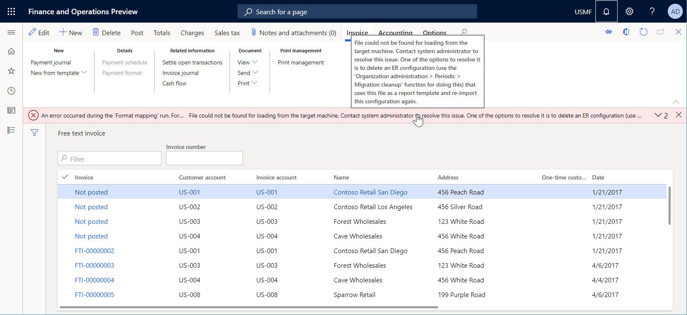
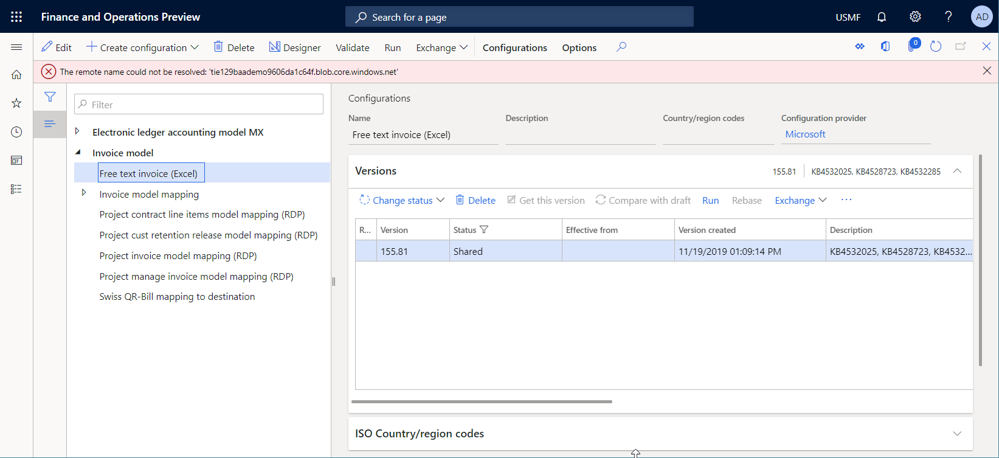
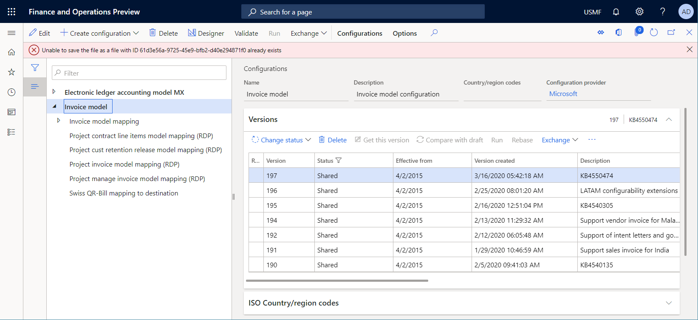

---
# required metadata

title: ER migration cleanup
description: This topic explains how you can use the ER migration cleanup function for resolving issues with ER templates.
author: NickSelin
manager: AnnBe
ms.date: 04/27/2020
ms.topic: article
ms.prod: 
ms.service: dynamics-ax-platform
ms.technology: 

# optional metadata

ms.search.form: ERSolutionTable, ERWorkspace, ERParameters, ERMigrationCleanup
# ROBOTS: 
audience: Application User, Developer, IT Pro
# ms.devlang: 
ms.reviewer: kfend
ms.search.scope: Core, Operations
# ms.tgt_pltfrm: 
ms.custom: 
ms.assetid: 
ms.search.region: Global
# ms.search.industry: 
ms.author: nselin
ms.search.validFrom: 2018-01-01
ms.dyn365.ops.version: AX 8.0.0

---

# ER migration cleanup 

[!include[banner](../includes/banner.md)]

When you manage your Finance instances, you might decide to migrate the current instance to another location. For example, you might migrate your production instance to a new sandbox environment. If you configured the ER framework to store templates in Blob storage, the DocuValue table in the new sandbox environment refers to the instance of Blob storage in the production environment. However, this instance can't be accessed from the sandbox environment because the migration process doesn't support the migration of artifacts in Blob storage. It is expected that in the new sandbox environment you refer to the instance of Blob storage of the sandbox environment which is currently contains not ER templates.

Therefore, if you try to run an ER format that uses a template to generate business documents, an exception occurs, and you're notified about the missing template. You're also guided to use the ER migration cleanup option to delete and then re-import the ER format configuration that contains the template.

Similar error occurs if you try to delete on the **Configurations** page an ER format configuration that uses a template.

1.  Open the **Organization administration \> Electronic reporting \> Configurations** page.
2.  Select an ER format configuration in the configurations tree.
3.  Select **Delete**.

Complete the following steps to properly resolve the mentioned above issues with non-accessible ER templates.

1.  Open the **Organization administration \> Periodic \> Migration cleanup** page.
2.  Select an ER format configuration that can’t be executed or deleted.
3.  Select **Delete**.
4.  Confirm the deletion of the selected ER format configuration.
5.  [Import](download-electronic-reporting-configuration-lcs.md) the deleted ER format configuration to the current Finance instance.

## Applicability

> [Important]
> The **Migration cleanup** option is targeted for the only ER format configurations containing non-accessible ER templates. When you delete an ER format configuration by using the **Migration cleanup** option, ER deletes related to such configuration artefacts in the only application database. The existence of the appropriate physical files in Blob storage are not validated – it is assumed that there are none of them. Therefore, do not use the **Migration cleanup** option as an alternative of the ER configuration deletion option on the **Configurations** page. Use the **Migration cleanup** option only when the ER configuration deletion option on the **Configurations** page failed.
>
> If you use the **Migration cleanup** option to delete an ER format configuration when the referred from it template is available in the Blob storage, you only delete related to such configuration artefacts in the application database. The physical file of such template in the Blob storage remains. As starting from the Platform update 34 files overwriting in Blob storage is not allowed any more (see [KB4557217](https://fix.lcs.dynamics.com/Issue/Details?kb=4557217) for more), you will not be able to re-import the deleted this way ER configuration to this environment any longer. To resolve this issue, you need to find the corresponding file in Blob storage and manually delete it.

Because you might have several ER format configurations, this process can be time consuming. Therefore, the usage of the [Backup storage of ER templates](er-backup-storage-templates.md) feature to automatic recovery of template with broken references is preferable.
