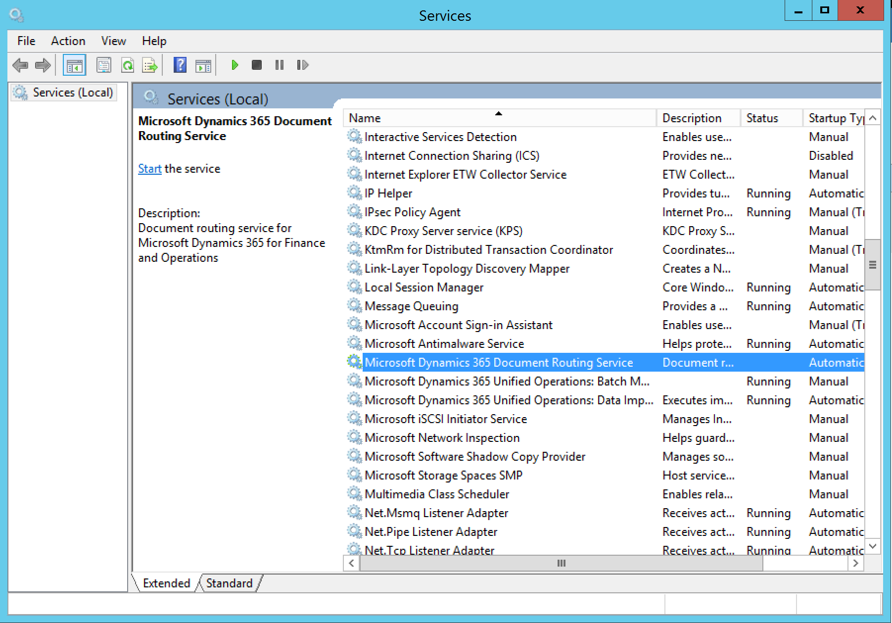

---
# required metadata

title: Upgrade the Document Routing Agent
description: This topic explains how to upgrade the Document Routing Agent.
author: TJVass
manager: AnnBe
ms.date: 09/06/2019
ms.topic: article
ms.prod: 
ms.service: dynamics-ax-applications
ms.technology: 

# optional metadata

# ms.search.form:  [Operations AOT form name to tie this topic to]
audience: IT Pro
# ms.devlang: 
ms.reviewer: kfend
ms.search.scope: Operations
# ms.tgt_pltfrm: 
# ms.custom: [used by loc for topics migrated from the wiki]
ms.search.region: Global
# ms.search.industry: [leave blank for most, retail, public sector]
ms.author: tjvass
ms.search.validFrom: 2016-02-28
ms.dyn365.ops.version: AX 7.0.0
---

# Upgrade the Document Routing Agent

[!include[banner](../includes/banner.md)]

Platform update 12 includes several important enhancements to the components that provide network printing capabilities. For example, the solution for managing the print job queue has been redesigned so that the Print Job Management service can be scaled to satisfy high-volume printing requirements. Although the Print Job Management service is backward-compatible with in-market versions of the Document Routing Agent (DRA) client, we strongly recommend that customers upgrade **all** existing DRA clients that are hosted on-premises.

If you don't upgrade existing installations of the DRA to Platform update 12 or later, you might experience the following issues:

- Observable performance degradation in applications
- Document loss that is associated with orphaned print jobs
- Inconsistent handling of printed documents that have custom margins

IT administrators must perform the following procedures on each domain resource that is used to host a DRA.

## Get started
To continue to run the DRA as a Microsoft Windows service, you must have both the user name and the password of the domain account that is used to run the service. This information must be available after the upgrade is completed. To find the information for the active service account, start the Microsoft Management Console (MMC) Services snap-in, and select **Microsoft Dynamics 365 Document Routing Service** in the list.

## Uninstall an existing Document Routing Agent
Open **Programs and Features**, and then find and uninstall **Microsoft Dynamics 365 for Finance and Operations: Document Routing**.

During the uninstallation process, if you're prompted to close the Microsoft Dynamics 365 Document Routing Service application, select **Automatically close applications and attempt to restart them after setup is complete.**

## Install the latest Document Routing Agent
For information about how to install the latest DRA that is available with your subscription, see [Install the Document Routing Agent to enable network printing](install-document-routing-agent.md).

> [!NOTE]
> Be sure to open the DRA client after upgrading to refresh network user credentials.
