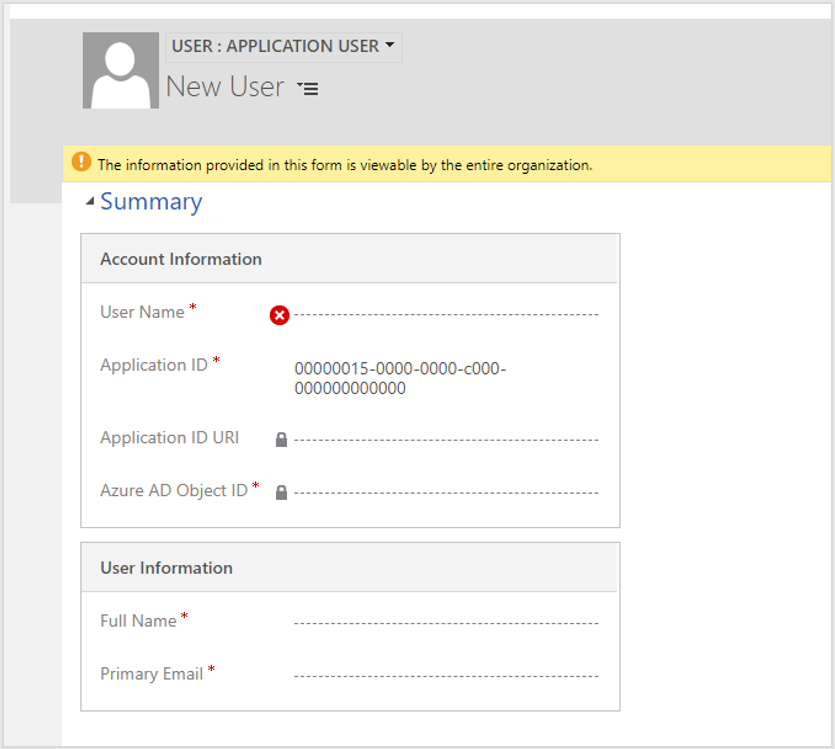
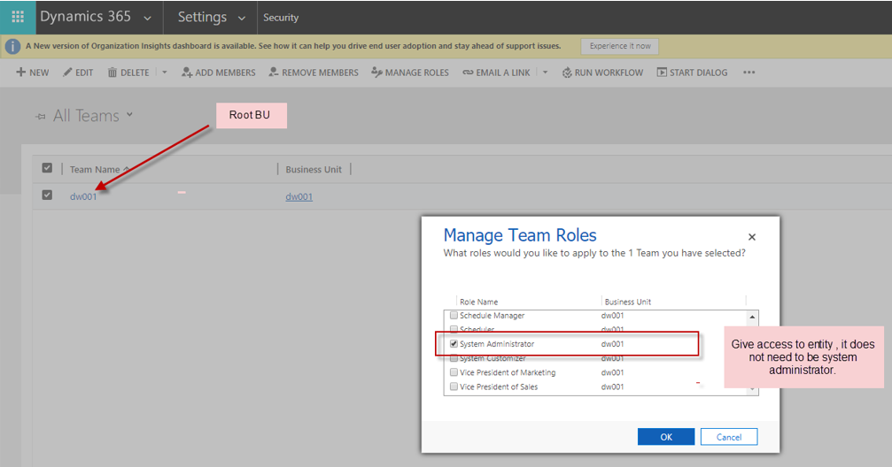
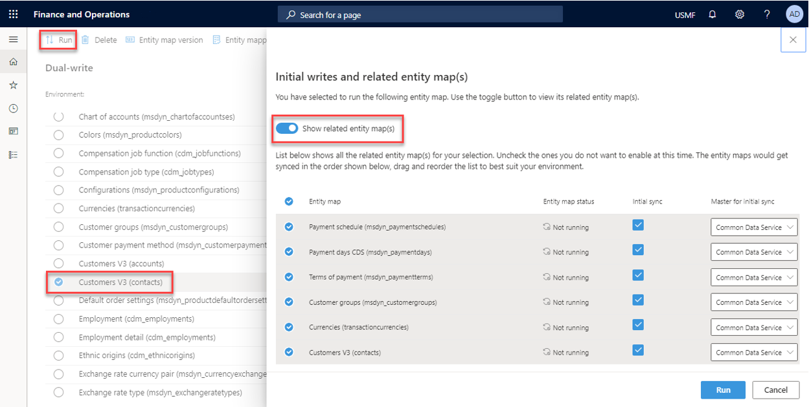

---

title: "System requirements and prerequisites"
description: Describes the system requirements and prerequisites for enabling dual-write in Finance and Operations apps.
author: sabinn-msft

ms.technology: 
ms.topic: conceptual
ms.date: 03/13/2020
ms.author: v-douklo

LocalizationGroup: 
---

# System requirements and prerequisites

[!include [banner](../../includes/banner.md)]

[!include [banner](../../includes/preview-banner.md)]

## Check requirements and grant access

Before you enable dual-write, follow the steps in the sections below to ensure you meet the minimum system requirements and to grant access to the apps that need to connect to each other. The dual-write _health check_ validates the required prerequisites below as you step through the dual-write wizard to link to the Common Data Service environment.

1. Check the platform update and app version.

    Ensure your Finance and Operations app environment is at least platform update 33 (App version 10.0.9) or above.

    Related health check:

    `App version is up to date`

    `Dual Write is supported on Finance and Operations app environments with Platform Update PU 33 (App version 10.0.9) or above`

2. Install the dual-write core solution.

   The dual-write core solution contains metadata for your entity maps and must be installed in your environments.

   To install the dual-write core solution:
   
   1. In Power Apps, select **Solutions** in the left-hand pane.
   1. Select **Open AppSource**.
   1. Choose the **Dual Write Core** solution.
   1. Follow the prompts to import the solution. 

       <kbd>

    Related health check:

    `The dual-write core solution was found`

    `The dual-write core solution contains metadata for your entity maps and must be installed in the environment`

3. Grant access to the Common Data Service to connect to a Finance and Operations app.

    Follow the steps below to grant access for the Common Data Service to connect to a Finance and Operations app.

    1. Launch your Finance and Operations app instance with this URL `https://<<BaseAXURL>>/?cmp=DAT&mi=SysAADClientTable` (substitute <BaseAXURL> with your instance).

    1. Select **New** to add a new Client ID record: **33976c19-1db5-4c02-810e-c243db79efde**. This record is the Application ID for an app that would be used to connect from Common Data Service to Finance and Operations.

    1. Repeat the above steps for another client ID record: **2e49aa60-1bd3-43b6-8ab6-03ada3d9f08b**

       <kbd>

    **Refresh entities**

    1. From the left-hand pane, go to **Data Management/Data entities** and make sure the entity list is populated.

    1. Also, go to **Data Management > Framework parameter > Entities tab > Refresh entities list** `(https://<<BaseAXURL>>/?cmp=USMF&mi=DM_DataManagementWorkspaceMenuItem&TableName=DMFDefinitionGroupEntity)` and make sure to refresh the entity list.
       
    Related health check:

    `The Common Data Service can connect to the Finance and Operations app`

    `Before you can enable dual-write, you must grant access to the apps to connect to each other` 
    &nbsp;&nbsp;&nbsp;&nbsp;&nbsp;&nbsp;`App id 33976c19-1db5-4c02-810e-c243db79efde exists` 
    &nbsp;&nbsp;&nbsp;&nbsp;&nbsp;&nbsp;`App id 2e49aa60-1bd3-43b6-8ab6-03ada3d9f08b exists` 
    &nbsp;&nbsp;&nbsp;&nbsp;&nbsp;&nbsp;`App user with id 33976c19-1db5-4c02-810e-c243db79efde exists` 
    &nbsp;&nbsp;&nbsp;&nbsp;&nbsp;&nbsp;`App user with id 2e49aa60-1bd3-43b6-8ab6-03ada3d9f08b exists`

4. Grant access to a Finance and Operations app to connect to the Common Data Service.

    Follow the steps below to grant access for a Finance and Operations app to connect to the Common Data Service:

    1. From Power Apps, select the gear on the top-right corner, navigate to **Advanced settings > Security**, and then select **Users**.

       <kbd>

    2. In **Enabled Users**, select **Application Users**. 

       <kbd>

    3. Create a new user and select **Application User** in the **User** drop down box.

       <kbd>

    4. Add the value **00000015-0000-0000-c000-000000000000** to **Application ID**, follow the prompts to fill the additional fields, and then save the user account. This application ID is for a Finance and Operations app and will allow the app to connect to the Common Data Service.

       <kbd>

    5. Provide a primary email address.

    6. Select **Manager Roles** and choose **System Administrator** to provide system administrator rights to the selected application user. 

       <kbd>

    7. From **Dynamics 365 > Settings > Security**, select **Teams**, and change the view to **All Teams**.

    8. Select the root business unit/organization, select the **Manage Roles** tab, and assign to it the required "system administrator" role.

       <kbd>

    9. Repeat steps d through h for the **2e49aa60-1bd3-43b6-8ab6-03ada3d9f08b** application ID, and follow the prompts to fill additional fields and save the user account.

       <kbd>

    1. Provide system administrator rights to the application user using **Manage Roles**.

    Related health check:

    `The Finance and Operations app can connect to the Common Data Service`

    `Before you can enable dual-write, you must grant access to the apps to connect to each other` 
    &nbsp;&nbsp;&nbsp;&nbsp;&nbsp;&nbsp;`App user with id 00000015-0000-0000-c000-000000000000 exists` 
    &nbsp;&nbsp;&nbsp;&nbsp;&nbsp;&nbsp;`App user with id 2e49aa60-1bd3-43b6-8ab6-03ada3d9f08b exists`

5. Provide app consent in the tenant.

    Follow these steps to make sure you provide the required app consent.

    1. Launch the following URL with your admin credentials, which should prompt you for consent.

       [https://login.microsoftonline.com/common/oauth2/authorize?client_id=33976c19-1db5-4c02-810e-c243db79efde&response_type=code&prompt=admin_consent](https://login.microsoftonline.com/common/oauth2/authorize?client_id=33976c19-1db5-4c02-810e-c243db79efde&response_type=code&prompt=admin_consent)

    1. Select **Accept**.

       Selecting accept means you're providing the consent to install the app (with `id =33976c19-1db5-4c02-810e-c243db79efde`) in your tenant. This app is required for Common Data Service to talk to the Finance and Operations app.

    1. Repeat the previous two steps for application ID **2e49aa60-1bd3-43b6-8ab6-03ada3d9f08b**, and follow the prompts.

    Related health check:

    `Apps in tenant`

    `The required dual-write applications need to be installed in the tenant.` 
    &nbsp;&nbsp;&nbsp;&nbsp;&nbsp;&nbsp;`App ID: 33976c19-1db5-4c02-810e-c243db79efde` 
    &nbsp;&nbsp;&nbsp;&nbsp;&nbsp;&nbsp;`App ID: 2e49aa60-1bd3-43b6-8ab6-03ada3d9f08b`

6. Ensure dual-write plugins are enabled.

    The dual-write plugins should be enabled as part of the dual-write core solution installation. However, if this check fails, follow the steps below to enable dual-write plugins.

    >[!Note]
    >The steps below are typically not required, and plugins should be available and enabled as part of installing the dual-write core solution.

    1. Download the [Plug-in Registration Tool](https://www.nuget.org/packages/Microsoft.CrmSdk.XrmTooling.PluginRegistrationTool). 
   
       In the Plugin Registration Tool, there should be two plugin assemblies associated with dual-write: **DualWriteRegistration.Plugins** and **DualWriteRuntime.Plugins**. These assemblies have plugin steps that must be enabled in order for successful use of dual-write. To view the plugin steps, you can expand the plugin assembly and its plugin types. All the steps belonging to the dual-write assemblies should be enabled. 

    2. To enable a step, select and hold (or right-click) the step, and then select **Enable** (note that if there's no option for **Enable**, but instead an option for **Disable**, then the step is already enabled and does not need to be changed).

       <kbd>

    If the dual-write plugin assemblies cannot be found, import the latest version of the Dual Write Core solution.

    Related health check:

    `The dual-write registration and runtime plugins are enabled`

    `To ensure listening into CRUD operations on the Common Data Service, the dual-write plugins need to be enabled`

7. Uninstall the Prospect to Cash solution.

    The "Prospect to Cash" solution or P2C doesn't work simultaneously with dual-write. So, don't install "Prospect to Cash" solution. If you have the P2C solution installed, you'll need to uninstall it before enabling dual-write.

8. Provide the supported tenant configuration.

    Ensure that the Finance and Operations app and Common Data Service are installed under the same tenant. We currently do not support cross tenant scenarios.

9. Install the dual-write entity maps solution.

    1. Like the instructions of installing the dual-write core package, in Power Apps, select **Solutions** in the left-hand pane, open **AppSource**, and search for the solution named **Common Data Service Add-in for Finance and Operations package**. Select the solution and follow the prompts to import the solution.

    1. On the dual-write UI in the Finance and Operations app, select **Apply Solution** in the top menu of the dual-write page to apply the entity maps that you just downloaded and installed. Once you apply the solution, you'll see the default entity maps published.

       <kbd> 

That's it&mdash;you successfully imported and applied a Microsoft published dual-write entity map solution to your environment.

 

## How-to use the dual-write wizard to link your environments

1. Sign in to the Finance and Operation app environment that you want to link to your Common Data Service environment, select **Data Management**, and then select the **Dual Write** tile.

    <kbd>

2. Select the **New link to environment** button to link your Finance and Operations app and the Common Data Service environments.

3. At this point, the Common Data Service environments are automatically fetched for the logged-in user, where user is an environment admin. Once the environments are discovered, under the **Choose environment** step, select the Common Data Service environment that you want to link to, and then select **Next**.

    <kbd>

4. Choose your legal entities and select **Next**.

    <kbd>

5. At this point, a Health check is run to make sure that your system meets the requirements to enable dual-write and all the prerequisites are complete.

    <kbd>

    If any of the health checks fails, ensure that you've completed all the prerequisites before you move to the next step.

    In this example, the health check shows that the check for granting access to connect the apps failed. First, you'll need to grant the access to connect the apps by the creating the respective application IDs, and then rerun the dual-write wizard. 

6. Review the summary and privacy notice and consent, and then select **Create**.

7. That's it&mdash;you've just linked your Finance and Operations app to the Common Data Service environment. The next step is to enable entity maps for dual-write.

    <kbd>

   >[!Note]
   >If you don't see your entity maps or see a blank screen, make sure to install the Finance and Operations app entity map solution.

## Enable entity map for dual-write

When you enable an entity map for dual-write, it starts from the Not Running stage. The entity map then goes through the initialization phase where it does an initial write by copying pre-existing data on entities on both sides. Finally, the entity map marks the status as Running, when the entity is completely enabled.

<kbd>

From the Run state, you can stop or pause an entity wherein all changes are queued until you resume. Upon resuming, the entity goes through catch-up mode when all the queued changes are played back.

The following figure illustrates an example of pausing an entity.

<kbd>

|Status |Description |Available actions |
| --- | --- | --- |
|Not running |Every entity begins from the "Not Running" status. Prior to enabling an entity for dual-write, it is in the "Not Running" status. |Run |
|Initializing |Initial write. |N/A |
|Running |Entity is enabled for dual-write. |Stop, Pause |
|Paused |Entity is in paused state and all new requests are queued. |Run |
|Resuming |Catch-up on queued records from when entity was paused. |N/A |
| | | |

In the initializing phase, if you have preexisting data, the data is copied as part of the initial write phase.

<kbd>

Entities have several dependent entities. For example, Customers-Contacts have "customer groups" and "currencies" as dependent entities. 

<kbd>

Since these are relational apps with relational data, if you don't enable the dependent entities, you may run into errors down the line. To prevent these errors, before we enable the entity map, we provide you with a list of related entities that we recommend you enable.

### Example of enabling Customers V3&mdash;Contacts entity map 

When you select an entity map (for example, Customers V3&mdash;Contacts) and select **Run** (in top menu), before the entity map is enabled, you are provided with a list of all the dependent entities. You can enable **Show related entity map(s)** to show all of the related entity maps. By selecting **Run**, you can enable the Customers V3&mdash;Contacts entity map and all its related entities.

>[!Note]
>This also applies when you Pause an entity, wherein you get the option to pause all the related entities as well.

<kbd>

You can further customize this by specifying a different master (default is Common Data Service) for resolving conflicts. In cases where you don't want to copy pre-existing data, you can skip initial sync by unchecking the **Initial Sync** checkbox or remove one or more of the related entities by unchecking them. You can also drag and drop the entity maps to change the order in which they would sync.

Once you've made your selections and select **Run**, the entity map and all its related entities go through the initial write phase and you will be redirected to the entity map list page. In case you run into errors, you can view the error details under the **Initial sync details** tab. This tab provides all the detailed errors while copying pre-existing data. Once you fix the underlying errors, you can choose to rerun the execution and monitor the outcome. Alternatively, if you choose to no longer sync the pre-existing data or you run into recurring issues due to underlying data, you can choose to skip initial writes and turn on live writes by selecting **Skip initial sync** in the top menu.

<kbd>
    
### Criteria for linking entities

To enable dual-write entity maps, an alternative key must be defined in the Common Data Service. The alternative key value in Common Data Service must match the key defined in the Finance and Operations app.

For example, in a Finance and Operations app, **CustomerAccount** is the key for the Account entity.

<kbd>

In the Common Data Service, **accountnumber** is also defined as the key for the Account entity. 

<kbd>

In addition, you can see that **accountnumber** is mapped to **CustomerAccount** in the Customers V3 entity map.

<kbd>

## Next steps

[Customizing entity and field mappings](customizing-mappings.md)

